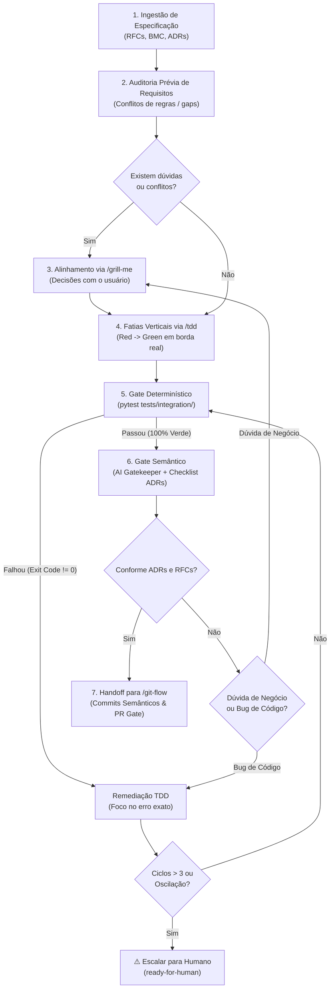

# Development Workflow: Spec to Verified Code

The `dev-workflow` skill orchestrates the end-to-end development lifecycle for features and RFCs. It bridges requirement analysis, interactive alignment via `/grill-me`, implementation in vertical slices via `/tdd`, and deterministic quality gates with circuit breakers before handing off to `/git-flow`.



---

## As 5 Travas Determinísticas do Ciclo

Para garantir que o fluxo circular seja determinístico e nunca caia em loops infinitos ou oscilações de código ("ping-pong"):

1. **Circuit Breaker (`MAX_CYCLES = 3`)**: O ciclo de correção de falhas possui teto fixo de 3 repetições. Atingido o limite sem convergência, o agente interrompe o loop e escala o problema com status `ready-for-human`.
2. **Bifurcação Rígida de Gates**:
   - **Gate Determinístico (Binário)**: Testes de integração ponta a ponta e schemas rodam primeiro (`exit code 0/1`). Zero subjetividade.
   - **Gate Semântico (AI Gatekeeper)**: Só roda quando o Gate Determinístico está 100% verde. Avalia estritamente a conformidade com as ADRs e a RFC.
3. **Checklist Monotônica (Anti-Moving Goalposts)**: No primeiro ciclo de auditoria, o Gatekeeper emite uma lista finita de pendências. Ciclos posteriores apenas marcam itens como resolvidos; o agente é proibido de adicionar novas preferências estilísticas ou refatorações fora da lista original.
4. **Detecção de Oscilação (Diff Hashing)**: Se o diff do ciclo atual reverter código alterado no ciclo anterior ou repetir um estado anterior, o loop é abortado por detecção de oscilação.
5. **Escrow Humano via `/grill-me`**: Inconsistências conceituais entre RFCs, taxas, regras de negócio ou modelos de dados nunca são "adivinhadas" pelo modelo; acionam compulsoriamente a dinamica de `/grill-me`.

---

## Procedimento Passo a Passo

### Fase 1: Ingestão de Especificação e RFC
1. Localize a RFC de referência em `docs/rfc/` e o alinhamento de negócio em `docs/business-model-canvas-e-adrs.md`.
2. Identifique os **seams públicos** (rotas HTTP, contratos de payload JSON, chaves públicas UUIDv4, tabelas de banco de dados).
3. Consulte as ADRs vigentes aplicáveis ao domínio ([ADR-0001](docs/adr/0001-apenas-testes-de-integracao.md) a [ADR-0008](docs/adr/0008-tarifacao-bruta-debito-atomico.md)).

### Fase 2: Auditoria Prévia & Alinhamento (`/grill-me`)
1. Analise se há regras conflitantes ou lacunas de especificação:
   - Modelagem de concorrência ou travas de saldo.
   - Prazos, taxas de liquidação ou estados de transição.
   - Eventos de auditoria ou campos obrigatórios.
2. Se houver divergências ou dúvidas de produto, **não adivinhe**: acione a skill `grilling` (`/grill-me`) apresentando uma pergunta objetiva por vez com a opção `(Recommended)`.

### Fase 3: Desenvolvimento em Fatias Verticais (`/tdd`)
1. Para cada caso de uso ou funcionalidade:
   - **Red**: Escreva um teste de integração em `tests/integration/<dominio>/` que exercita o endpoint HTTP real e valida o comportamento esperado. Execute o teste para garantir que ele falha pelo motivo correto.
   - **Green**: Implemente o código de produção mínimo (Model, DTO, Repository, Controller, Resource, Schema) para fazer o teste passar.
2. Siga as regras arquiteturais fundamentais:
   - Sem mocks unitários na camada de domínio (apenas integrações reais contra PostgreSQL).
   - Locks com ordenação de Dijkstra (`sorted([id1, id2])`) em operações concorrentes.
   - Valores monetários representados estritamente como `BIGINT` em centavos.
   - Partidas dobradas imutáveis no Ledger.
   - Chaves públicas UUIDv4 (`*_key`) na borda da API.

### Fase 4: Loop de Verificação Bounded
1. **Rodar o Gate Determinístico**:
   ```bash
   .venv/bin/pytest tests/integration/ -v
   ```
2. Se houver falhas:
   - Trate o erro específico com `/tdd`.
   - Incremente o contador de iterações (`ciclo <= 3`).
   - Verifique que o novo diff não reverteu a iteração anterior.
3. Se 100% verde nos testes, acione o **Gate Semântico (AI Gatekeeper)**:
   - Valide a conformidade com as ADRs de 0001 a 0008.
   - Se houver não-conformidade técnica, emita a checklist fechada e corrija.
   - Se houver divergência de regra de negócio, invoque o `/grill-me`.

### Fase 5: Conclusão & Handoff para `/git-flow`
1. Quando ambos os gates (Determinístico e Semântico) estiverem 100% verdes:
2. Delegue a finalização para a skill `git-flow`:
   - Inspeção de diff e status limpo.
   - Agrupamento em **Conventional Commits** (`docs(...)`, `feat(...)`, `test(...)`, `fix(...)`).
   - Apresentação do resumo de alterações e solicitação de autorização humana antes de push ou abertura de PR.
