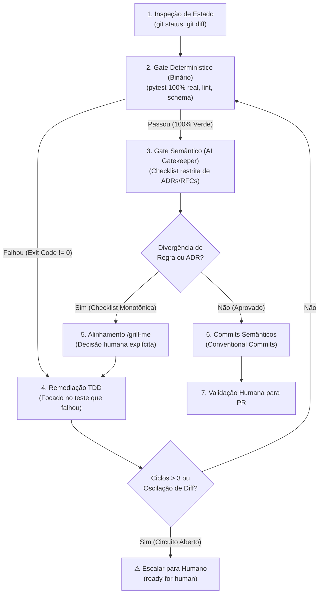

# Git Flow: Pre-Commit & Pre-PR Quality Gate

The `git-flow` skill is the gatekeeper pipeline that validates development work on a feature branch before committing and creating a Pull Request.

It operates as a **safe, deterministic feedback loop** equipped with a Circuit Breaker and monotonic checks to prevent infinite non-deterministic agent loops.



---

## Travas Determinísticas contra Loops Infinitos

Para evitar loops não-determinísticos e oscilações ("ping-pong") entre o AI Gatekeeper e a remediação:

1. **Circuit Breaker (`MAX_CYCLES = 3`)**: O ciclo de remediação só pode rodar no máximo 3 vezes. Se na 3ª rodada ainda houver pendências, o pipeline desarma e escala para `ready-for-human`.
2. **Bifurcação de Gates**:
   - **Gate Determinístico (Binário)**: Testes de integração reais e linters rodam primeiro. Não há subjetividade de LLM: exit code `0` ou `1`.
   - **Gate Semântico (AI Gatekeeper)**: Só roda quando os testes estão 100% verdes. Avalia estritamente a conformidade com as ADRs e RFCs.
3. **Checklist Monotônica (Anti-Moving Goalposts)**: No primeiro ciclo, o Gatekeeper emite uma lista fechada de pendências. Em ciclos subsequentes, o agente só atua para fechar itens abertos; novas sugestões de estilo ou refatorações subjetivas são proibidas.
4. **Detecção de Oscilação (Diff Hashing)**: Se uma alteração reverter o código do ciclo anterior ou repetir um estado de diff, o agente interrompe o loop imediatamente.
5. **Decisão Humana Obrigatória (`/grill-me`)**: Ambiguidade de especificação ou regras de negócio conflitantes nunca são "adivinhadas" pelo agente; requerem alinhamento interativo via `/grill-me`.

---

## Procedimento de Execução

### Passo 1: Inspeção de Estado e Diff
1. Inspecione o estado atual do repositório:
   ```bash
   git status -s
   git diff
   ```
2. Mapeie os arquivos modificados e as RFCs/ADRs envolvidas.

### Passo 2: Gate Determinístico (Testes e Schema)
1. Execute a suíte de testes de integração ponta a ponta:
   ```bash
   .venv/bin/pytest tests/integration/ -v
   ```
2. Se qualquer teste falhar, vá diretamente para o **Passo 4 (TDD)** sem acionar o Gatekeeper Semântico.

### Passo 3: Gate Semântico (AI Gatekeeper)
1. Com os testes verdes, valide a aderência estrita às ADRs:
   - **ADR-0001**: Apenas testes de integração reais na borda HTTP (zero mocks unitários).
   - **ADR-0002**: Locks de concorrência com ordenação de Dijkstra (`sorted([id1, id2])`).
   - **ADR-0003**: Representação monetária em centavos inteiros (`BIGINT`).
   - **ADR-0004**: Partidas dobradas imutáveis no Ledger.
   - **ADR-0005**: Chaves públicas UUIDv4 (`*_key`).
   - **ADR-0006**: Tabela dedicada de idempotência com TTL 24h.
   - **ADR-0007**: Tabelas de domínio para status e eventos append-only.
   - **ADR-0008**: Tarifação bruta com débito atômico no ledger.
2. Emita uma **Checklist Fechada** caso encontre não-conformidades.

### Passo 4: Remediação com `/tdd`
1. Aplique o ciclo **`/tdd`** (Red $\rightarrow$ Green) focado exclusivamente na falha detectada.
2. Verifique o contador de ciclos (`ciclo <= 3`) e a ausência de oscilação de diff.

### Passo 5: Alinhamento via `/grill-me` (Se Houver Inconsistência de Negócio)
1. Se a não-conformidade envolver ambiguidade entre RFCs, BMC ou regras de negócio:
   - Acione a dinâmica de **`/grill-me`** para obter a decisão explícita do desenvolvedor.

### Passo 6: Geração de Commits Semânticos
Com 100% de aprovação nos dois gates:
1. Agrupe as mudanças logicamente usando **Conventional Commits**:
   - `docs(...)`: Alterações em RFCs, BMC e ADRs.
   - `feat(...)`: Novas funcionalidades, rotas ou modelos.
   - `test(...)`: Novos testes de integração.
   - `fix(...)`: Correções de bugs ou alinhamentos de schema.
2. Execute os commits locais.

### Passo 7: Validação Humana para PR
1. Apresente um resumo executivo das mudanças prontas para envio:
   - Branch de trabalho e branch de destino.
   - Lista de commits gerados.
   - Status final dos testes de integração.
2. Solicite expressamente a **autorização do usuário** para realizar o `git push` e abrir o PR.
