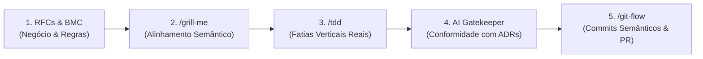

# Bootcamp QI Tech — Core Banking & Governança MEI API

API REST em **Python + Flask + SQLAlchemy** com banco **PostgreSQL**, desenvolvida para atuar como uma plataforma de **Banking-as-a-Service (BaaS)** e **Governança Patrimonial** focada nas dores reais do Microempreendedor Individual (MEI).

---

## 1. Como o Projeto Está Sendo Desenvolvido

Este projeto adota uma metodologia de **Engenharia de Software Assistida por IA** de alta maturidade, orientada pelo framework de habilidades do Matt Pocock (*Agent Skills*) e pelas diretrizes de governança em [AGENTS.md](AGENTS.md).



### Pilares de Desenvolvimento

1. **Test-Driven Development (TDD) em Fatias Verticais**:
   - Nenhuma funcionalidade ou alteração de modelo é implementada sem um teste que falhe primeiro (*Red*), seguido pela implementação estritamente necessária para aprová-lo (*Green*).
   - O desenvolvimento avança em **fatias verticais** (*tracer bullets*), integrando da rota HTTP até o banco de dados.

2. **Apenas Testes de Integração Reais ([ADR-0001](docs/adr/0001-apenas-testes-de-integracao.md))**:
   - Não utilizamos mocks unitários isolados para regras de negócio.
   - 100% dos testes em `tests/integration/` exercitam as rotas HTTP reais contra uma instância real do PostgreSQL, garantindo que constraints, locks, foreign keys e transações sejam rigorosamente validados.

3. **Fluxo de Trabalho Determinístico e Circuito Fechado**:
   - **[`dev-workflow`](.agents/skills/dev-workflow/SKILL.md)**: Orquestra o ciclo completo desde a ingestão da RFC até a verificação da qualidade.
   - **[`git-flow`](.agents/skills/git-flow/SKILL.md)**: Quality gate pré-commit/PR que executa os testes determinísticos, audita a conformidade com as ADRs e solicita validação humana antes de qualquer envio remoto.
   - **Circuit Breaker**: O ciclo de remediação possui limite rígido de 3 repetições contra loops infinitos (*ping-pong* de diffs).

---

## 2. Arquitetura de Negócio e RFCs (Requests for Comments)

O modelo de negócio foi desenhado a partir do [Business Model Canvas](docs/business-model-canvas-e-adrs.md) para resolver os três maiores gargalos do MEI: **confusão patrimonial (PF vs PJ)**, **risco de desenquadramento fiscal** e **dificuldade de acesso a crédito**.

| RFC | Título | Escopo e Responsabilidades | Status |
| :--- | :--- | :--- | :--- |
| **[RFC 01](docs/rfc/rfc-01-core-customer-accounts.md)** | **Core Customer & Twin Accounts** | Onboarding de clientes, modelo de **Contas Gêmeas** (PF e PJ sob o mesmo titular), ciclo de vida da conta (`active`, `blocked`, `closed`), encerramento voluntário com saldo zerado (`QIT001011`) e **Bloqueio Cautelar MED** (Mecanismo Especial de Devolução - Resolução BCB 103/2021). | Aprovada & Implementada |
| **[RFC 02](docs/rfc/rfc-02-transactions-ledger.md)** | **Transactions & Double-Entry Ledger** | Contabilidade imutável de **partidas dobradas** (soma zero), transferências atômicas entre contas com **Locks de Dijkstra** (`SELECT FOR UPDATE`), liquidação de cash-in e cobrança bruta de tarifas no ledger da plataforma. | Aprovada & Implementada |
| **[RFC 03](docs/rfc/rfc-03-onboarding-antifraude-estados.md)** | **Onboarding, Antifraude & KYC** | Máquina de estados finitos para abertura de conta (`pending` $\rightarrow$ `under_review` $\rightarrow$ `active` / `rejected`), integração com bureau antifraude via `kyc_connector` e trilha de auditoria append-only de eventos. | Aprovada & Implementada |
| **[RFC 04](docs/rfc/rfc-04-meios-de-pagamento-liquidacao.md)** | **Meios de Pagamento & Liquidação** | Emissão de cobranças multimeios (PIX Copia e Cola / QR Code, Boleto Bancário e Link de Cartão), processamento seguro de Webhook com assinatura HMAC-SHA256 e job de conciliação ativa. | Aprovada & Implementada |
| **[RFC 06](docs/rfc/rfc-06-fluxo-caixa-remunerado-cdb.md)** | **Fluxo de Caixa Remunerado (CDB/Tesouraria)** | Aplicação automática do saldo ocioso da conta em CDB de liquidez diária remunerado a 100% do CDI, com apropriação diária de rendimentos via partidas dobradas no Ledger. | Aprovada & Implementada |
| **[RFC 07](docs/rfc/rfc-07-governanca-patrimonial-pockets.md)** | **Governança Patrimonial & Pockets** | Separação patrimonial via "Caixinhas" (*Pockets*): reserva fiscal para pagamento do DAS-MEI, caixinha de capital de giro, **trava de recebíveis (fumaça)** para garantia de crédito e monitoramento do teto anual do MEI (R$ 81.000). | Aprovada & Implementada |

---

## 3. Decisões Arquiteturais Registradas (ADRs)

Todas as escolhas técnicas estruturais estão documentadas no diretório [`docs/adr/`](docs/adr/):

| ADR | Decisão Arquitetural | Justificativa e Impacto |
| :--- | :--- | :--- |
| **[ADR-0001](docs/adr/0001-apenas-testes-de-integracao.md)** | **Apenas Testes de Integração** | Elimina testes unitários com mocks na camada de domínio. Todo teste sobe a API HTTP e grava no PostgreSQL real, garantindo fidelidade de produção. |
| **[ADR-0002](docs/adr/0002-locks-de-concorrencia-ordenacao-dijkstra.md)** | **Locks de Concorrência com Dijkstra** | Transferências entre contas travam os registros no banco com `SELECT FOR UPDATE` sempre na ordem do **menor ID para o maior**, eliminando deadlocks circulares. |
| **[ADR-0003](docs/adr/0003-representacao-monetaria-centavos.md)** | **Valores Monetários em Centavos (`BIGINT`)** | Proíbe o uso de `float` ou `double` para valores financeiros. R$ 10,50 é armazenado como o inteiro `1050`, eliminando erros de arredondamento de ponto flutuante. |
| **[ADR-0004](docs/adr/0004-partidas-dobradas-ledger.md)** | **Partidas Dobradas Imutáveis no Ledger** | Toda operação financeira gera entradas de débito e crédito balanceadas cuja soma é exatamente zero. Registros do ledger são estritamente append-only (sem `UPDATE`/`DELETE`). |
| **[ADR-0005](docs/adr/0005-chaves-publicas-uuidv4.md)** | **Chaves Públicas UUIDv4 (`*_key`)** | IDs inteiros sequenciais são de uso exclusivamente interno do banco. A borda pública da API expõe apenas UUIDs aleatórios para evitar enumeração de recursos e vazamento de métricas. |
| **[ADR-0006](docs/adr/0006-tabela-dedicada-idempotencia.md)** | **Tabela Dedicada de Idempotência** | Operações críticas de escrita (pagamentos, transferências) exigem `Idempotency-Key` com TTL de 24h, garantindo que retransmissões de rede não dupliquem débitos. |
| **[ADR-0007](docs/adr/0007-tabelas-dominio-status-eventos.md)** | **Tabelas de Domínio para Status e Eventos** | Status de entidades utilizam normalização com tabelas de catálogo e tabelas de eventos append-only para registro histórico imutável das transições. |
| **[ADR-0008](docs/adr/0008-tarifacao-bruta-debito-atomico.md)** | **Tarifação Bruta com Débito Atômico** | Cobrança de tarifas de liquidação (PIX R$ 0,90, Boleto R$ 2,50) ocorre de forma atômica no momento do evento, debitando a conta de origem e creditando a conta de receita da plataforma no ledger. |

---

## 4. Estrutura do Código

O projeto segue uma arquitetura em camadas bem delimitada:

```
bootcamp-qitech-api/
├── .agents/skills/      ← Habilidades dos agentes de IA (dev-workflow, git-flow, tdd, etc.)
├── database/
│   └── database.sql     ← Schema relacional completo com constraints e índices
├── docs/
│   ├── adr/             ← Architecture Decision Records (ADR-0001 a ADR-0008)
│   ├── rfc/             ← Especificações de produto e engenharia (RFC 01 a 07)
│   ├── next/            ← Roadmap de escala, segurança e glossário explicativo
│   └── business-model-canvas-e-adrs.md ← Alinhamento estratégico do MEI
├── src/
│   ├── app.py           ← Inicialização da aplicação, rotas e tratamento de erros
│   ├── constants.py     ← Configurações e variáveis de ambiente
│   ├── connectors/      ← Clientes HTTP para serviços externos (KYC, Pagamentos)
│   ├── controllers/     ← Regras de negócio e orquestração de domínio
│   ├── dtos/            ← Data Transfer Objects para serialização de saída
│   ├── errors/          ← Hierarquia de erros com códigos padronizados (QIT00xxxx)
│   ├── middlewares/     ← Session manager do SQLAlchemy e logging correlacionado
│   ├── models/          ← Mapeamento objeto-relacional (ORM SQLAlchemy)
│   ├── repositories/    ← Acesso a dados e transações atômicas com locks
│   ├── resources/       ← Endpoints HTTP (REST) desacoplados de SQL e regras
│   └── schemas/         ← Contratos de validação JSON Schema de entrada
└── tests/
    └── integration/     ← Suíte de testes de integração ponta a ponta (60 testes)
```

---

## 5. Como Executar o Projeto

### Pré-requisitos
- **Docker** e **Docker Compose**
- **Python 3.11+** (para execução local dos testes)
- **Git**

### 1. Subir a API e o Banco de Dados
```bash
docker compose up -d
```
- A API estará respondendo em: `http://localhost:3031` (ou na porta configurada no seu `.env`).
- O banco PostgreSQL estará acessível na porta: `localhost:5435`.

### 2. Verificar a Saúde da Aplicação
```bash
curl http://localhost:3031/health_check
# Resposta esperada: HTTP 204 No Content
```

### 3. Rodar a Suíte de Testes de Integração
Os testes rodam no seu ambiente local e se conectam diretamente à API e ao banco de dados:

```bash
# Criar o ambiente virtual e instalar dependências
python3 -m venv .venv
source .venv/bin/activate
pip install -r requirements-dev.txt

# Executar todos os testes de integração
pytest tests/integration/ -v
```

> **Resultado Atual**: **60 testes passando** em ~10 segundos.

---

## 6. Próximos Passos e Evolução

Para entender os desafios futuros de infraestrutura e o dicionário de termos do projeto, consulte:
- **[Roadmap de Escala, Segurança e Glossário](docs/next/roadmap-escala-seguranca-e-glossario.md)**:
  - *Batching Assíncrono de Tarifas* (resolução de hotspot no PostgreSQL).
  - *Proteção contra Replay Attacks e Rotação Dual-Secret*.
  - *Transactional Outbox Pattern* (resolução do Dual-Write Problem com conectores externos).
  - *Governança Proativa do Faturamento MEI* (alertas aos 80%, 90% e 95% do teto).

---

## 7. Licença

Este projeto é distribuído sob a licença **MIT**. Consulte o arquivo [LICENSE](LICENSE) para mais detalhes.
