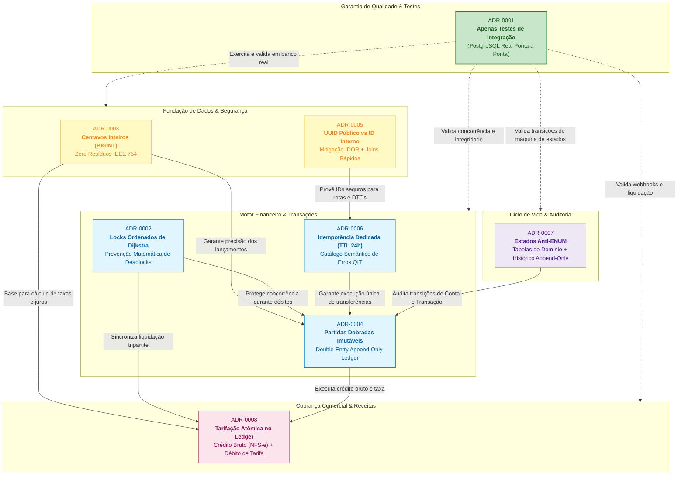

# Índice Executivo de Decisões Arquiteturais (ADRs)

> [!NOTE]
> **Padrão Arquitetural Adotado**: Este repositório adota a convenção internacional de **Architectural Decision Records (ADRs)** formulada por Michael Nygard e recomendada pelas práticas de engenharia assistida por IA (Matt Pocock Skills / [docs/agents/domain.md](file:///home/jpcalsavara/projetos/andamento/bootcamp-qitech-api/docs/agents/domain.md)).
> 
> **Por que as ADRs são mantidas em arquivos individuais e atômicos?**
> 1. **Atomicidade e Imutabilidade**: Cada decisão técnica representa um ponto fixo no tempo. ADRs nunca devem ser fundidas destrutivamente, pois preservam o histórico forense e a justificativa de design original.
> 2. **Rastreabilidade Direta**: O código-fonte, suítes de teste, commits semânticos e agentes de IA referenciam explicitamente o identificador único (ex: `conforme ADR-0002` ou `[ADR-0007](docs/adr/0007-...)`).
> 3. **Ciclo de Vida de Substituição (*Superseded*)**: Quando uma decisão técnica é revisitada no futuro, ela não é reescrita; cria-se uma nova ADR (ex: `ADR-0009`) marcando a ADR anterior formalmente como `Substituída por ADR-0009`.

---

## 1. Tabela Executiva Comparativa

| ID | Título da Decisão | Status | Decisão Central em 1 Linha | Trade-off Principal Assumido | Arquivo Completo |
|---|---|---|---|---|---|
| **ADR-0001** | Adoção Exclusiva de Testes de Integração | **Aprovado** | Proibir testes unitários com mocks; todos os testes devem rodar ponta a ponta (`tests/integration/`) contra PostgreSQL real. | Testes ligeiramente mais lentos que testes puros em memória, compensados pela confiabilidade contábil inegociável. | [0001-apenas-testes-de-integracao.md](file:///home/jpcalsavara/projetos/andamento/bootcamp-qitech-api/docs/adr/0001-apenas-testes-de-integracao.md) |
| **ADR-0002** | Prevenção de Deadlock via Dijkstra | **Aprovado** | Ordenar deterministicamente os IDs internos das contas em ordem crescente (`sorted([origem, destino])`) antes de `SELECT FOR UPDATE`. | Exige disciplina de 1 linha de Python (`sorted(...)`) antes de travas, tornando a espera circular impossível sem mecanismos de retry. | [0002-prevencao-deadlock-ordenacao-dijkstra.md](file:///home/jpcalsavara/projetos/andamento/bootcamp-qitech-api/docs/adr/0002-prevencao-deadlock-ordenacao-dijkstra.md) |
| **ADR-0003** | Representação Monetária em Centavos (`BIGINT`) | **Aprovado** | Representar todos os valores monetários como centavos inteiros (`BIGINT`) no banco e usar apenas aritmética inteira no código. | Clientes da API que esperam float precisam ler o campo inteiro em centavos ou a string formatada (`"10.00"`). | [0003-representacao-monetaria-centavos-bigint.md](file:///home/jpcalsavara/projetos/andamento/bootcamp-qitech-api/docs/adr/0003-representacao-monetaria-centavos-bigint.md) |
| **ADR-0004** | Arquitetura Contábil de Partidas Dobradas | **Aprovado** | Toda transação insere atomicamente no mínimo um `DEBIT` e um `CREDIT` na tabela imutável *append-only* `ledger_entry`. | Maior volume de escritas no PostgreSQL, compensado pela auditoria forense instantânea e soma algébrica zero garantida. | [0004-arquitetura-contabil-partidas-dobradas.md](file:///home/jpcalsavara/projetos/andamento/bootcamp-qitech-api/docs/adr/0004-arquitetura-contabil-partidas-dobradas.md) |
| **ADR-0005** | Desacoplamento de UUID Público e Mitigação IDOR | **Aprovado** | Usar chaves primárias inteiras sequenciais internamente no banco e expor exclusivamente UUIDv4 público na API, respondendo 404 em acessos não autorizados. | Manutenção de duas chaves nas tabelas principais, compensada pela blindagem contra enumeração horizontal (IDOR). | [0005-desacoplamento-identificadores-uuid-publico.md](file:///home/jpcalsavara/projetos/andamento/bootcamp-qitech-api/docs/adr/0005-desacoplamento-identificadores-uuid-publico.md) |
| **ADR-0006** | Idempotência Dedicada com TTL e Catálogo de Erros | **Aprovado** | Rastrear requisições em tabela desacoplada `idempotency_record` com TTL de 24h e retornar catálogo de erros semânticos estruturados (`QIT...`). | Consulta adicional antes de processar requisições financeiras e job de limpeza de registros expirados. | [0006-idempotencia-tabela-dedicada-catalogo-erros.md](file:///home/jpcalsavara/projetos/andamento/bootcamp-qitech-api/docs/adr/0006-idempotencia-tabela-dedicada-catalogo-erros.md) |
| **ADR-0007** | Estados como Tabela de Domínio (Anti-ENUM) | **Aprovado** | Banir enums nativos do banco e colunas de texto livre; estados residem em tabelas de domínio com histórico append-only em `_status_event`. | Junção adicional por leitura mitigada por relacionamentos `selectin` do ORM, permitindo novas opções via simples `INSERT` sem lock DDL. | [0007-estados-tabela-dominio-historico-append-only.md](file:///home/jpcalsavara/projetos/andamento/bootcamp-qitech-api/docs/adr/0007-estados-tabela-dominio-historico-append-only.md) |
| **ADR-0008** | Tarifação Transacional Atômica no Ledger | **Aprovado** | Cobranças são creditadas pelo valor bruto total com débito atômico imediato da taxa para a conta interna `FeeRevenueAccount`. | Duas linhas transacionais no ledger por venda liquidada, compensado pelo espelhamento 1:1 com a Nota Fiscal (NFS-e) do MEI (teto 81k). | [0008-tarifacao-transacional-debito-atomico-ledger.md](file:///home/jpcalsavara/projetos/andamento/bootcamp-qitech-api/docs/adr/0008-tarifacao-transacional-debito-atomico-ledger.md) |

---

## 2. Mapa de Interdependência Arquitetural

O diagrama abaixo ilustra como as 8 decisões arquiteturais se conectam organicamente para sustentar a integridade e segurança do CoreBank MEI:

---

## 3. Matriz de Impacto no Código-Fonte

| ADR | Camadas Afetadas no Repositório | Módulos e Arquivos Principais | Como se Manifesta no Código |
|---|---|---|---|
| **ADR-0001** | `tests/integration/` | `tests/integration/test_*.py` | Todos os testes utilizam `TestClient` FastAPI contra banco PostgreSQL real; zero uso de `unittest.mock` para persistência. |
| **ADR-0002** | `src/controllers/`, `src/repositories/` | `transaction.py`, `charge.py`, `account.py` | Chamada determinística `sorted([acc_a.id, acc_b.id])` imediatamente antes de adquirir `SELECT FOR UPDATE`. |
| **ADR-0003** | `src/models/`, `src/schemas/`, `src/dtos/` | `account.py`, `ledger.py`, `charge.py` | Todas as colunas de valor usam sufixo `_cents` (`BIGINT`); DTOs expõem `_cents` (inteiro) e representação formatada em reais (`str`). |
| **ADR-0004** | `src/models/`, `src/repositories/` | `ledger.py`, `account.py` | Toda operação financeira insere pares simétricos em `ledger_entry` (`DEBIT` e `CREDIT`); tabela é estritamente append-only. |
| **ADR-0005** | `src/models/`, `src/resources/`, `src/dtos/` | `customer.py`, `account.py`, `transaction.py` | Chaves primárias internas são `SERIAL`; rotas expõem `customer_key`, `account_key`, `transaction_key` (`UUIDv4`); não autorizado retorna 404. |
| **ADR-0006** | `src/middlewares/`, `src/models/`, `src/errors/` | `idempotency.py`, `errors.py`, `ledger.py` | Verificação do cabeçalho `Idempotency-Key` em `idempotency_record` com TTL 24h; erros usam o catálogo padronizado `QIT...`. |
| **ADR-0007** | `src/models/`, `src/controllers/` | `account_status.py`, `customer_status.py`, `account_status_event.py` | Tabelas de domínio separadas com FK para a entidade; cada mudança de estado insere registro imutável em `..._status_event`. |
| **ADR-0008** | `src/controllers/`, `src/models/` | `charge.py`, `ledger.py`, `account.py` | Liquidação de cobrança executa transação tripartite: crédito do valor bruto na conta MEI, débito atômico da taxa para `FeeRevenueAccount` e acúmulo no `RevenueTracker`. |

---

## 4. Governança: Como Propor Novas ADRs

Ao identificar uma nova decisão arquitetural estruturante no projeto:
1. Copie o formato padrão de 3 seções (**Contexto**, **Decisão**, **Consequências**).
2. Adicione a tabela formal de metadados no topo (`Status: Proposto`, `Data`, `Decisores`, `Tags`).
3. Crie o arquivo nomeado como `docs/adr/NNNN-<slug-da-decisao>.md` (seguindo a sequência incremental, ex: `0009-...`).
4. Atualize este arquivo `docs/adr/README.md` incluindo a nova linha na tabela comparativa e no diagrama de interdependência.
5. Caso a nova decisão altere ou revogue uma decisão anterior, marque a ADR anterior como `Status: Substituído por ADR-NNNN` sem apagar o arquivo original.
