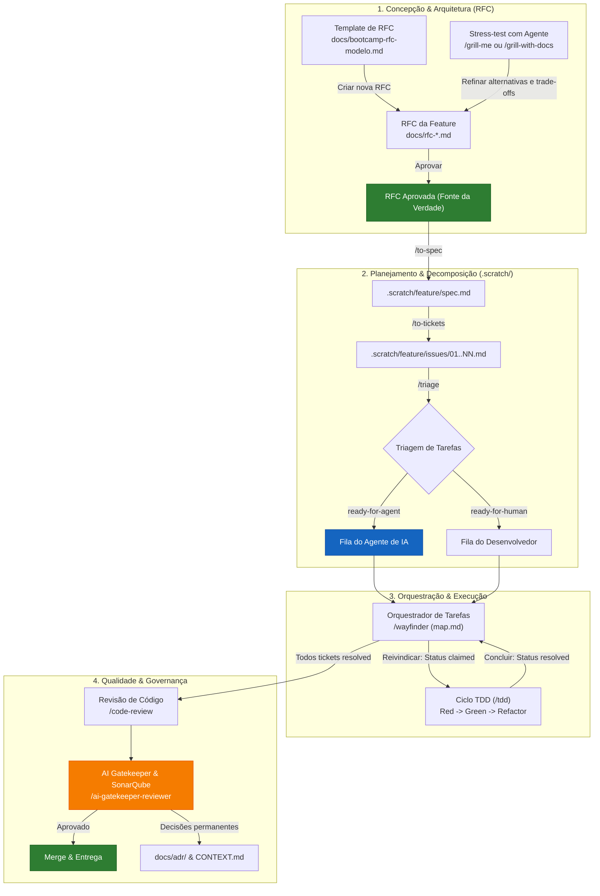

# Guia de Gerenciamento do Projeto com Agentes de IA & RFCs

Este documento explica como funciona o gerenciamento deste projeto utilizando a metodologia de **Engenharia Orientada a RFCs (RFC-Driven Development)** em conjunto com as **Matt Pocock Skills** e o **AI Gatekeeper**.

---

## 1. Fluxograma do Ciclo de Vida de uma Feature (RFC-Driven)



---

## 2. Como Funciona o Gerenciamento Orientado a RFCs

No modelo **RFC-Driven Feature Management**, nenhuma linha de código de negócio ou endpoint é implementado sem antes passar por uma RFC. A RFC atua como o contrato de escopo, contratos de dados e decisões de arquitetura.

### 2.1. Níveis de Documentação

1. **A RFC (`docs/rfc-<slug>.md`)**:
   - **O que é**: O documento mestre de arquitetura da funcionalidade (exemplo: [`docs/rfc-corebank-mei.md`](file:///home/jpcalsavara/projetos/andamento/bootcamp-qitech-api/docs/rfc-corebank-mei.md)).
   - **O que contém**:
     - Contextualização do problema e escopo delimitado.
     - Solução macro e **trade-offs com alternativas descartadas**.
     - Tabela de rotas e contratos de API (método, path, entrada, status code, payload de erro).
     - Diagrama ER (Mermaid) das tabelas e relacionamentos.
     - **Desenho de Fluxo da Rota (As Seis Perguntas Respondidas no Desenho)** em Mermaid para cada rota crítica.
     - Catálogo semântico de códigos de erro (`QIT000001`, `QIT001001`, etc.).


2. **A Especificação Técnica (`.scratch/<slug>/spec.md`)**:
   - Derivada diretamente da RFC via `/to-spec`.
   - Detalha a implementação física: classes, arquivos a modificar, schemas Pydantic, serviços e repositórios.

3. **Os Tickets de Implementação (`.scratch/<slug>/issues/<NN>-<slug>.md`)**:
   - Decomposição atômica gerada via `/to-tickets`.
   - Cada ticket representa um passo que pode ser codificado e testado independentemente (ex: migração Alembic, modelos de dados, rotas FastAPI, validação de regras).

4. **Decisões Permanentes (`docs/adr/` e `CONTEXT.md`)**:
   - Decisões transversais que transcendem uma única feature (ex: adoção do PostgreSQL, locking pessimista com ordem de Dijkstra) viram ADRs permanentes.
   - Termos do negócio são consolidados no glossário `CONTEXT.md`.

---

## 3. Passo a Passo: Do Requisito ao Código

### Passo 1: Criar a RFC
1. Copie o modelo oficial em [`docs/bootcamp-rfc-modelo.md`](file:///home/jpcalsavara/projetos/andamento/bootcamp-qitech-api/docs/bootcamp-rfc-modelo.md) para `docs/rfc-<sua-feature>.md`.
2. Preencha o problema, alternativas descartadas, rotas, contratos de erro e diagrama de banco de dados.
3. *Dica*: Use o comando `/grill-me` ou `/grill-with-docs` com o agente para estressar a RFC antes de iniciar o código:
   > *"Estresse esta RFC procurando vulnerabilidades de concorrência, deadlocks, campos faltantes e casos de borda."*

### Passo 2: Gerar Tickets no Rastreador Local
1. Execute `/to-tickets` passando a RFC como contexto.
2. O agente criará a pasta `.scratch/<sua-feature>/issues/` com os tickets sequenciais numerados (`01-`, `02-`, etc.).

### Passo 3: Triagem das Tarefas
1. Execute `/triage` para avaliar as tarefas:
   - Tarefas bem especificadas e mecânicas recebem `Status: ready-for-agent`.
   - Tarefas que dependem de credenciais externas ou decisões de produto recebem `Status: ready-for-human`.

### Passo 4: Execução com Wayfinding e TDD
1. Utilize `/wayfinder` para gerenciar o grafo de dependências (`.scratch/<feature>/map.md`).
2. O agente pega a primeira tarefa desimpedida (`Status: claimed`).
3. Aplica a skill `/tdd`:
   - Escreve os testes unitários/integração primeiro (**Red**).
   - Implementa a funcionalidade mínima (**Green**).
   - Refatora mantendo os testes passando (**Refactor**).
4. O ticket é finalizado (`Status: resolved`).

### Passo 5: AI Gatekeeper & Revisão
1. Execute `/code-review` para comparar o código produzido com os critérios estabelecidos na RFC.
2. Execute `/ai-gatekeeper-reviewer` para rodar os testes, lint (`.flake8`) e análise de qualidade estática via SonarQube (`/sonarqube-runner`).

---

## 4. Estrutura de Diretórios Completa

```
bootcamp-qitech-api/
├── AGENTS.md                                # Instruções centrais para agentes
├── CONTEXT.md                               # Glossário canônico de termos do negócio
├── docs/
│   ├── bootcamp-rfc-modelo.md               # Template oficial de RFC do projeto
│   ├── rfc-corebank-mei.md                  # RFC da feature de Core Banking MEI
│   ├── adr/                                 # Architectural Decision Records (ADRs)
│   ├── agents/                              # Configurações operacionais dos agentes
│   │   ├── issue-tracker.md                 # Rastreador local em .scratch/
│   │   ├── triage-labels.md                 # Estados: ready-for-agent, etc.
│   │   └── domain.md                        # Leitura de CONTEXT.md e docs/adr/
│   └── gerenciamento-do-projeto-com-agentes.md # Este documento
└── .scratch/
    └── corebank-mei/
        ├── spec.md                          # Spec técnica derivada da RFC
        ├── map.md                           # Grafo de tarefas e decisões
        └── issues/
            ├── 01-modelagem-party-account.md
            ├── 02-ledger-partidas-dobradas.md
            ├── 03-rotas-transacoes-idempotencia.md
            └── 04-extrato-contabil-paginado.md
```
