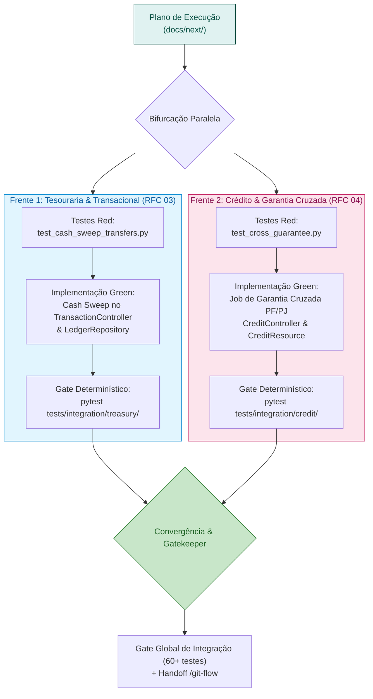

# Plano de Execução: Frentes Paralelas de Implementação

| | |
|---|---|
| **Status** | **Aprovado para Execução** |
| **Data** | 23/09/2026 |
| **Versão** | 1.0 |
| **Origem** | Avaliação AI Gatekeeper & RFCs Consolidadas (RFC 03 e RFC 04) |

---

## 1. Visão Geral e Estratégia de Paralelismo

Com a suíte de 4 RFCs e 8 ADRs consolidadas e 100% dos testes atuais verdes (60 testes em 10.55s), iniciamos a implementação de duas frentes funcionais independentes e de alto valor agregado para o CoreBank MEI.

As duas frentes atuam em domínios desacoplados, permitindo **desenvolvimento concorrente e paralelo** através de subagentes independentes com a esteira **`/dev-workflow` (TDD Red $\rightarrow$ Green em borda real)**:

---

## 2. Detalhamento da Frente 1: Cash Sweep Invisível & Resgate de CDB ([RFC 03](file:///home/jpcalsavara/projetos/andamento/bootcamp-qitech-api/docs/rfc/rfc-03-governanca-caixa-envelopes-tesouraria.md))

### 2.1. Problema de Negócio & Desafio Técnico
Atualmente, se um MEI possui R$ 50,00 de saldo livre em conta corrente e R$ 500,00 aplicados em CDB com liquidez diária (`YieldPosition`), ao tentar transferir R$ 100,00 via `POST /transactions/transfers`, o sistema acusa erro `422 QIT001010` (`INSUFFICIENT_FUNDS`), porque a conta corrente isolada não possui fundos suficientes.
Isso força o microempreendedor a fazer resgates manuais em caixinhas antes de transacionar, gerando alto atrito e cancelamentos de compras.

### 2.2. Solução a Implementar
1. **Detecção de Déficit**: No [`TransactionController.execute_transfer`](file:///home/jpcalsavara/projetos/andamento/bootcamp-qitech-api/src/controllers/transaction_controller.py#L20), antes de rejeitar por saldo insuficiente, consultar se a conta possui saldo em `YieldPosition` (`yield_repository.get_or_create_position`).
2. **Resgate Automático Contábil (*Cash Sweep*)**:
   - Se `free_balance + yield_position.principal_amount >= amount`:
     - Calcular o valor faltante: `deficit = amount - free_balance`.
     - Baixar o montante de principal em `YieldPosition`.
     - Executar crédito do valor resgatado na conta corrente com contrapartida de débito contábil (`TREASURY_SWEEP_REDEMPTION`).
     - Prosseguir com a transferência solicitada atomicamente.
3. **Persistência das Regras dos ADRs**:
   - Locks ordenados de Dijkstra ([ADR-0002](file:///home/jpcalsavara/projetos/andamento/bootcamp-qitech-api/docs/adr/0002-prevencao-deadlock-ordenacao-dijkstra.md)) mantidos.
   - Partidas dobradas no ledger ([ADR-0004](file:///home/jpcalsavara/projetos/andamento/bootcamp-qitech-api/docs/adr/0004-arquitetura-contabil-partidas-dobradas.md)).
   - Centavos inteiros `BIGINT` ([ADR-0003](file:///home/jpcalsavara/projetos/andamento/bootcamp-qitech-api/docs/adr/0003-representacao-monetaria-centavos-bigint.md)).

### 2.3. Especificação do Teste de Integração (TDD Red)
Arquivo: [`tests/integration/treasury/test_cash_sweep_transfers.py`](file:///home/jpcalsavara/projetos/andamento/bootcamp-qitech-api/tests/integration/treasury/test_cash_sweep_transfers.py)
- `test_transfer_with_sufficient_free_balance_does_not_trigger_sweep`
- `test_transfer_with_insufficient_free_balance_triggers_automatic_cash_sweep_from_cdb`
- `test_transfer_exceeding_both_free_and_cdb_balance_fails_with_422`

---

## 3. Detalhamento da Frente 2: Garantia Cruzada Patrimonial PF/PJ ([RFC 04](file:///home/jpcalsavara/projetos/andamento/bootcamp-qitech-api/docs/rfc/rfc-04-linhas-credito-trava-recebiveis.md))

### 3.1. Problema de Negócio & Desafio Técnico
Quando um MEI contrata uma Cédula de Crédito Bancário (CCB) e atinge o vencimento de uma parcela sem faturamento na conta PJ e sem saldo suficiente na trava de recebíveis (`AmortizationPocket`), o contrato entra em inadimplência.
No entanto, no regime de Empresário Individual (213-5), a pessoa física responde ilimitadamente pelas obrigações da empresa (Art. 368 do Código Civil). Se o MEI possuir saldo disponível em sua `PersonalAccount`, a compensação contábil cruzada pode regularizar a dívida automaticamente após uma janela de tolerância de 5 dias úteis, evitando negativação do CPF nos bureaus.

### 3.2. Solução a Implementar
1. **Método de Compensação no `CreditController`**:
   - `execute_cross_guarantee(target_date: Optional[date])`:
     - Localizar contratos de CCB ativos com parcelas com `due_date <= target_date - 5 dias` e status `PENDING` ou `OVERDUE`.
     - Para cada contrato elegível:
       - Se a `PersonalAccount` do mesmo titular tiver saldo disponível `>= installment.amount`:
         - Executar transferência com partidas dobradas: `DÉBITO PersonalAccount` / `CRÉDITO SettlementAccount da CCB` com motivo formal `CROSS_GUARANTEE_MEI_SETTLEMENT`.
         - Marcar a parcela como `PAID` e atualizar `outstanding_balance` do contrato.
2. **Exposição de Rota no `CreditResource`**:
   - `POST /credit/cross-guarantee/execute` protegido pelo cabeçalho `INTERNAL-TOKEN`.
   - Schema JSON: `post_cross_guarantee.json` com campo opcional `target_date`.

### 3.3. Especificação do Teste de Integração (TDD Red)
Arquivo: [`tests/integration/credit/test_cross_guarantee.py`](file:///home/jpcalsavara/projetos/andamento/bootcamp-qitech-api/tests/integration/credit/test_cross_guarantee.py)
- `test_cross_guarantee_ignores_installments_within_grace_period`
- `test_cross_guarantee_settles_overdue_installment_from_personal_account`
- `test_cross_guarantee_keeps_contract_overdue_when_personal_account_has_no_funds`

---

## 4. Matriz de Entregáveis e Arquivos Afetados

| Frente | Camadas / Arquivos a Criar ou Modificar |
|---|---|
| **Frente 1 (Cash Sweep)** | - `src/controllers/transaction_controller.py` - `src/repositories/yield_repository.py` - `src/repositories/ledger_repository.py` - `tests/integration/treasury/test_cash_sweep_transfers.py` |
| **Frente 2 (Garantia Cruzada)** | - `src/controllers/credit_controller.py` - `src/repositories/credit_repository.py` - `src/resources/credit_resource.py` - `src/schemas/post_cross_guarantee.json` - `tests/integration/credit/test_cross_guarantee.py` |

---

## 5. Critérios de Aceite Globais

1. **Zero Mocks na Camada de Negócio**: Ambas as frentes validadas 100% via testes de integração reais contra PostgreSQL ([ADR-0001](file:///home/jpcalsavara/projetos/andamento/bootcamp-qitech-api/docs/adr/0001-apenas-testes-de-integracao.md)).
2. **Preservação da Suite Legada**: Todos os 60 testes de integração anteriores devem continuar passando com status verde.
3. **Conformidade Contábil**: Soma algébrica zero mantida em todos os lançamentos no livro-razão imutável ([ADR-0004](file:///home/jpcalsavara/projetos/andamento/bootcamp-qitech-api/docs/adr/0004-arquitetura-contabil-partidas-dobradas.md)).
