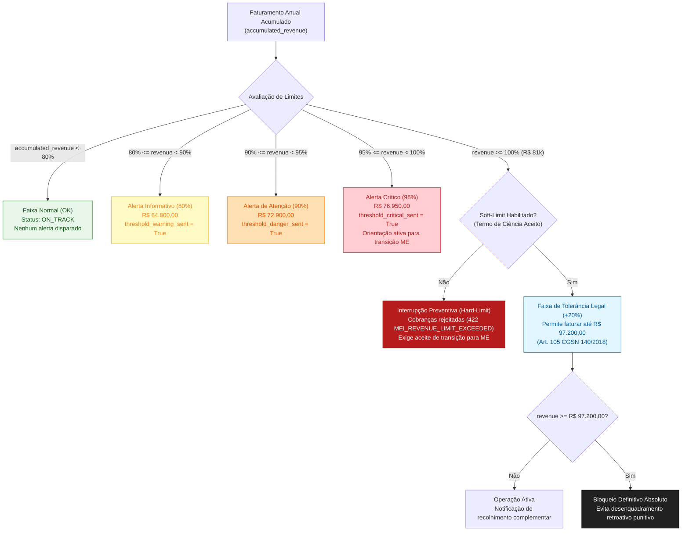

# Plano de Implementação: Governança do Teto MEI, Alertas Escalonados e Projeção Preditiva

| | |
|---|---|
| **Status** | **Aprovado para Implementação** |
| **Data** | 23/09/2026 |
| **Versão** | 1.0 |
| **Origem** | [Item 1.4 do Roadmap de Evolução Arquitetural](file:///home/jpcalsavara/projetos/andamento/bootcamp-qitech-api/docs/next/roadmap-escala-seguranca-e-glossario.md#L50-L56) |
| **Fundamentação Legal** | Lei Complementar nº 123/2006 e Resolução CGSN nº 140/2018 (Art. 105) |

---

## 1. Contexto e Justificativa de Negócio

O Microempreendedor Individual (MEI) está sujeito a um limite legal de faturamento bruto anual de **R$ 81.000,00** (8.100.000 centavos), regulamentado pela Lei Complementar nº 123/2006.

Quando o empreendedor se aproxima desse limite, o comportamento da plataforma financeira é crucial para a sobrevivência do negócio:
1. **Bloqueio abrupto ("Hard Stop")**: Se a API simplesmente travar a emissão de cobranças ou o recebimento de PIX ao atingir R$ 81.000,00 sem aviso, o comerciante é pego de surpresa em meio à sua atividade diária e perde vendas imediatas.
2. **Ausência de governança e monitoramento**: Se a plataforma permitir que o MEI fature livremente sem alertas, ele pode ultrapassar o teto e sofrer **desenquadramento compulsório** pela Receita Federal do Brasil.

### O Risco Fiscal do Desenquadramento:
* **Excesso de até 20% (até R$ 97.200,00 = 9.720.000 centavos)**: Conforme o Art. 105 da Resolução CGSN nº 140/2018, o MEI continua recolhendo o DAS-MEI fixo até dezembro daquele ano, recolhe um DAS complementar sobre o excesso em janeiro do ano seguinte, e é desenquadrado para Microempresa (ME) a partir de 1º de janeiro. O processo é suave e previsível.
* **Excesso superior a 20% (> R$ 97.200,00)**: O desenquadramento é **retroativo ao início do ano-calendário**, obrigando a empresa a recalcular e recolher todos os tributos federais, estaduais e municipais pelo Simples Nacional como ME desde 1º de janeiro, acrescidos de multas moratórias punitivas e juros pela taxa SELIC, gerando alto risco de falência para o microempreendedor.

Portanto, o Core Banking precisa fornecer:
- **Alertas Escalonados** (80%, 90%, 95% e 100%) para conscientização progressiva.
- **Projeção Preditiva de Faturamento** (análise de *run-rate* diário e estimativa de data de estouro).
- **Soft-Limit com Termo de Ciência**: Permite faturar até o teto de tolerância legal (R$ 97.200,00), desde que o MEI formalize eletronicamente que está ciente da obrigatoriedade de transição para ME no exercício seguinte.

---

## 2. Diagrama de Fluxo e Estados de Alerta



---

## 3. Especificação Técnica Detalhada

### 3.1. Alertas Escalonados no `pocket_repository.add_revenue`

O limite MEI base é **8.100.000 centavos** (R$ 81.000,00). Os gatilhos de alerta são avaliados de forma atômica no banco sob `SELECT ... FOR UPDATE`:

| Nível | Porcentagem | Valor em Centavos | Flag no Banco | Severidade |
|---|---|---|---|---|
| **Warning** | 80% | `6_480_000` | `threshold_warning_sent` | `INFO` |
| **Danger** | 90% | `7_290_000` | `threshold_danger_sent` | `WARNING` |
| **Critical** | 95% | `7_695_000` | `threshold_critical_sent` | `CRITICAL` |
| **Limit** | 100% | `8_100_000` | Limite padrão atingido | `LIMIT_REACHED` |
| **Soft Ceiling** | 120% | `9_720_000` | Teto absoluto de tolerância MEI | `ABSOLUTE_CEILING` |

### 3.2. Algoritmo de Projeção Preditiva de Faturamento (*Run-Rate*)

A projeção calcula a velocidade de vendas do microempreendedor ao longo do ano corrente para antecipar o risco de estouro antes que ele ocorra:

1. **Dia do Ano Atual ($D$)**:
   $$\text{day\_of\_year} = \text{data\_atual.timetuple().tm\_yday}$$
   $$\text{days\_in\_year} = 366 \text{ (se bissexto) senão } 365$$
   $$\text{days\_remaining} = \text{days\_in\_year} - \text{day\_of\_year}$$

2. **Velocidade Média Diária ($R_{daily}$)**:
   $$R_{daily} = \frac{\text{accumulated\_revenue}}{D}$$

3. **Faturamento Projetado para o Fim do Ano ($Rev_{proj}$)**:
   $$Rev_{proj} = \text{accumulated\_revenue} + (R_{daily} \times \text{days\_remaining})$$

4. **Dias Restantes até o Estouro ($Days_{breach}$)**:
   * Se $R_{daily} > 0$ e $\text{accumulated\_revenue} < 8.100.000$:
     $$Days_{breach} = \left\lfloor \frac{8.100.000 - \text{accumulated\_revenue}}{R_{daily}} \right\rfloor$$
     $$\text{estimated\_breach\_date} = \text{data\_atual} + Days_{breach} \text{ dias}$$
   * Se $\text{accumulated\_revenue} \ge 8.100.000$:
     $$Days_{breach} = 0, \quad \text{estimated\_breach\_date} = \text{data\_atual}$$
   * Se $R_{daily} = 0$:
     $$Days_{breach} = \text{null}, \quad \text{estimated\_breach\_date} = \text{null}$$

5. **Classificação de Risco (`risk_tier`)**:
   - `ON_TRACK`: Projeção anual $< \text{R\$ } 64.800,00$ ($< 80\%$).
   - `WARNING`: Projeção anual entre R$ 64.800,00 e R$ 72.900,00 ($80\% - 90\%$).
   - `DANGER`: Projeção anual entre R$ 72.900,00 e R$ 76.950,00 ($90\% - 95\%$).
   - `CRITICAL`: Projeção anual $\ge \text{R\$ } 76.950,00$ ($95\% - 100\%$) com estouro projetado para o ano atual.
   - `BREACHED`: Faturamento acumulado real já superou R$ 81.000,00.

### 3.3. Mecanismo de Soft-Limit & Aceite de Termo de Ciência

* **Endpoint**: `POST /customers/{customer_key}/revenue-tracker/soft-limit`
* **Regras de Validação**:
  - Exige que o faturamento acumulado já tenha atingido ao menos **80% do teto** (R$ 64.800,00) para habilitar o termo.
  - O cliente envia `{"accept_terms": true}`.
  - Grava atomicamente `soft_limit_enabled = True` e `migration_term_accepted_at = func.now()`.
  - Uma vez ativado, o teto efetivo (`effective_limit`) da conta passa a ser **9.720.000 centavos** (R$ 97.200,00).

---

## 4. Modelagem de Dados & Migração

Arquivo de migração: [`database/migrations/0007_revenue_tracker_alerts_and_projection.sql`](file:///home/jpcalsavara/projetos/andamento/bootcamp-qitech-api/database/migrations/0007_revenue_tracker_alerts_and_projection.sql)

```sql
-- Migration 0007: Alertas escalonados, projeção e soft-limit no revenue_tracker
ALTER TABLE revenue_tracker 
ADD COLUMN IF NOT EXISTS threshold_critical_sent BOOLEAN NOT NULL DEFAULT FALSE;

ALTER TABLE revenue_tracker 
ADD COLUMN IF NOT EXISTS soft_limit_enabled BOOLEAN NOT NULL DEFAULT FALSE;

ALTER TABLE revenue_tracker 
ADD COLUMN IF NOT EXISTS migration_term_accepted_at TIMESTAMP NULL;
```

---

## 5. Contratos de API (Endpoints & Schemas)

### 5.1. Consulta de Status do Rastreador
`GET /customers/{customer_key}/revenue-tracker`

**Resposta de Sucesso (`200 OK`)**:
```json
{
  "tracker_key": "c3d9a1e0-...",
  "calendar_year": 2026,
  "accumulated_revenue": 6800000,
  "annual_limit": 8100000,
  "soft_limit_ceiling": 9720000,
  "effective_limit": 8100000,
  "threshold_warning_sent": true,
  "threshold_danger_sent": false,
  "threshold_critical_sent": false,
  "soft_limit_enabled": false,
  "migration_term_accepted_at": null
}
```

### 5.2. Consulta de Projeção Preditiva
`GET /customers/{customer_key}/revenue-tracker/projection`

**Resposta de Sucesso (`200 OK`)**:
```json
{
  "tracker_key": "c3d9a1e0-...",
  "calendar_year": 2026,
  "accumulated_revenue": 6800000,
  "annual_limit": 8100000,
  "daily_run_rate": 25563,
  "projected_year_end_revenue": 9356058,
  "days_to_breach": 50,
  "estimated_breach_date": "2026-11-12",
  "risk_tier": "CRITICAL",
  "soft_limit_enabled": false
}
```

### 5.3. Habilitação de Soft-Limit com Termo de Ciência
`POST /customers/{customer_key}/revenue-tracker/soft-limit`

**Payload de Requisição**:
```json
{
  "accept_terms": true
}
```

**Resposta de Sucesso (`200 OK`)**:
```json
{
  "tracker_key": "c3d9a1e0-...",
  "soft_limit_enabled": true,
  "effective_limit": 9720000,
  "migration_term_accepted_at": "2026-09-23T14:30:00",
  "message": "Soft-limit ativado com sucesso. Limite operacional estendido para até R$ 97.200,00."
}
```

**Erros Mapeados**:
* `400 Bad Request` (`QIT002013`): `accept_terms` ausente ou falso.
* `422 Unprocessable Entity` (`QIT002014`): Faturamento ainda não atingiu o limiar mínimo de elegibilidade (80% / R$ 64.800,00) para requerer soft-limit.

---

## 6. Matriz de Testes de Integração (TDD)

Conforme o [ADR-0001](file:///home/jpcalsavara/projetos/andamento/bootcamp-qitech-api/docs/adr/0001-apenas-testes-de-integracao.md), todos os testes serão executados de ponta a ponta via HTTP contra PostgreSQL real, sem mocks:

Arquivo de testes: [`tests/integration/pocket/test_revenue_tracker_projection.py`](file:///home/jpcalsavara/projetos/andamento/bootcamp-qitech-api/tests/integration/pocket/test_revenue_tracker_projection.py)

1. `test_revenue_tracker_escalating_thresholds_80_90_95_100`:
   - Simula cobranças acumuladas e verifica a ativação sequencial dos flags:
     - R$ 64.800,00 $\rightarrow$ `threshold_warning_sent = True`
     - R$ 72.900,00 $\rightarrow$ `threshold_danger_sent = True`
     - R$ 76.950,00 $\rightarrow$ `threshold_critical_sent = True`
2. `test_predictive_projection_calculation`:
   - Verifica o cálculo determinístico de `daily_run_rate`, `days_to_breach`, `estimated_breach_date` e `risk_tier`.
3. `test_soft_limit_requires_terms_acceptance`:
   - Envio de `accept_terms: false` retorna erro 400.
4. `test_soft_limit_activation_extends_effective_limit`:
   - Acumula faturamento acima de 80%, ativa o soft limit e valida `effective_limit = 9720000` e timestamp gravado.
5. `test_soft_limit_rejected_if_revenue_below_threshold`:
   - Tentar ativar soft-limit com faturamento zero ou baixo retorna 422.

---

## 7. Critérios de Aceite

1. **Persistência Imutável e Transacional**: Todas as transições de faturamento e habilitação de soft-limit usam locks pessimistas (`SELECT ... FOR UPDATE`).
2. **Conformidade com ADR-0003**: Todas as variáveis monetárias utilizam inteiros em centavos (`BIGINT`).
3. **Preservação da Suite Existente**: A suíte total de 73 testes anteriores permanece 100% verde.
4. **Governança de Migrações**: Migração `0007` registrada em `database/migrations/` e refletida no mestre `database/database.sql`.
