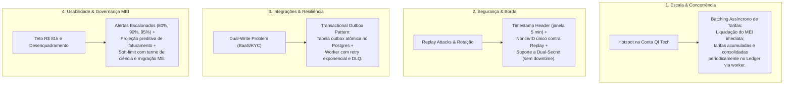

# Roadmap de Evolução Arquitetural & Glossário do Projeto

Este documento consolida as decisões tomadas para os próximos passos de evolução do projeto (**Escala, Segurança, Integrações e Usabilidade**), acompanhadas de um **Glossário Explicativo** dos termos técnicos e financeiros do Core Banking MEI.

---

## 1. Roadmap de Evolução Arquitetural

### 1.1. Escala: Batching Assíncrono de Tarifas
- **Problema**: O modelo atual executa um `SELECT ... FOR UPDATE` ordenado (Dijkstra) na conta da plataforma QI Tech (`QI_TECH_ESCROW_ACCOUNT_KEY`) para debitar/creditar a tarifa de cada transação (PIX R$ 0,90, Boleto R$ 2,50). Em alto volume, milhares de transações concorrentes tentam travar a **mesma linha do banco de dados**, gerando filas de espera e timeouts de conexão no PostgreSQL.
- **Solução**: 
  - A liquidação para o MEI continua ocorrendo em tempo real na conta dele.
  - A tarifa é calculada e armazenada no registro do evento.
  - Um worker assíncrono executa o débito e o crédito consolidado na conta da QI Tech em lotes periódicos (ex: a cada 60 segundos ou a cada $N$ eventos), reduzindo a disputa de lock em até 99%.

### 1.2. Segurança: Proteção contra Replay Attacks & Rotação Dual-Secret
- **Problema**: O endpoint `POST /charges/webhook` valida apenas a assinatura HMAC-SHA256 do payload. Se um atacante interceptar uma requisição legítima na rede, ele pode reenviá-la repetidamente (*Replay Attack*). Além disso, a chave secreta é estática: se vazar ou precisar ser trocada, o sistema precisaria parar para atualizar a variável de ambiente.
- **Solução**:
  - **Timestamp + Tolerância**: O webhook exige o cabeçalho `X-Webhook-Timestamp`. Se a diferença entre a hora atual e o timestamp da mensagem for superior a 5 minutos, a requisição é descartada.
  - **Nonce Único**: O cabeçalho `X-Webhook-Nonce` (UUID único gerado pelo emissor) é armazenado temporariamente em cache/banco. Se o mesmo nonce for visto duas vezes, a requisição é rejeitada.
  - **Dual-Secret (Zero-Downtime Secret Rotation)**: A API aceita validação contra a chave ativa (`WEBHOOK_SECRET_CURRENT`) e contra a chave em fase de desativação (`WEBHOOK_SECRET_PREVIOUS`), permitindo trocar segredos sem perder nenhuma notificação.

### 1.3. Integrações: Transactional Outbox Pattern & Dead-Letter Queue
- **Problema**: O *Dual-Write Problem*. Se o sistema tenta gravar uma transação no banco de dados e, na mesma rota, chamar uma API HTTP externa (ex: notificar o BaaS da QI Tech real ou consultar bureau de KYC), podem ocorrer duas falhas críticas:
  1. O banco grava com sucesso, mas a internet cai antes da chamada externa: o parceiro nunca fica sabendo (evento perdido).
  2. A chamada externa tem sucesso, mas o banco sofre rollback por erro de constraint: o parceiro processou algo que não existe no nosso banco (inconsistência fantasma).
- **Solução**:
  - **Tabela Outbox**: Ao executar qualquer ação que exija notificação externa, inserimos um registro na tabela `outbox_events` **dentro da mesma transação atômica** (`BEGIN ... COMMIT`) do banco.
  - **Worker com Retries e DLQ**: Um processo em segundo plano lê a tabela `outbox_events`, envia a requisição HTTP para o parceiro externo com retries exponenciais (1s, 2s, 4s, 8s...) e, se falhar definitivamente (ex: 5 tentativas), move o evento para uma fila de erro (*Dead-Letter Queue - DLQ*) para análise humana sem interromper a API.

### 1.4. Usabilidade: Governança do Teto MEI e Desenquadramento Fiscal
- **Problema**: O MEI possui um teto anual de faturamento de R$ 81.000,00 (Lei Complementar 123/2006). Se o sistema simplesmente bloquear a emissão de cobranças no momento em que ele atinge R$ 81.000,00, o cliente é pego de surpresa e perde vendas. Se não alertar, ele ultrapassa o limite e sofre desenquadramento compulsório pela Receita Federal, tendo que pagar impostos retroativos de Microempresa (ME) acrescidos de multas e juros.
- **Solução**:
  - **Alertas Escalonados**: Notificações ativas ao atingir 80% (R$ 64.800), 90% (R$ 72.900) e 95% (R$ 76.950) do faturamento anual.
  - **Projeção Preditiva**: O sistema calcula a média de vendas diárias e projeta em quantos dias o MEI atingirá o teto.
  - **Transição Assistida e Soft-Limit**: Orientação no app para migração para ME e opção de emitir termo de ciência com a contabilidade, permitindo que ele continue vendendo caso já esteja em processo de alteração cadastral.

---

## 2. Glossário Explicativo do Projeto

### Termos Financeiros e Contábeis

| Termo | Significado no Projeto |
| :--- | :--- |
| **Partidas Dobradas (Double-Entry Ledger)** | Princípio contábil onde **não existe criação de dinheiro do nada**: para todo débito (saída de valor), deve haver exatamente um crédito (entrada de valor) correspondente, e a soma algébrica de cada transação é sempre rigorosamente **zero**. |
| **Centavos Inteiros (`BIGINT`)** | Nunca utilizar números com ponto flutuante (`float`/`double`) para dinheiro (pois computadores sofrem com imprecisões decimais como `0.1 + 0.2 = 0.30000000000000004`). R$ 10,50 é armazenado no banco como o número inteiro `1050`. |
| **Twin Accounts (Contas Gêmeas PF e PJ)** | Arquitetura que vincula o mesmo empreendedor a duas contas distintas: a conta Pessoa Física (CPF) e a conta da empresa (CNPJ/MEI). Essencial para evitar a confusão patrimonial e garantir conformidade fiscal. |
| **Pockets (Caixinhas de Governança)** | Subdivisões do saldo da conta PJ com finalidades específicas: reserva para imposto mensal (DAS), capital de giro ou garantia de empréstimo. O dinheiro na caixinha fica protegido e não pode ser gasto em transferências comuns sem desbloqueio. |
| **Trava de Recebíveis (Fumaça)** | Mecanismo de garantia em operações de crédito: uma porcentagem dos recebimentos futuros de PIX e boleto do MEI é retida automaticamente no momento da liquidação e destinada para uma caixinha de amortização do empréstimo. |
| **MED (Mecanismo Especial de Devolução)** | Norma do Banco Central (Resolução BCB 103/2021) para o PIX. Permite que o saldo da conta recebedora seja cautelarmente bloqueado (`blocked_balance`) caso haja denúncia fundada de fraude ou golpe, impedindo o saque dos recursos até a apuração. |
| **CDB com CDI Diário** | Certificado de Depósito Bancário. O dinheiro que sobra na conta de tesouraria rende diariamente uma taxa proporcional ao CDI (Certificado de Depósito Interbancário), aumentando o saldo sem risco de crédito para o cliente. |

---

### Termos de Engenharia de Software e Banco de Dados

| Termo | Significado no Projeto |
| :--- | :--- |
| **Lock de Dijkstra (`SELECT ... FOR UPDATE`)** | Técnica para evitar travamento mútuo (*Deadlock*). Quando duas contas transferem dinheiro entre si simultaneamente (Conta A $\rightarrow$ B e B $\rightarrow$ A), se cada uma travar a sua primeira conta, o sistema congela para sempre. A regra de Dijkstra obriga o sistema a sempre adquirir a trava na conta de **menor ID primeiro**, eliminando a possibilidade de deadlock circular. |
| **Hotspot de Concorrência** | Situação em que dezenas ou centenas de requisições simultâneas tentam alterar exatamente o mesmo registro no banco de dados. Como o banco precisa colocar uma trava de exclusividade nessa linha, todas as outras requisições são forçadas a esperar em fila indiana, gerando lentidão extrema. |
| **Idempotência (`idempotency_key`)** | Propriedade que garante que realizar a mesma operação várias vezes produz exatamente o mesmo resultado que realizá-la uma única vez. Se o MEI estiver com internet oscilando e clicar 3 vezes no botão "Pagar R$ 100", o envio da mesma chave de idempotência assegura que o dinheiro só saia da conta uma única vez. |
| **HMAC-SHA256 (Hash-based Message Authentication Code)** | Código de autenticação criptográfica que garante que a mensagem recebida de um webhook foi realmente gerada pelo parceiro bancário e que o conteúdo não foi adulterado durante o caminho. |
| **Replay Attack (Ataque de Repetição)** | Ataque em que uma mensagem legítima (ex: um webhook avisando que uma fatura de R$ 500 foi paga) é capturada por um invasor e reenviada várias vezes para o servidor, com o intuito de fazer o sistema creditar os R$ 500 repetidamente. |
| **Nonce (Number used ONCE)** | Identificador exclusivo gerado para uma única requisição. Uma vez que o servidor processa esse identificador, qualquer outra requisição que chegue com o mesmo número é sumariamente rejeitada. |
| **Dual-Write Problem** | O erro arquitetural de tentar salvar em um banco de dados e chamar um serviço externo na mesma requisição HTTP sem garantia transacional distribuída. |
| **Dead-Letter Queue (DLQ)** | "Fila de mensagens mortas": uma área segura onde o sistema guarda eventos ou mensagens que falharam repetidamente após todas as tentativas automáticas de reenvio, permitindo que os engenheiros inspecionem o erro sem travar a fila principal. |
| **Append-Only** | Estrutura de dados onde informações nunca são apagadas nem alteradas (`UPDATE` ou `DELETE`). Novos eventos são sempre adicionados ao final (`INSERT`). Vital para trilhas de auditoria, histórico de status e segurança contábil. |
