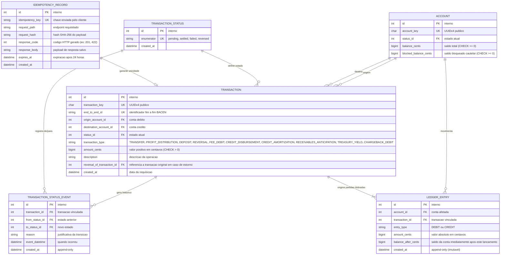
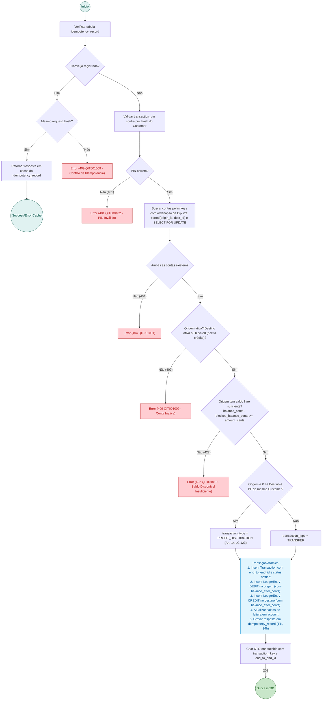
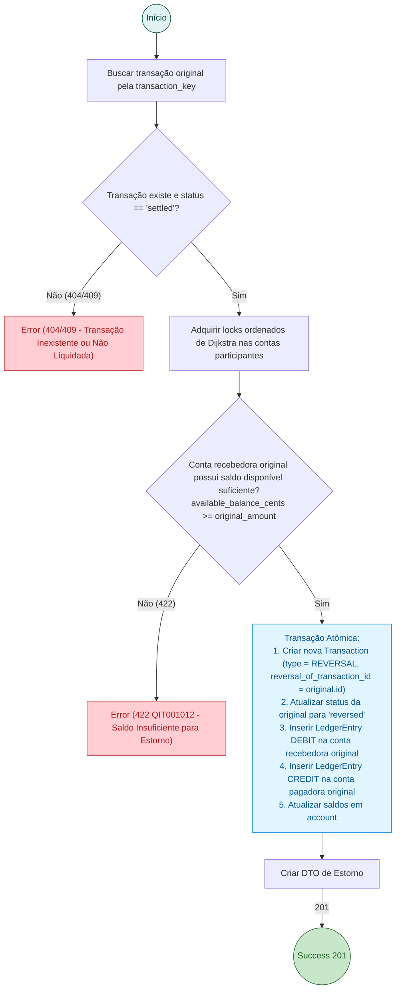

# RFC 02 — Core Transactions: Motor Financeiro, Ledger de Partidas Dobradas e Idempotência

| | |
|---|---|
| **Status** | **Aprovada (Pronta para Especificação)** |
| **Time** | João Pedro Calsavara |
| **Data** | 19/09/2026 |
| **Versão** | 3 (Incorporando decisões de Grilling, Idempotência com TTL, Estornos e LC 123/2006) |

---

## Contextualização

### Entendendo o problema

No núcleo de um sistema bancário, as transferências financeiras precisam cumprir requisitos inegociáveis de engenharia financeira, segurança e conformidade regulatória:
1. **Precisão Contábil e Auditoria Forense**: O saldo nunca é uma coluna mutável sem lastro. Toda movimentação deve ser lastreada por um livro-razão (*ledger*) de partidas dobradas (*double-entry*), onde a soma algébrica de débitos e créditos de qualquer transação é rigorosamente zero.
2. **Prevenção de Deadlocks sob Alta Concorrência**: Transferências simultâneas e cruzadas entre contas no mesmo milissegundo adquirem locks de linha em ordens opostas, causando deadlocks no banco (`40P01`) e derrubando requisições se não houver ordenação determinística.
3. **Idempotência com Tabela Dedicada e TTL**: Retentativas causadas por instabilidades de rede não podem reprocessar pagamentos nem colidir. A idempotência deve ser gerenciada em tabela dedicada (`idempotency_record`) com TTL de 24 horas, gravando tanto respostas de sucesso quanto respostas de erro.
4. **Segurança de Execução (PIN Transacional)**: O token de login (JWT) não é suficiente para transferir fundos; a operação exige a verificação criptográfica do **PIN Transacional de 4 dígitos** do titular.
5. **Classificação Fiscal (Art. 14 da LC 123/2006)**: Transferências da Conta PJ para a Conta PF do mesmo titular representam **Distribuição de Lucros Isenta** e devem ser etiquetadas como tal no ledger para fins contábeis e fiscais do MEI.
6. **Mecânica Estrita de Estornos (`reversed`)**: Estornos geram lançamentos contábeis invertidos e exigem verificação de saldo disponível na conta recebedora. Se a conta de destino não tiver saldo livre suficiente, o estorno falha com erro semântico, impedindo saldo negativo desautorizado.

### Explicando a solução de forma macro

A solução combina seis pilares de engenharia financeira:
- **Ledger Imutável de Partidas Dobradas**: A tabela `ledger_entry` é exclusivamente append-only. Cada transferência insere atomicamente um registro de `DEBIT` na conta de origem e um registro de `CREDIT` na conta de destino, ambos com o mesmo valor em centavos inteiros (`BIGINT`).
- **Hierarquia Global de Locks de Dijkstra**: Antes de adquirir travas de linha via `SELECT FOR UPDATE`, o sistema ordena deterministicamente os identificadores numéricos das contas (`sorted([origin_id, destination_id])`), tornando a espera circular matematicamente impossível.
- **Tabela Dedicada de Idempotência (`idempotency_record`)**: Armazena `idempotency_key`, hash do payload, código de resposta HTTP e corpo de resposta com expiração de 24h. Requisições concorrentes ou retentadas recebem a resposta em cache ou erro de conflito (`409 QIT001008`).
- **Verificação de Saldo Disponível**: A conta de origem só pode transferir valores se `balance_cents - blocked_balance_cents >= amount_cents`.
- **Identificador Fim a Fim Padronizado (`end_to_end_id`)**: Cada transação gera um identificador único de rastreabilidade no padrão do Banco Central.
- **Extrato Contábil Enriquecido**: Cada item do extrato retorna os dados da contraparte (nome e documento), a classificação fiscal (`PROFIT_DISTRIBUTION`, `TRANSFER`, `DEPOSIT`) e o saldo resultante imediatamente após o lançamento (`balance_after_cents`).

### Alternativas Descartadas e Trade-offs

- *Idempotência apenas como coluna na tabela `transaction`* — descartada porque não permitiria cachear falhas de validação nem controlar locks de requisições em voo.
- *Permitir que estornos deixem o saldo negativo (overdraft/cheque especial forçado)* — descartada por compliance bancário e proteção contra inadimplência: o estorno só é liquidado se houver fundos suficientes.
- *Ponto flutuante (`FLOAT`/`DOUBLE`) para valores monetários* — descartada pelos erros de arredondamento inerentes ao padrão IEEE 754.
- *Testes unitários com mocks de transação* — **descartada conforme [ADR-0001](file:///home/jpcalsavara/projetos/andamento/bootcamp-qitech-api/docs/adr/0001-apenas-testes-de-integracao.md)**: concorrência, idempotência e integridade do ledger são testadas exclusivamente através de **testes de integração** reais no PostgreSQL.

---

## Implementação

### Diretriz Obrigatória de Testes
> [!IMPORTANT]
> **Padrão do Projeto: Apenas Testes de Integração (Sem Testes Unitários)**
> Conforme definido no [ADR-0001](file:///home/jpcalsavara/projetos/andamento/bootcamp-qitech-api/docs/adr/0001-apenas-testes-de-integracao.md), todo o motor financeiro deve ser coberto por testes de integração ponta a ponta (`tests/integration/`), testando concorrência real com múltiplas threads/conexões simultâneas no banco de dados.

---

### Rotas

| Método | Caminho | O que faz | Entrada (campos que importam) | Saídas (status e quando) |
|---|---|---|---|---|
| `POST` | `/transactions/transfers` | Executa transferência bilateral atômica, validando PIN e idempotência | `origin_account_key`, `destination_account_key`, `amount_cents`, `description`, `transaction_pin`, cabeçalho `Idempotency-Key` | `201` liquidada com `transaction_key` e `end_to_end_id`; `400` payload inválido (`QIT000001`); `401` PIN transacional inválido (`QIT000402`); `404` conta de origem ou destino não encontrada (`QIT001001`); `409` conflito de idempotência (`QIT001008`) ou conta de origem bloqueada/inativa (`QIT001009`); `422` saldo disponível insuficiente (`QIT001010`) |
| `POST` | `/transactions/{transaction_key}/reversals` | Executa estorno de uma transação liquidada | `reason`, `transaction_pin`, cabeçalho `Idempotency-Key` | `201` estorno liquidado com nova transação de contrapartida; `401` PIN inválido; `404` transação original não encontrada; `409` transação já estornada; `422` conta recebedora original não possui saldo suficiente para suportar o estorno (`QIT001012`) |
| `GET` | `/transactions/{transaction_key}` | Consulta detalhes e status de uma transação específica | `transaction_key` no caminho | `200` detalhes da transação, contas envolvidas, valor, tipo fiscal e status; `404` transação não encontrada |
| `GET` | `/accounts/{account_key}/statement` | Emite o extrato de lançamentos contábeis enriquecido | `account_key` no caminho, `limit`, `page`, `start_date`, `end_date` | `200` extrato paginado contendo: contraparte (nome/documento), tipo fiscal (`PROFIT_DISTRIBUTION`, `TRANSFER`, etc.), valor, data e `balance_after_cents`; `404` conta não encontrada (`QIT001001`) |

---

### Banco de Dados (Diagrama ER)

---

### Desenho de Fluxo da Rota (As Seis Perguntas Respondidas no Desenho)

#### POST /transactions — Execução de Transferência, Validação de PIN e Partidas Dobradas

#### POST /transactions/{transaction_key}/reversals — Estorno Contábil com Verificação de Saldo

---

## Principal Desafio

- **Qual é:** Concorrência extrema sem Deadlocks, gestão completa de idempotência resiliente a falhas e consistência fiscal/contábil estrita entre as contas de pessoa jurídica e física do MEI.
- **Como o desenho resolve:** Ordenação de Dijkstra (1965) no `SELECT FOR UPDATE`, tabela desacoplada de idempotência com TTL, classificação automática de lucros isentos (LC 123/2006) e validação de saldo livre antes de estornos para evitar saldo negativo forçado.
