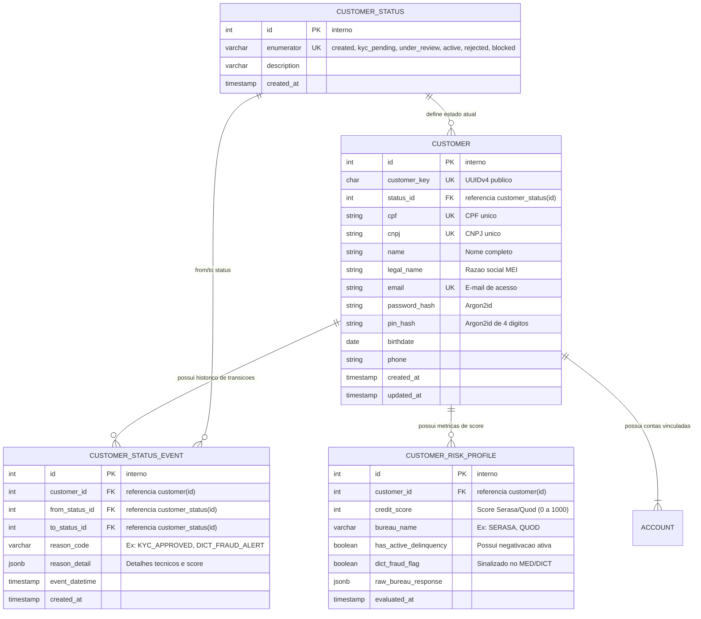
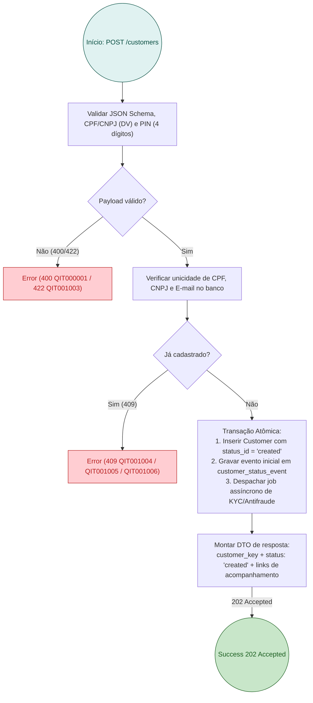
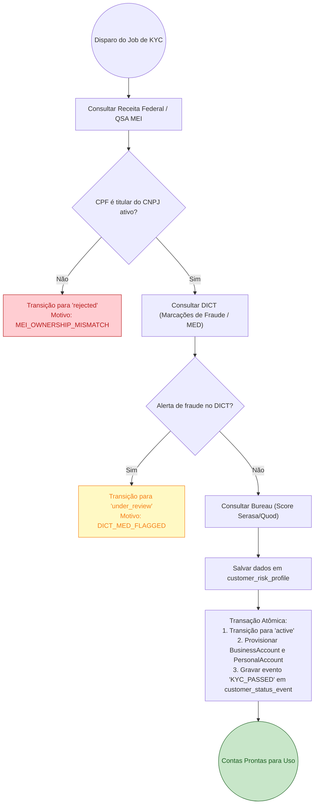

# RFC 03 — Onboarding Seguro, Antifraude, Validação Cadastral e Máquina de Estados do Customer

| | |
|---|---|
| **Status** | **Proposta** |
| **Time** | Core Banking & Compliance |
| **Data** | 21/09/2026 |
| **Versão** | 1.0 |

---

## Contextualização

### Entendendo o problema

No Brasil, abrir uma conta bancária para um Microempreendedor Individual (MEI) traz um vetor crítico de risco de fraude de identidade, sequestro de dados e uso de "contas laranjas" (*money mules*). Como o MEI compartilha o mesmo CPF para o titular e o CNPJ, criminosos frequentemente utilizam dados vazados para abrir contas fraudulentas, receber recursos de golpes (PIX do golpe do falso parente, compras fraudulentas) e esvaziar os fundos antes de qualquer bloqueio.

Além disso, a regulamentação do Banco Central do Brasil (Resoluções BCB nº 96/2021, nº 103/2021 e Circular 3.978 de PLD/FT) impõe obrigações rígidas de **KYC (Know Your Customer)** e monitoramento de fraude, ao mesmo tempo em que **veda a recusa discriminatória** de abertura de conta de pagamento transacional apenas por histórico de negativação civil ou Score de Crédito baixo no Serasa/SPC. 

Portanto, o sistema precisa:
1. Validar rigorosamente a identidade civil e empresarial antes de ativar a conta (Receita Federal, DICT e Antifraude);
2. Consultar o Score de Crédito para enriquecimento do perfil de risco e limites de crédito, sem barrar indevidamente a bancarização transacional;
3. Eliminar campos booleanos estáticos (`is_active: bool`) e implementar uma máquina de estados auditável com tabela de domínio e histórico *append-only*, em estrita conformidade com o [ADR-0007](file:///home/jpcalsavara/projetos/andamento/bootcamp-qitech-api/docs/adr/0007-estados-tabela-dominio-historico-append-only.md).

### Explicando a solução de forma macro

A solução redefine o fluxo de cadastro do `Customer` para um processo orientado a eventos assíncronos e estados auditáveis:
1. Ao receber a chamada `POST /customers`, o sistema valida os formatos de CPF, CNPJ e credenciais, inserindo o `Customer` no estado inicial `created`.
2. O sistema dispara a esteira de validações cadastrais e antifraude:
   - **Receita Federal / QSA**: Confirmação se o CPF é realmente o responsável legal pelo CNPJ do MEI e se ambos estão com situação cadastral `ATIVA`/`REGULAR`.
   - **DICT (Banco Central)**: Verificação de existência de chaves PIX em outros bancos e consulta a marcações ativas de fraude no MED (Mecanismo Especial de Devolução).
   - **Consulta de Score e Bureau (Serasa/Quod)**: Obtenção do score de crédito e restrições financeiras, armazenados no perfil de risco para subsidiar as esteiras de crédito futuro (CCB e Antecipação), sem impedir a abertura da conta.
3. Se todas as checagens forem bem-sucedidas, o status transita para `active` e as contas vinculadas (`BusinessAccount` e `PersonalAccount`) são provisionadas e liberadas para transacionar.
4. Se houver divergências leves ou necessidade de documentoscopia/biometria adicional, o cliente passa para `under_review`.
5. Se for constatada fraude, óbito do titular ou CPF/CNPJ baixado/cancelado, o cadastro transita para `rejected`.
6. Toda e qualquer alteração de estado é gravada de forma imutável na tabela `customer_status_event`, contendo `from_status_id`, `to_status_id`, `reason_code`, `reason_detail` (JSONB com score e metadados) e `event_datetime`.

### Alternativas Descartadas e Trade-offs

- *Bloquear a abertura da conta se o Score no Serasa for inferior a 400 pontos* — descartada porque a regulamentação do BACEN veda negar abertura de conta de pagamento simples exclusivamente por negativação civil, e o MEI negativado é um dos perfis que mais necessita de ferramentas de organização financeira para voltar a faturar. Ganharia apenas em instituições financeiras cujo único produto fosse empréstimo arriscado sem garantias.
- *Executar todas as validações externas de bureaus de forma síncrona dentro da requisição HTTP do `POST /customers`* — descartada pela fragilidade e alta latência dos serviços de bureaus externos (que frequentemente levam de 3 a 15 segundos ou entram em indisponibilidade), gerando timeouts na API. Ganharia apenas em protótipos locais ou MVPs descartáveis.
- *Manter apenas uma coluna `VARCHAR status` na tabela `customer`* — descartada conforme [ADR-0007](file:///home/jpcalsavara/projetos/andamento/bootcamp-qitech-api/docs/adr/0007-estados-tabela-dominio-historico-append-only.md), pois não garante integridade referencial nativa e apaga o histórico de transições necessário para auditoria regulatória do Banco Central.

---

## Implementação

### Diretriz Obrigatória de Testes
> [!IMPORTANT]
> **Padrão do Projeto: Apenas Testes de Integração (Sem Testes Unitários)**
> Conforme o [ADR-0001](file:///home/jpcalsavara/projetos/andamento/bootcamp-qitech-api/docs/adr/0001-apenas-testes-de-integracao.md), todo teste deve residir em `tests/integration/`, exercitando os endpoints FastAPI via `TestClient` e verificando o estado persistido no PostgreSQL real.

---

### Rotas Propostas

| Método | Caminho | O que faz | Entrada (campos que importam) | Saídas (status e quando) |
|---|---|---|---|---|
| `POST` | `/customers` | Submete cadastro inicial do MEI e inicia esteira de KYC | `name`, `email`, `password`, `transaction_pin`, `cpf`, `cnpj`, `birthdate`, `legal_name`, `phone` | `202 Accepted` com `customer_key` e status `created`; `400` payload inválido ou PIN não numérico (`QIT000001`); `409` CPF/CNPJ/e-mail já existente; `422` formato de CPF/CNPJ inválido |
| `GET` | `/customers/{customer_key}` | Consulta os dados cadastrais e status atual do cliente | `customer_key` no caminho | `200 OK` com status atual (`created`, `kyc_pending`, `under_review`, `active`, `rejected`), dados cadastrais |
| `POST` | `/customers/{customer_key}/kyc/analysis` | Aciona a esteira de análise de risco e bureau via `KycConnector` | `score` (opcional), `risk_tier` (opcional), `cnd_federal_status` (opcional), `flags` (opcional) | `200 OK` transição de status executada (`active`, `under_review`, `rejected`); `404` cliente não encontrado |

### Integração Externa via Conector HTTP (`KycConnector`)
- A comunicação com Bureau de Crédito (Serasa/Boa Vista/BigDataCorp) e Antifraude é isolada em `KycConnector` (herdando de `RestConnector`).
- Em ambiente de produção, o conector consome a API externa via HTTP de saída (`egress-only`), sem necessidade de portas abertas ou webhooks de parceiros para o cadastro básico.
- Em ambientes `local` e `test` (com `MOCK_EXTERNAL_SERVICES=true` ou ausência de URL externa), o conector simula respostas determinísticas baseadas no documento do cliente, garantindo testes reproduzíveis e rápidos.

---

### Banco de Dados (Diagrama ER)

---

### Desenho de Fluxo da Rota `POST /customers`

---

### Desenho de Fluxo da Validação Assíncrona e Ativação de Contas

---

## Principal Desafio

- **Qual é:** Concorrência e idempotência nas transições de estado do cliente sob múltiplas fontes de webhook externas assíncronas (Receita Federal, Bureau Serasa, DICT).
- **Por que é difícil:** Respostas de parceiros externos podem chegar fora de ordem ou duplicadas. Uma aprovação de score não pode sobrescrever uma recusa sumária por fraude já registrada por outro conector, sob risco de abrir contas ativas para fraudadores.
- **Como o desenho resolve:** Aplicação da máquina de estados governada centralizadamente no `Controller` com lock pessimista (`SELECT FOR UPDATE`) no registro de `Customer`. Transições a partir de estados terminais (`rejected` ou `blocked`) são estritamente rejeitadas, e qualquer atualização requer validação contra a matriz de transições permitidas gravando o histórico em `customer_status_event`.
