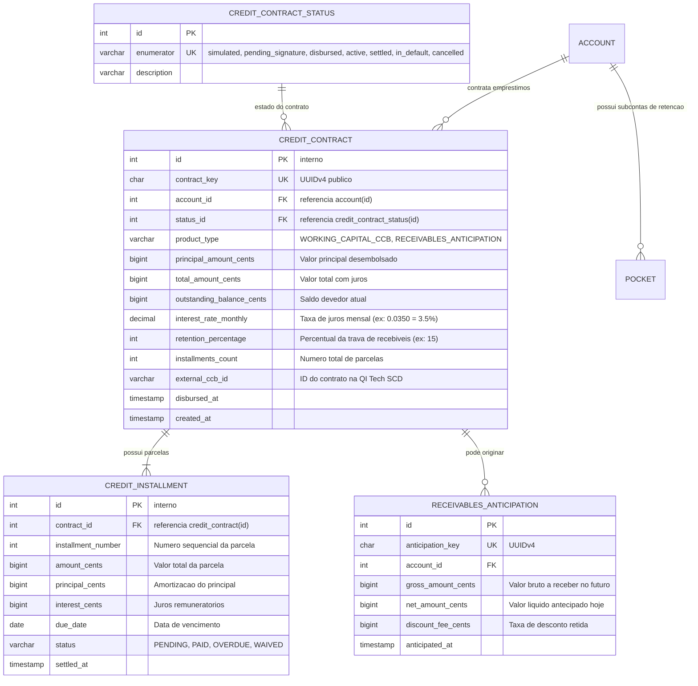
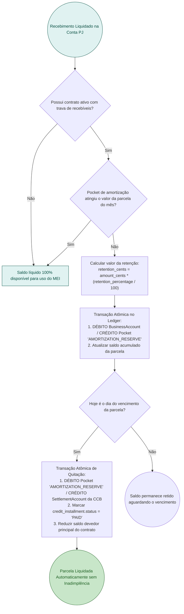
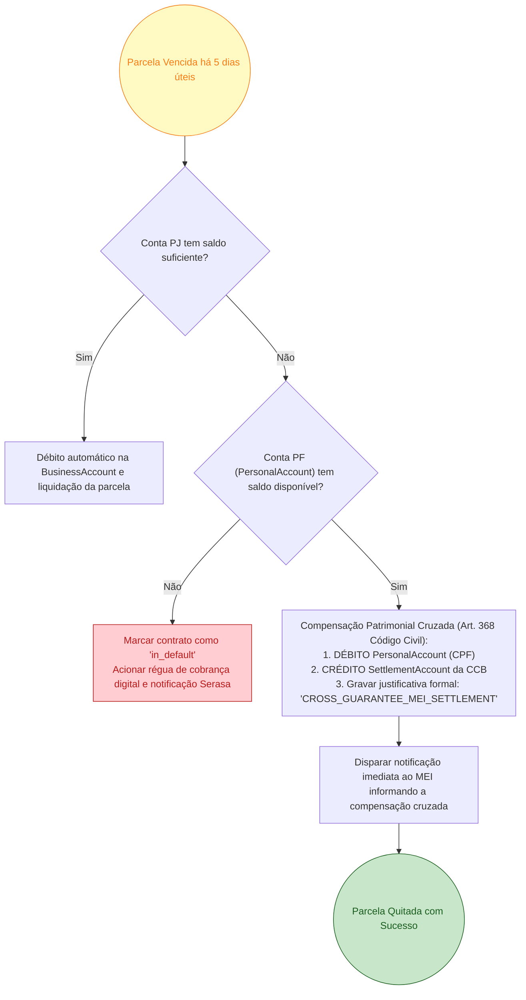

# RFC 05 — Linhas de Crédito MEI: Antecipação de Recebíveis e Capital de Giro (CCB) com Trava Dinâmica

| | |
|---|---|
| **Status** | **Proposta** |
| **Time** | Core Banking & Crédito |
| **Data** | 21/09/2026 |
| **Versão** | 1.0 |

---

## Contextualização

### Entendendo o problema

O Microempreendedor Individual (MEI) enfrenta uma das maiores barreiras do sistema financeiro nacional: a falta de acesso a crédito acessível. Grandes bancos tradicionais exigem garantias reais pesadas ou cobram juros extorsivos (chegando a ultrapassar 12% a 15% ao mês em cheque especial ou cartão PJ) pela falta de visibilidade do faturamento real do MEI.

Ao mesmo tempo, para a fintech, emprestar dinheiro para MEIs sem uma estrutura adequada de garantias e travas acarreta índices de inadimplência proibitivos (frequentemente superiores a 20% no crédito fumaça tradicional).

Para viabilizar uma carteira de crédito sustentável, rentável e segura para ambas as partes, a arquitetura do CoreBank MEI precisa:
1. Oferecer **Antecipação de Recebíveis** imediata sobre vendas a prazo com colateral garantido pelo próprio fluxo de liquidação futura;
2. Estruturar **Cédulas de Crédito Bancário (CCBs)** de Capital de Giro através da infraestrutura de BaaS da QI Tech SCD;
3. Mitigar o risco de inadimplência através de uma **Trava de Recebíveis Dinâmica**: retenção automática e contínua de uma fração percentual (ex: 15%) de cada venda (PIX/Boleto/Cartão) em um subenvelope (`Pocket`) dedicado à amortização da parcela;
4. Executar **Garantia Cruzada Patrimonial PF/PJ**: alavancar o vínculo unificado entre `BusinessAccount` e `PersonalAccount` do mesmo `Customer`, respaldada pela responsabilidade legal ilimitada do MEI perante o Código Civil.

### Explicando a solução de forma macro

A solução estabelece a esteira de crédito do MEI em duas fases complementares:
1. **Antecipação de Recebíveis (`POST /credit/anticipations`)**:
   - O MEI seleciona cobranças ou parcelas futuras de vendas com cartão/boleto ainda a vencer.
   - O sistema calcula a taxa de desconto (ex: 1,99% a 2,49% a.m.) pró-rata pelos dias de antecipação.
   - Na contratação, o valor líquido é creditado imediatamente na `BusinessAccount` com contrapartida na conta de antecipação da instituição. Quando a adquirente liquida a venda original no futuro, o valor quita a operação automaticamente.
2. **Capital de Giro via CCB Digital (`POST /credit/contracts`)**:
   - O motor de crédito consulta o histórico de faturamento consolidado no `RevenueTracker` e o score salvo no `CustomerRiskProfile` da [RFC 03](file:///home/jpcalsavara/projetos/andamento/bootcamp-qitech-api/docs/rfc/rfc-03-onboarding-antifraude-estados.md).
   - Com limite aprovado, a minuta da CCB é emitida via QI Tech SCD com taxa entre 2,89% e 4,5% a.m., parcelada em até 24 meses.
   - O MEI assina eletronicamente com seu `TransactionPin` de 4 dígitos.
   - Os fundos são liberados na `BusinessAccount` em transação de partidas dobradas.
3. **Mecanismo da Trava de Recebíveis Dinâmica (Retenção em Pocket)**:
   - A cada recebimento liquidado na `BusinessAccount`, o sistema desvia atomicamente o percentual pactuado (ex: 15%) para o `Pocket` de código `AMORTIZATION_RESERVE`.
   - Quando o saldo do `Pocket` atinge o valor da parcela vincenda, o split é suspenso. No dia do vencimento, o sistema debita o `Pocket` e liquida a parcela da CCB sem gerar atrito de cobrança manual.
4. **Acionamento de Garantia Cruzada PF/PJ**:
   - Caso o MEI passe do vencimento sem faturamento suficiente na PJ para cobrir a parcela, após 5 dias úteis de tolerância o sistema executa a compensação contábil debitando a `PersonalAccount` vinculada ao mesmo titular.

### Alternativas Descartadas e Trade-offs

- *Empréstimo pessoal tradicional sem garantia nem retenção no fluxo de caixa (Crédito Fumaça)* — descartada pelo alto índice de perda por inadimplência em MEIs sem formalidade fiscal. Ganharia apenas em cenários com taxas de juros abusivas que desvirtuam a proposta de valor do produto.
- *Exigir registro formal de trava de domicílio em registradora autorizada (CERC/B3) para todas as operações* — descartada para microantecipações de baixo valor devido ao custo fixo regulatório de registro por contrato cobrado pelas registradoras. O registro em registradora é reservado apenas para CCBs de valores mais elevados (> R$ 10.000,00).
- *Executar cobrança forçada na PersonalAccount imediatamente no primeiro minuto de atraso* — descartada para evitar atrito desnecessário e litígios; o modelo adota régua de notificação transparente e janela de tolerância de 5 dias úteis antes da compensação cruzada.

---

## Implementação

### Diretriz Obrigatória de Testes
> [!IMPORTANT]
> **Padrão do Projeto: Apenas Testes de Integração (Sem Testes Unitários)**
> Conforme o [ADR-0001](file:///home/jpcalsavara/projetos/andamento/bootcamp-qitech-api/docs/adr/0001-apenas-testes-de-integracao.md), todos os fluxos de cálculo de juros, amortização em pocket, retenção automática e compensação cruzada devem ser validados exclusivamente via testes de integração ponta a ponta com banco real.

---

### Rotas Propostas

| Método | Caminho | O que faz | Entrada (campos que importam) | Saídas (status e quando) |
|---|---|---|---|---|
| `POST` | `/credit/simulations` | Simula parcelas, juros e margem para CCB ou antecipação | `account_key`, `product_type` (`WORKING_CAPITAL_CCB`, `RECEIVABLES_ANTICIPATION`), `requested_amount_cents`, `installments` | `200 OK` com simulação detalhada (CET, taxa mensal, valor da parcela, % de trava sugerido); `400` valor fora das faixas permitidas |
| `POST` | `/credit/contracts` | Formaliza e contrata CCB de Capital de Giro | `account_key`, `simulation_id`, `transaction_pin`, cabeçalho `Idempotency-Key` | `201 Created` com `contract_key`, link do instrumento da CCB e status `disbursed`; `401` PIN incorreto; `409` proposta expirada |
| `POST` | `/credit/anticipations` | Contrata antecipação de recebíveis futuros de vendas | `account_key`, `charge_keys` (lista de cobranças a antecipar), `transaction_pin` | `201 Created` com `anticipation_key`, valor líquido creditado e taxas retidas; `422` cobrança inelegível |
| `GET` | `/credit/contracts/{contract_key}` | Consulta contrato de crédito, parcelas e saldo devedor | `contract_key` no caminho | `200 OK` detalhes do contrato, parcelas pagas, parcelas em aberto e saldo acumulado no Pocket de amortização |
| `POST` | `/credit/contracts/{contract_key}/repay` | Realiza amortização extraordinária ou quitação antecipada | `contract_key`, `amount_cents`, `transaction_pin` | `200 OK` quitação processada com desconto proporcional de juros futuros |

---

### Banco de Dados (Diagrama ER)

---

### Desenho de Fluxo da Trava Dinâmica de Recebíveis e Amortização em Pocket

---

### Desenho de Fluxo da Garantia Cruzada PF/PJ em Atraso

---

## Principal Desafio

- **Qual é:** Conciliação determinística da trava de recebíveis concorrente com movimentações operacionais do MEI, garantindo que o split nunca bloqueie mais recursos do que o estritamente contratado para a parcela do mês.
- **Por que é difícil:** Se o MEI recebe dezenas de transações PIX e boletos em curto intervalo de tempo em horário de pico, múltiplas transações concorrentes tentam calcular e debitar para o `Pocket`. Sem controle adequado de contenção, o `Pocket` poderia acumular mais do que o valor da parcela ou gerar contenção severa de locks de linha.
- **Como o desenho resolve:** Utilização de lock pessimista na linha do `Pocket` e verificação do teto da parcela dentro da mesma transação de liquidação da cobrança com ordenação de Dijkstra ([ADR-0002](file:///home/jpcalsavara/projetos/andamento/bootcamp-qitech-api/docs/adr/0002-prevencao-deadlock-ordenacao-dijkstra.md)), garantindo que a soma acumulada nunca exceda a meta da parcela.
