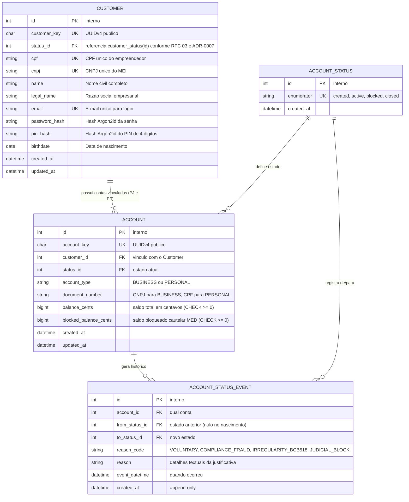
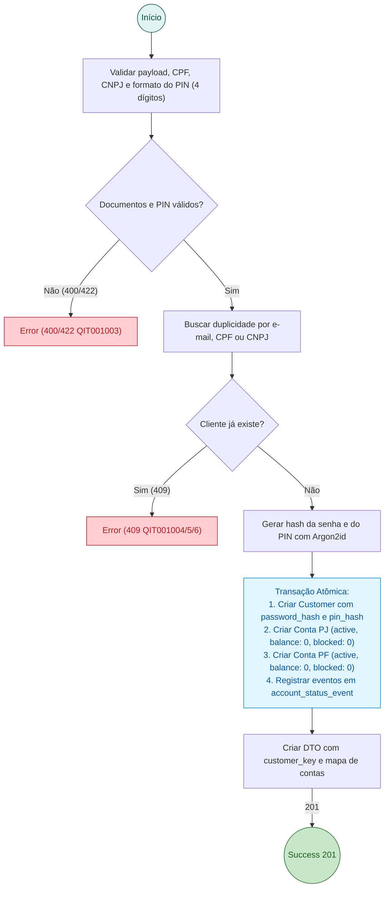
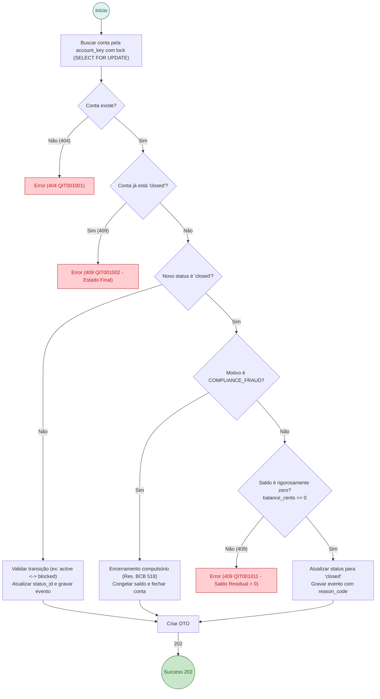

# RFC 01 — Core Identity: Clientes (Customers) e Contas Vinculadas (PF e PJ)

| | |
|---|---|
| **Status** | **Aprovada (Pronta para Especificação)** |
| **Time** | João Pedro Calsavara |
| **Data** | 19/09/2026 |
| **Versão** | 3 (Incorporando decisões de Grilling, Resoluções BACEN e LC 123/2006) |

---

## Contextualização

### Entendendo o problema

O Microempreendedor Individual (MEI) é juridicamente um *Empresário Individual (213-5)*: perante o direito civil, a pessoa física (CPF) e a pessoa jurídica (CNPJ) são a mesma pessoa natural, mas perante as obrigações fiscais e o Banco Central, a operação financeira da empresa não pode se misturar com a vida pessoal.

Além da separação patrimonial, a operação bancária do MEI precisa obedecer às normas estritas do Banco Central:
1. **Segurança de Transações e Prevenção a Furto de Sessão**: A autenticação no app (login) deve ser segregada da autorização financeira, exigindo um **PIN Transacional (4 dígitos numéricos)** para qualquer movimentação.
2. **Resolução BCB nº 103/2021 (MED e Bloqueio Cautelar)**: O banco deve suportar a segregação entre saldo total e **saldo bloqueado cautelarmente (`blocked_balance_cents`)** para prevenção a fraudes.
3. **Resolução BCB nº 518/2025 (Encerramento Compulsório por "Contas-Bolsão")**: Obrigatoriedade de encerramento unilateral por irregularidades graves ou triangulação ilícita de recursos.
4. **Encerramento de Contas e Saldo Residual**: Não é permitido fechar contas com saldo positivo (`balance_cents > 0`) em encerramentos voluntários.
5. **Injeção de Liquidez (Cash-in)**: Abertura de contas nasce com saldo zero; é necessário um mecanismo de aporte de fundos com contrapartida em conta contábil interna (`SYSTEM_SETTLEMENT`).

### Explicando a solução de forma macro

A solução estabelece o conceito central de **Customer (Cliente MEI)** com **Onboarding Atômico**:
1. O empreendedor realiza uma única chamada em `POST /customers` fornecendo seus dados civis (CPF, nome, data de nascimento), seus dados empresariais (CNPJ, razão social), senha de acesso (`password`) e **PIN Transacional de 4 dígitos** (`transaction_pin`).
2. Em uma única transação atômica no PostgreSQL, o sistema:
   - Cria o registro de `Customer` com os hashes seguros de senha (`password_hash`) e de PIN (`pin_hash`) usando `Argon2id`.
   - Provisiona automaticamente **duas contas correntes interligadas**:
     - **Conta PJ (`BUSINESS`)**: vinculada ao CNPJ, destinada a operações do negócio, vendas, fornecedores e tributos.
     - **Conta PF (`PERSONAL`)**: vinculada ao CPF, destinada a despesas pessoais e recebimento de pró-labore/lucro distribuído.
3. Ambas as contas nascem com saldo zero (`balance_cents = 0`, `blocked_balance_cents = 0`) e status `active`.
4. Rota explícita de **Cash-in** (`POST /accounts/{account_key}/deposits`) credita a conta com contrapartida de débito na conta interna `SYSTEM_SETTLEMENT`, mantendo a soma algébrica do ledger igual a zero.
5. Regras de máquina de estados de conta:
   - `closed`: Exige saldo rigorosamente zero (`balance_cents == 0`). Se `balance_cents > 0`, rejeita com `409 Conflict` (`QIT001011`). Exceção para encerramento compulsório de compliance (`reason_code = COMPLIANCE_FRAUD` ou `IRREGULARITY_BCB518`).
   - `blocked`: Bloqueio unidirecional independente: saídas (`DEBIT`) são bloqueadas, mas entradas (`CREDIT`) permanecem permitidas. O bloqueio da Conta PJ não afeta a Conta PF automaticamente.

### Alternativas Descartadas e Trade-offs

- *Conta única com divisão interna apenas em "fundos/cofrinhos"* — descartada pelos riscos fiscais: a Receita Federal (e-Financeira) reporta créditos em contas CNPJ como faturamento da empresa, arriscando desenquadramento do teto de R$ 81k.
- *Permitir encerramento com saldo positivo varrendo automaticamente para a PF* — descartada porque transferências automáticas sem consentimento expresso geram confusão patrimonial involuntária e litígios.
- *Bloqueio total de crédito em contas com status `blocked`* — descartada conforme práticas do SISBAJUD: contas bloqueadas judicialmente devem aceitar créditos para quitação de execuções, mas travar débitos.
- *Testes unitários com mocks* — **descartada conforme [ADR-0001](file:///home/jpcalsavara/projetos/andamento/bootcamp-qitech-api/docs/adr/0001-apenas-testes-de-integracao.md)**: validações de onboarding, bloqueio cautelar e encerramento de contas são testadas exclusivamente através de **testes de integração ponta a ponta** com banco de dados real.

---

## Implementação

### Diretriz Obrigatória de Testes
> [!IMPORTANT]
> **Padrão do Projeto: Apenas Testes de Integração (Sem Testes Unitários)**
> Conforme o [ADR-0001](file:///home/jpcalsavara/projetos/andamento/bootcamp-qitech-api/docs/adr/0001-apenas-testes-de-integracao.md), todo teste deve residir em `tests/integration/`, exercitando os endpoints FastAPI via `TestClient` e verificando o estado persistido no PostgreSQL.

---

### Rotas

| Método | Caminho | O que faz | Entrada (campos que importam) | Saídas (status e quando) |
|---|---|---|---|---|
| `POST` | `/customers` | Submete cadastro unificado do MEI e inicia esteira de KYC/Antifraude (RFC 03) | `name`, `email`, `password`, `transaction_pin`, `cpf`, `cnpj`, `birthdate`, `legal_name` | `202` aceito com `customer_key` e status `created`; contas provisionadas automaticamente ao atingir status `active`; `400` payload inválido ou PIN não numérico (`QIT000001`); `409` duplicidade (`QIT001004`/`05`/`06`); `422` documento inválido (`QIT001003`) |
| `POST` | `/customers/login` | Autentica o cliente e emite o token JWT de acesso | `email`, `password` | `200` autenticado com `access_token` e resumo das contas do cliente; `401` credenciais inválidas (`QIT000401`) |
| `GET` | `/customers/{customer_key}` | Consulta os dados cadastrais do cliente MEI | `customer_key` no caminho | `200` dados do cliente (CPF, CNPJ, nome, e-mail); `404` cliente não encontrado (`QIT001001`) |
| `GET` | `/customers/{customer_key}/accounts` | Lista as contas vinculadas ao cliente com saldos total, bloqueado e disponível | `customer_key` no caminho | `200` lista contendo a Conta PJ (`BUSINESS`) e a Conta PF (`PERSONAL`); `404` cliente não encontrado |
| `GET` | `/accounts/{account_key}` | Consulta detalhes e saldos de uma conta específica | `account_key` no caminho | `200` detalhes da conta, tipo, status, `balance_cents`, `blocked_balance_cents` e `available_balance_cents`; `404` conta não encontrada |
| `POST` | `/accounts/{account_key}/deposits` | Executa Cash-in (depósito/aporte de liquidez) com contrapartida em conta do sistema | `amount_cents`, `description`, cabeçalho `Idempotency-Key` | `201` liquidado com `deposit_key`; `400` valor <= 0; `404` conta não encontrada; `409` conta inativa ou fechada |
| `PUT` | `/accounts/{account_key}/status` | Altera o estado da conta (ativar, bloquear, encerrar) com código de motivo formal | `status` (`active`, `blocked`, `closed`), `reason_code` (`VOLUNTARY`, `COMPLIANCE_FRAUD`, `IRREGULARITY_BCB518`, `JUDICIAL_BLOCK`), `reason` | `202` transição aceita com `account_key`; `400` status desconhecido; `404` conta não encontrada; `409` saldo > 0 em encerramento voluntário (`QIT001011`) ou transição a partir de status final (`QIT001002`) |
| `PUT` | `/accounts/{account_key}/blocked-balance` | Aplica ou remove bloqueio cautelar de saldo (Resolução BCB nº 103/2021) | `amount_cents`, `operation` (`BLOCK` ou `UNBLOCK`), `reason` | `200` saldo bloqueado atualizado; `400` valor inválido; `422` saldo disponível insuficiente para bloqueio |

---

### Banco de Dados (Diagrama ER)

---

### Desenho de Fluxo da Rota (As Seis Perguntas Respondidas no Desenho)

#### POST /customers — Onboarding do Cliente MEI e Abertura de Contas

#### PUT /accounts/{account_key}/status — Encerramento e Validação de Saldo Residual

---

## Principal Desafio

- **Qual é:** Garantir atomicidade no onboarding conjunto, segurança contra fraudes via PIN transacional independente e conformidade regulatória estrita com as resoluções do BACEN (MED e Resolução 518/2025).
- **Como o desenho resolve:** Inserção em transação única no PostgreSQL com separação de credenciais (senha e PIN), controle nativo de saldo cautelar (`blocked_balance_cents`) e auditoria imutável de transições de conta com códigos de motivo formal.
