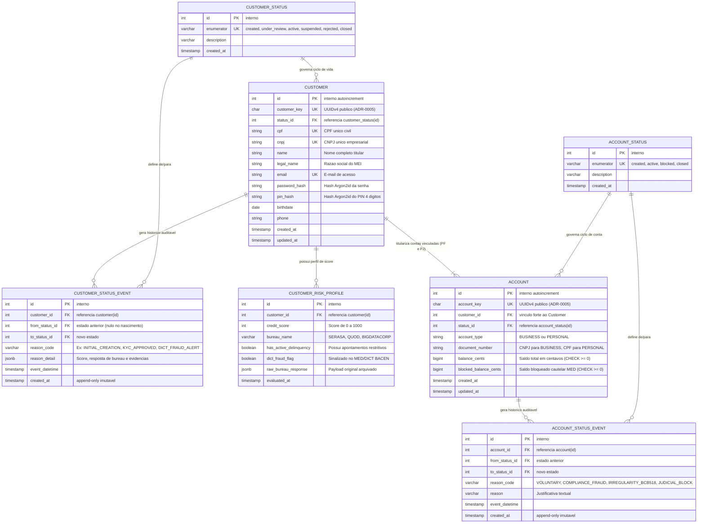
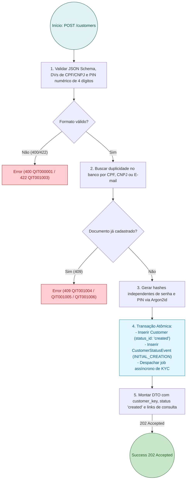
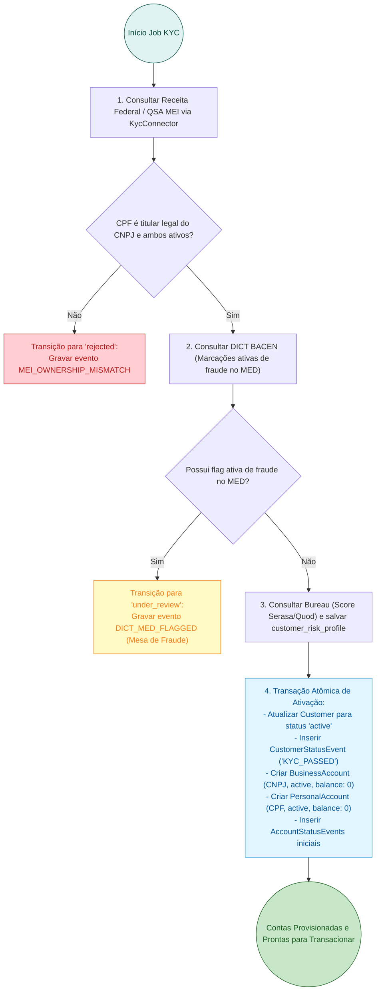
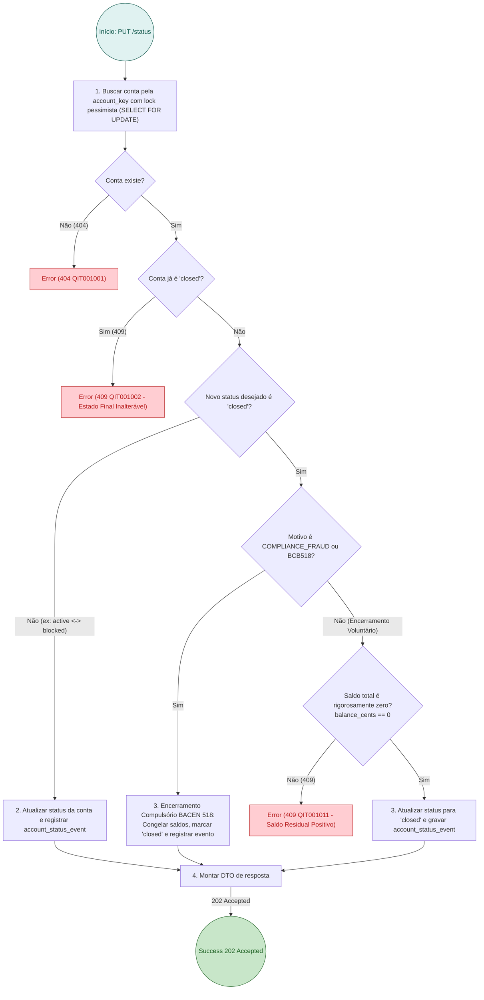

# RFC 01 — Onboarding Seguro, Identidade MEI e Provisionamento de Contas Vinculadas (PF/PJ)

| | |
|---|---|
| **Status** | **Aprovada / Parcialmente Implementada** |
| **Time** | Core Banking, Identidade & Compliance |
| **Data** | 23/09/2026 |
| **Versão** | 1.0 (Consolidação Unificada das RFCs 01 e 03) |

> [!NOTE]
> **Grau de Maturidade e Roadmap**:
> - **Implementado em Código**: Estrutura base de `Customer`, provisionamento atômico de `BusinessAccount` e `PersonalAccount`, hash seguro de senha e PIN transacional (`Argon2id`), identificadores públicos UUIDv4 ([ADR-0005](file:///home/jpcalsavara/projetos/andamento/bootcamp-qitech-api/docs/adr/0005-desacoplamento-identificadores-uuid-publico.md)), controle de saldo cautelar ([Res. BCB 103/2021](file:///home/jpcalsavara/projetos/andamento/bootcamp-qitech-api/docs/adr/0007-estados-tabela-dominio-historico-append-only.md)) e cash-in com contrapartida contábil.
> - **Roadmap / Em Refinamento**: Esteira assíncrona de KYC via conector de bureau/antifraude (`KycConnector`), consolidação da tabela `customer_risk_profile` e disparo de notificações regulatórias do MED/DICT.

---

## Contextualização

### Entendendo o problema

O Microempreendedor Individual (MEI) é juridicamente um *Empresário Individual (natureza jurídica 213-5)*: perante o direito civil, a pessoa física (CPF) e a pessoa jurídica (CNPJ) respondem com o mesmo patrimônio pessoal ilimitado. Todavia, sob a ótica fiscal da Receita Federal (e-Financeira e LC 123/2006) e das normas do Banco Central do Brasil, a movimentação da empresa deve ser mantida rigorosamente apartada da vida doméstica para viabilizar a apuração correta do faturamento e evitar autuações fiscais.

Simultaneamente, o processo de abertura de contas no ecossistema MEI enfrenta desafios regulatórios e de segurança críticos:
1. **Vulnerabilidade a Fraudes de Identidade e Contas-Laranja (*Money Mules*)**: Criminosos usam frequentemente dados vazados de MEIs para abrir contas fraudulentas, receber recursos de golpes (ex: golpe do falso parente ou fraude de boleto) e esvaziar os fundos antes de qualquer contenção.
2. **Conformidade Regulatória Rigorosa do BACEN**: As Resoluções BCB nº 96/2021, nº 103/2021 (MED e Bloqueio Cautelar) e Circular 3.978 de PLD/FT impõem identificação civil precisa, checagens no DICT e acompanhamento de alertas de fraude, além do encerramento compulsório unilateral por irregularidades graves ou triangulação ilícita (Resolução BCB nº 518/2025).
3. **Vedação a Recusa Discriminatória Transacional**: O Banco Central veda expressamente a negativa de abertura de conta de pagamento simples apenas por histórico de negativação civil ou Score de Crédito baixo no Serasa/SPC. O score deve enriquecer o perfil de risco do cliente, mas não impedir a bancarização transacional.
4. **Segregação de Credenciais**: Para evitar fraudes por invasão de sessão web/mobile, a autenticação no sistema (`password`) deve ser estritamente segregada da autorização financeira, exigindo um **PIN Transacional de 4 dígitos numéricos** (`transaction_pin`).
5. **Auditoria de Estados e Ciclo de Vida**: Booleans estáticos (`is_active: bool`) apagam o histórico forense e violam a conformidade do BACEN. É mandatório adotar tabelas de domínio e histórico *append-only* ([ADR-0007](file:///home/jpcalsavara/projetos/andamento/bootcamp-qitech-api/docs/adr/0007-estados-tabela-dominio-historico-append-only.md)).

### Explicando a solução de forma macro

A solução estabelece o ciclo de vida completo de identidade do **Customer (MEI)** integrando onboarding seguro, validação assíncrona de compliance e provisionamento atômico de contas:

1. **Submissão de Cadastro (`POST /customers`)**:
   - O empreendedor informa seus dados civis (CPF, nome, nascimento, e-mail, telefone), empresariais (CNPJ, razão social) e credenciais segregadas (`password` e `transaction_pin`).
   - O sistema valida formatos, calcula hashes criptográficos independentes usando `Argon2id` e insere o `Customer` no estado inicial `created`.
2. **Esteira de Validação Assíncrona e Antifraude (KYC)**:
   - **Receita Federal / QSA MEI**: Confirma se o CPF cadastrado é o responsável legal e titular exclusivo do CNPJ, ambos em situação cadastral `ATIVA`/`REGULAR`.
   - **DICT (Banco Central)**: Consulta a existência de chaves PIX e histórico de notificações ativas de infração no MED (Mecanismo Especial de Devolução).
   - **Consulta de Bureaus (Serasa / Quod)**: Coleta do score de crédito e restrições financeiras, armazenados na tabela `customer_risk_profile` para subsidiar futuras concessões de crédito (CCB e Antecipação), sem travar a abertura transacional.
3. **Máquina de Estados Auditável do Customer ([ADR-0007](file:///home/jpcalsavara/projetos/andamento/bootcamp-qitech-api/docs/adr/0007-estados-tabela-dominio-historico-append-only.md))**:
   - Transições de estado controladas (`created` -> `under_review` -> `active` / `rejected` / `blocked`).
   - Toda mudança gera um registro imutável em `customer_status_event` com carimbo de tempo, motivo formal e detalhes técnicos (JSONB).
4. **Provisionamento Atômico de Contas Vinculadas**:
   - Assim que o cadastro transita para `active`, o sistema cria atomicamente duas contas correntes vinculadas com UUID público ([ADR-0005](file:///home/jpcalsavara/projetos/andamento/bootcamp-qitech-api/docs/adr/0005-desacoplamento-identificadores-uuid-publico.md)):
     - **Conta PJ (`BUSINESS`)**: vinculada ao CNPJ, para movimentações comerciais, liquidações de vendas e recolhimento do DAS-MEI.
     - **Conta PF (`PERSONAL`)**: vinculada ao CPF, para despesas domésticas e recebimento de pró-labore/lucros distribuídos.
   - Ambas iniciam com status `active` e saldo zero (`balance_cents = 0`, `blocked_balance_cents = 0`).
5. **Governança de Saldo e Encerramento de Contas**:
   - **Bloqueio Cautelar MED**: Parcela do saldo retida cautelarmente (`blocked_balance_cents`) impede retiradas sem travar recebimentos de novos créditos.
   - **Encerramento de Contas (`PUT /accounts/{account_key}/status`)**: Encerramento voluntário exige saldo rigorosamente zero (`balance_cents == 0`); encerramento compulsório de compliance ([Res. BCB 518/2025](file:///home/jpcalsavara/projetos/andamento/bootcamp-qitech-api/docs/adr/0007-estados-tabela-dominio-historico-append-only.md)) congela fundos e encerra unilateralmente por ordem regulatória.
6. **Injeção de Liquidez (Cash-in)**:
   - Depósito inicial via `POST /transactions/cash-in` credita a conta com contrapartida de débito na conta contábil interna `SYSTEM_SETTLEMENT`, mantendo o balanço contábil zerado ([ADR-0004](file:///home/jpcalsavara/projetos/andamento/bootcamp-qitech-api/docs/adr/0004-arquitetura-contabil-partidas-dobradas.md)).

### Alternativas Descartadas e Trade-offs

- *Conta bancária única com separação visual de saldo via tags no app* — descartada pelo risco fiscal: todo crédito em conta CNPJ entra no radar da e-Financeira da Receita Federal, distorcendo o cálculo do faturamento anual e gerando risco de desenquadramento compulsório do Simples Nacional. Ganharia em simplicidade de banco de dados, mas geraria problemas jurídicos insolúveis ao MEI.
- *Rejeitar cadastro de conta de pagamento transacional se o Score no Serasa for inferior a 400 pontos* — descartada porque o Banco Central proíbe a recusa arbitrária de conta corrente simples por negativação de crédito civil. A recusa deve ocorrer apenas por fraude cadastral, inconsistência grave na Receita ou alertas do DICT/MED.
- *Executar validações síncronas de bureaus e Receita Federal bloqueando o endpoint HTTP `POST /customers`* — descartada pela instabilidade e latência das APIs externas públicas e privadas (frequentemente entre 3s e 15s com quedas periódicas). O processamento assíncrono com resposta imediata `202 Accepted` garante resiliência e alta disponibilidade da API.
- *Varredura automática de saldo remanescente da Conta PJ para a Conta PF no encerramento voluntário* — descartada porque transferência sem consentimento explícito confunde patrimônios no encerramento e gera litígios sobre comprovação de destinação de recursos remanescentes. O encerramento exige zeramento prévio e consciente dos saldos pelo cliente.
- *Uso de coluna `VARCHAR status` mutável sem tabela de domínio* — **descartada conforme [ADR-0007](file:///home/jpcalsavara/projetos/andamento/bootcamp-qitech-api/docs/adr/0007-estados-tabela-dominio-historico-append-only.md)**: perde integridade referencial, permite escrita de strings arbitrárias e destrói o histórico de transições necessário em auditorias forenses do BACEN.

---

## Implementação

### Diretriz Obrigatória de Testes
> [!IMPORTANT]
> **Padrão do Projeto: Apenas Testes de Integração (Sem Testes Unitários)**
> Conforme definido no [ADR-0001](file:///home/jpcalsavara/projetos/andamento/bootcamp-qitech-api/docs/adr/0001-apenas-testes-de-integracao.md), nenhuma funcionalidade deve possuir testes unitários com mocks. Toda a suíte de validações cadastrais, transições de status do Customer, provisionamento de contas e bloqueios cautelares deve residir sob `tests/integration/`, exercitando a API contra uma instância real do PostgreSQL.

---

### Rotas Propostas

| Método | Caminho | O que faz | Entrada (campos que importam) | Saídas (status e quando) |
|---|---|---|---|---|
| `POST` | `/customers` | Submete cadastro inicial unificado do MEI e inicia esteira de KYC | `name`, `email`, `password`, `transaction_pin`, `cpf`, `cnpj`, `birthdate`, `legal_name`, `phone` | `202 Accepted` cadastro aceito com `customer_key` e status `created`; `400` payload inválido ou PIN não numérico (`QIT000001`); `409` conflito de CPF, CNPJ ou e-mail (`QIT001004`/`05`/`06`); `422` documento inválido (`QIT001003`) |
| `GET` | `/customers/{customer_key}` | Consulta dados cadastrais, situação de risco e status do MEI | `customer_key` no caminho | `200 OK` dados cadastrais, status atual e perfil de risco resumido; `404` cliente não encontrado (`QIT001001`) |
| `POST` | `/customers/{customer_key}/kyc/analysis` | Dispara ou processa análise cadastral e retorno de bureaus via conector | `customer_key` no caminho, `score` (opcional), `risk_tier` (opcional), `flags` | `200 OK` transição de status executada (`active`, `under_review`, `rejected`); `404` cliente não encontrado |
| `POST` | `/customers/{customer_key}/accounts` | Provisiona explicitamente o par de contas vinculadas (PJ e PF) caso aprovado | `customer_key` no caminho | `201 Created` lista das duas contas vinculadas provisionadas em status `active`; `404` cliente não encontrado; `409` cliente ainda não aprovado |
| `GET` | `/customers/{customer_key}/accounts` | Lista contas vinculadas ao cliente MEI com saldos detalhados | `customer_key` no caminho | `200 OK` lista contendo a Conta PJ (`BUSINESS`) e a Conta PF (`PERSONAL`); `404` cliente não encontrado |
| `GET` | `/accounts/{account_key}` | Consulta detalhes, status e saldos de uma conta específica | `account_key` no caminho | `200 OK` detalhes da conta, `balance_cents`, `blocked_balance_cents` e `available_balance_cents`; `404` conta não encontrada |
| `GET` | `/accounts/{account_key}/balance` | Consulta saldo consolidado em tempo real da conta | `account_key` no caminho | `200 OK` saldos total, bloqueado e disponível em centavos inteiros ([ADR-0003](file:///home/jpcalsavara/projetos/andamento/bootcamp-qitech-api/docs/adr/0003-representacao-monetaria-centavos-bigint.md)); `404` conta não encontrada |
| `POST` | `/transactions/cash-in` | Injeta aporte de liquidez (depósito) com contrapartida em conta do sistema | `account_key`, `amount_cents`, `description`, cabeçalho `Idempotency-Key` | `201 Created` liquidado com `transaction_key`; `400` valor <= 0; `404` conta não encontrada; `409` conta inativa ou fechada |
| `PUT` | `/accounts/{account_key}/status` | Altera estado da conta (ativar, bloquear, encerrar) com código formal de motivo | `status` (`active`, `blocked`, `closed`), `reason_code` (`VOLUNTARY`, `COMPLIANCE_FRAUD`, `IRREGULARITY_BCB518`, `JUDICIAL_BLOCK`), `reason` | `202 Accepted` transição aceita com `account_key`; `400` status inválido; `404` conta não encontrada; `409` saldo > 0 em encerramento voluntário (`QIT001011`) ou transição a partir de status terminal (`QIT001002`) |
| `PUT` | `/accounts/{account_key}/blocked-balance` | Aplica ou estorna bloqueio cautelar MED (Resolução BCB nº 103/2021) | `amount_cents`, `operation` (`BLOCK` ou `UNBLOCK`), `reason` | `200 OK` saldo cautelar atualizado; `400` valor inválido; `422` saldo disponível insuficiente para retenção cautelar |

---

### Banco de Dados (Diagrama ER Unificado)

---

### Desenho de Fluxo da Rota (As Seis Perguntas Respondidas no Desenho)

#### Fluxo 1: `POST /customers` — Submissão Cadastral e Disparo Assíncrono

#### Fluxo 2: Esteira de KYC e Ativação com Provisionamento Automático de Contas

#### Fluxo 3: `PUT /accounts/{account_key}/status` — Encerramento e Regras de Saldo Residual

---

### Fluxos Detalhados Textuais

#### Fluxo 1: Caminho Feliz do Onboarding
1. O cliente submete `POST /customers` com dados de CPF, CNPJ, dados civis e credenciais de acesso.
2. O controller valida a formatação dos documentos e hashes via Argon2id, gravando o cliente em estado `created` e retornando `202 Accepted`.
3. A esteira em background consulta a Receita Federal confirmando vínculo societário ativo e regularidade cadastral.
4. O DICT confirma ausência de marcações de fraude de MED e o conector de bureau salva as métricas de score em `customer_risk_profile`.
5. Em transação atômica única, o status do `Customer` é promovido para `active` e as contas `BusinessAccount` e `PersonalAccount` são geradas prontas para uso.

#### Fluxo 2: Caminhos de Falha e Exceções Formais
1. **Dígito Verificador ou Formato Inválido**: Retorna `422 Unprocessable Entity` com código `QIT001003` (`INVALID_DOCUMENT_FORMAT`).
2. **Duplicidade Cadastral**: Retorna `409 Conflict` identificando o campo colidente: `QIT001004` (CPF já cadastrado), `QIT001005` (CNPJ já cadastrado) ou `QIT001006` (E-mail já cadastrado).
3. **PIN Transacional Fora do Padrão**: PIN que contenha caracteres não numéricos ou tamanho diferente de 4 dígitos retorna `400 Bad Request` com código `QIT000001`.
4. **Tentativa de Fechar Conta com Saldo Residual**: Se `balance_cents > 0` em encerramento voluntário, a requisição é negada com `409 Conflict` e código `QIT001011` (`CANNOT_CLOSE_ACCOUNT_WITH_POSITIVE_BALANCE`).
5. **Tentativa de Transição em Conta Encerrada**: Uma conta no estado `closed` é terminal; qualquer tentativa de reativação resulta em `409 Conflict` e código `QIT001002` (`FINAL_STATE_REACHED`).

---

## Principal Desafio

- **Qual é:** Concorrência e idempotência nas transições de estado do cliente sob múltiplas fontes externas assíncronas (Receita Federal, DICT, Bureau Serasa), garantindo atomicidade estrita no provisionamento conjunto das contas PF/PJ com hashes de credenciais segregadas.
- **Por que é difícil:** Retornos de conectores externos podem chegar desordenados ou em retentativas duplicadas. Uma aprovação de score não pode sobrescrever uma recusa sumária por fraude cadastral já consolidada, sob risco de abrir contas ativas para estelionatários. Além disso, falhas parciais na criação do par de contas poderiam deixar o MEI em estado inconsistente ("meio-bancarizado").
- **Como o desenho resolve:** Aplicação de lock pessimista (`SELECT FOR UPDATE`) no registro de `Customer` para qualquer transição de estado, validação estrita contra a matriz de transições permitidas da máquina de estados ([ADR-0007](file:///home/jpcalsavara/projetos/andamento/bootcamp-qitech-api/docs/adr/0007-estados-tabela-dominio-historico-append-only.md)), registro histórico imutável em `customer_status_event` e execução do provisionamento das duas contas vinculadas dentro da mesma transação atômica do PostgreSQL.
