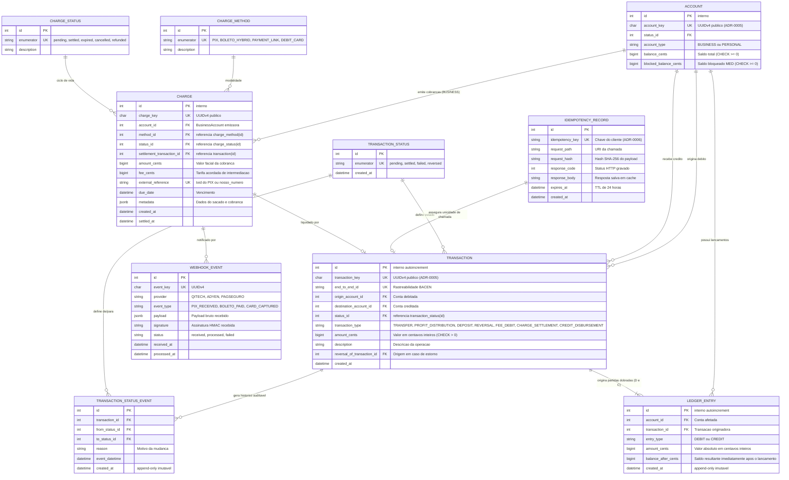
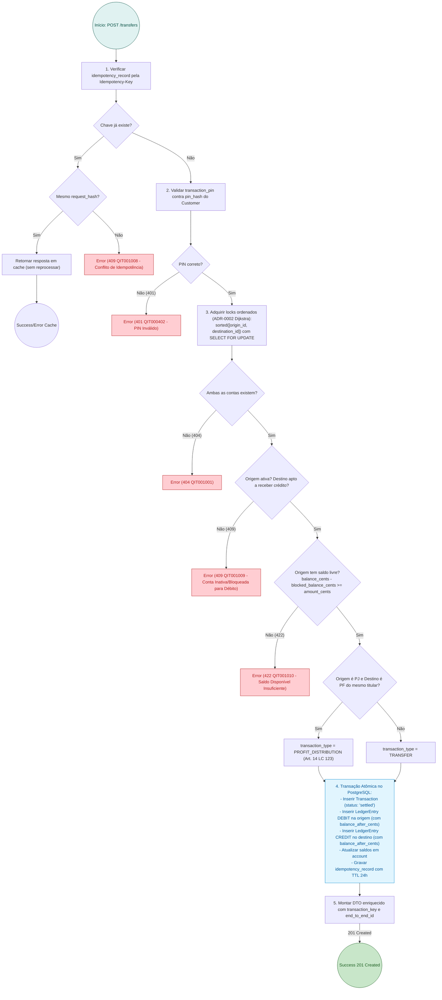
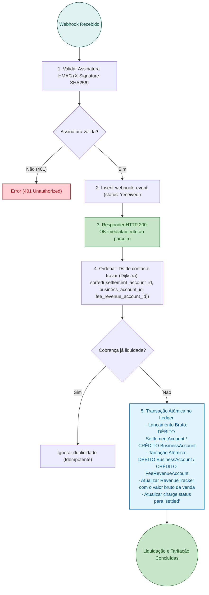

# RFC 02 — Motor Financeiro, Ledger de Partidas Dobradas, Meios de Pagamento e Liquidação Transacional

| | |
|---|---|
| **Status** | **Aprovada / Parcialmente Implementada** |
| **Time** | Core Banking, Transações & Pagamentos |
| **Data** | 23/09/2026 |
| **Versão** | 1.0 (Consolidação Unificada das RFCs 02 e 04) |

> [!NOTE]
> **Grau de Maturidade e Roadmap**:
> - **Implementado em Código**: Motor financeiro central de partidas dobradas ([ADR-0004](file:///home/jpcalsavara/projetos/andamento/bootcamp-qitech-api/docs/adr/0004-arquitetura-contabil-partidas-dobradas.md)), representação monetária estrita em centavos inteiros `BIGINT` ([ADR-0003](file:///home/jpcalsavara/projetos/andamento/bootcamp-qitech-api/docs/adr/0003-representacao-monetaria-centavos-bigint.md)), hierarquia de locks de Dijkstra contra deadlocks ([ADR-0002](file:///home/jpcalsavara/projetos/andamento/bootcamp-qitech-api/docs/adr/0002-prevencao-deadlock-ordenacao-dijkstra.md)), tabela de idempotência com TTL de 24h ([ADR-0006](file:///home/jpcalsavara/projetos/andamento/bootcamp-qitech-api/docs/adr/0006-idempotencia-tabela-dedicada-catalogo-erros.md)), classificação contábil da LC 123/2006 (`PROFIT_DISTRIBUTION`) e política estrita de estornos.
> - **Roadmap / Em Refinamento**: Emissão de cobranças multimodais (`Charge` via PIX QR Code dinâmico, Boleto Híbrido e Link), ingestão de webhooks com assinatura HMAC SHA-256 e tarifação transacional automática em partidas dobradas com crédito em `FeeRevenueAccount` ([ADR-0008](file:///home/jpcalsavara/projetos/andamento/bootcamp-qitech-api/docs/adr/0008-tarifacao-transacional-debito-atomico-ledger.md)).

---

## Contextualização

### Entendendo o problema

No núcleo de uma instituição financeira voltada a microempreendedores, o processamento transacional e as cobranças comerciais exigem requisitos inegociáveis de precisão contábil, segurança cibernética e clareza fiscal:

1. **Precisão Contábil e Auditoria Forense**: O saldo bancário nunca é uma coluna arbitrária sujeita a updates pontuais sem lastro. Toda e qualquer movimentação de recursos deve ser fundamentada por um livro-razão (*ledger*) de partidas dobradas (*double-entry*), no qual a soma algébrica de créditos e débitos de qualquer evento financeiro é rigorosamente zero ([ADR-0004](file:///home/jpcalsavara/projetos/andamento/bootcamp-qitech-api/docs/adr/0004-arquitetura-contabil-partidas-dobradas.md)).
2. **Prevenção Matemática de Deadlocks sob Alta Concorrência**: Transações simultâneas e cruzadas entre múltiplas contas no mesmo milissegundo adquirem travas de linha (`SELECT FOR UPDATE`) em ordens contrárias, provocando deadlocks no banco de dados (`40P01`) e derrubando requisições se não houver ordenação determinística ([ADR-0002](file:///home/jpcalsavara/projetos/andamento/bootcamp-qitech-api/docs/adr/0002-prevencao-deadlock-ordenacao-dijkstra.md)).
3. **Idempotência Resiliente com TTL**: Instabilidades de rede móvel provocam retentativas repetidas de clientes e parceiros externos. É indispensável gerenciar a idempotência em tabela dedicada com expiração de 24 horas, gravando tanto respostas de sucesso quanto de falha de validação ([ADR-0006](file:///home/jpcalsavara/projetos/andamento/bootcamp-qitech-api/docs/adr/0006-idempotencia-tabela-dedicada-catalogo-erros.md)).
4. **Segurança de Execução (PIN Transacional)**: O token de login (JWT) não pode conceder autorização irrestrita de débito; transferências exigem confirmação pelo **PIN Transacional de 4 dígitos** do titular.
5. **Enquadramento Fiscal MEI (Art. 14 da LC 123/2006)**: Movimentações da `BusinessAccount` para a `PersonalAccount` do mesmo MEI caracterizam distribuição isenta de lucros e devem ser etiquetadas nativamente no ledger (`PROFIT_DISTRIBUTION`) para subsidiar a declaração anual do IRPF.
6. **Cobrança Comercial e o Risco do Extrato Líquido**: Quando gateways tradicionais abatem as tarifas diretamente do valor creditado (ex: venda de R$ 100,00 entra líquida como R$ 96,01), o MEI enfrenta sérios problemas com a Receita Federal, pois sua Nota Fiscal (NFS-e) e o limite anual de R$ 81.000,00 exigem a comprovação do **faturamento bruto**.
7. **Ausência de Partidas Dobradas na Tarifação**: Tarifas deduzidas de forma opaca como "ajustes manuais" geram furos de conciliação. Toda tarifa cobrada deve ser formalizada como transferência atômica para a conta interna de receita (`FeeRevenueAccount`) ([ADR-0008](file:///home/jpcalsavara/projetos/andamento/bootcamp-qitech-api/docs/adr/0008-tarifacao-transacional-debito-atomico-ledger.md)).

### Explicando a solução de forma macro

A solução combina o motor contábil de transferências com a esteira de cobranças comerciais e liquidação de webhooks:

1. **Ledger Imutável de Partidas Dobradas ([ADR-0004](file:///home/jpcalsavara/projetos/andamento/bootcamp-qitech-api/docs/adr/0004-arquitetura-contabil-partidas-dobradas.md))**:
   - A tabela `ledger_entry` é estritamente *append-only*.
   - Toda transação insere atomicamente um registro de `DEBIT` e um registro de `CREDIT` de mesmo valor em centavos inteiros (`BIGINT`) ([ADR-0003](file:///home/jpcalsavara/projetos/andamento/bootcamp-qitech-api/docs/adr/0003-representacao-monetaria-centavos-bigint.md)), atualizando o campo `balance_after_cents` para auditoria imediata.
2. **Ordenação Determinística de Dijkstra ([ADR-0002](file:///home/jpcalsavara/projetos/andamento/bootcamp-qitech-api/docs/adr/0002-prevencao-deadlock-ordenacao-dijkstra.md))**:
   - Antes de adquirir locks de linha via `SELECT FOR UPDATE`, a aplicação ordena os identificadores inteiros das contas envolvidas (`sorted([account_a_id, account_b_id, ...])`). A espera circular torna-se matematicamente impossível.
3. **Idempotência com Tabela Dedicada (`idempotency_record`) ([ADR-0006](file:///home/jpcalsavara/projetos/andamento/bootcamp-qitech-api/docs/adr/0006-idempotencia-tabela-dedicada-catalogo-erros.md))**:
   - Chave enviada no cabeçalho `Idempotency-Key` é confrontada com o hash SHA-256 do payload. Retentativas recebem a resposta do cache sem reprocessamento. Disparos concorrentes com mesmo payload sofrem contenção e requisições com chave idêntica mas payload diferente recebem `409 Conflict` (`QIT001008`).
4. **Mecânica Estrita de Estornos (`reversed`)**:
   - O estorno gera lançamentos de contrapartida invertidos e exige validação de saldo livre na conta recebedora original (`available_balance_cents >= original_amount`). Se a conta não tiver fundos disponíveis suficientes, o estorno é recusado com erro semântico, impedindo saldo negativo desautorizado.
5. **Emissão de Cobranças Multimodais (`POST /accounts/{account_key}/charges`)**:
   - Suporte a **PIX Cobrança** (QR Code dinâmico e `txid` registrado no SPI via BaaS QI Tech), **Boleto Híbrido** (código de barras Febraban + QR Code PIX no mesmo título) e **Link de Pagamento** para cartão de crédito.
6. **Ingestão Resiliente de Webhooks e Tarifação Atômica ([ADR-0008](file:///home/jpcalsavara/projetos/andamento/bootcamp-qitech-api/docs/adr/0008-tarifacao-transacional-debito-atomico-ledger.md))**:
   - Webhooks de parceiros adquirentes/BaaS são autenticados via assinatura HMAC (`X-Signature-SHA256`) e registrados imediatamente na tabela `webhook_event`.
   - Na liquidação contábil, uma transação única executa:
     - **Crédito Bruto**: Débito em `SettlementAccount` / Crédito na `BusinessAccount` do MEI (valor integral da venda).
     - **Tarifação Atômica**: Débito na `BusinessAccount` / Crédito na conta interna de receita `FeeRevenueAccount` (tarifa transacional pactuada).
     - **Atualização Fiscal**: Acúmulo do faturamento bruto no `RevenueTracker` para governança do teto do MEI (R$ 81k).

### Alternativas Descartadas e Trade-offs

- *Idempotência controlada apenas como coluna única na tabela `transaction`* — descartada porque não permitiria reter e devolver respostas cacheadas de falha de validação ou erros de negócio antes da criação do registro financeiro, além de impedir o lock distribuído de requisições em voo.
- *Liquidação líquida direta (Net Settlement)* — creditar o valor da venda já deduzido da comissão/tarifa: descartada porque viola a transparência contábil, prejudica a emissão da NFS-e pelo MEI e esconde a receita transacional da instituição bancária.
- *Permitir saldo negativo em estornos forçados (Overdraft compulsório)* — descartada por compliance bancário e proteção contra inadimplência: sem contrato formal de limite de crédito garantido, a instituição financeira assume risco indevido caso o cliente recebedor já tenha sacado os recursos.
- *Valores monetários representados com números de ponto flutuante (`FLOAT`/`DOUBLE`)* — **descartada conforme [ADR-0003](file:///home/jpcalsavara/projetos/andamento/bootcamp-qitech-api/docs/adr/0003-representacao-monetaria-centavos-bigint.md)**: dízimas e imprecisões de arredondamento inerentes à norma IEEE 754 violam a exatidão centesimal do ledger.

---

## Implementação

### Diretriz Obrigatória de Testes
> [!IMPORTANT]
> **Padrão do Projeto: Apenas Testes de Integração (Sem Testes Unitários)**
> Conforme o [ADR-0001](file:///home/jpcalsavara/projetos/andamento/bootcamp-qitech-api/docs/adr/0001-apenas-testes-de-integracao.md), todo o motor financeiro e a esteira de cobrança devem ser cobertos exclusivamente por testes de integração ponta a ponta (`tests/integration/`), testando concorrência real via múltiplas conexões simultâneas no banco de dados PostgreSQL.

---

### Rotas Propostas

| Método | Caminho | O que faz | Entrada (campos que importam) | Saídas (status e quando) |
|---|---|---|---|---|
| `POST` | `/transactions/transfers` | Executa transferência bilateral atômica, validando PIN e idempotência | `origin_account_key`, `destination_account_key`, `amount_cents`, `description`, `transaction_pin`, cabeçalho `Idempotency-Key` | `201 Created` liquidada com `transaction_key` e `end_to_end_id`; `400` payload inválido (`QIT000001`); `401` PIN inválido (`QIT000402`); `404` conta não encontrada (`QIT001001`); `409` conflito de idempotência (`QIT001008`) ou conta de origem bloqueada/inativa (`QIT001009`); `422` saldo insuficiente (`QIT001010`) |
| `POST` | `/transactions/{transaction_key}/reversals` | Executa estorno contábil bilateral de uma transação liquidada | `reason`, `transaction_pin`, cabeçalho `Idempotency-Key` | `201 Created` estorno liquidado com nova transação de contrapartida; `401` PIN incorreto; `404` transação original não encontrada; `409` transação já estornada; `422` saldo insuficiente na conta recebedora (`QIT001012`) |
| `GET` | `/transactions/{transaction_key}` | Consulta detalhes, lançamentos e status de uma transação | `transaction_key` no caminho | `200 OK` detalhes da transação, contas, valor, tipo contábil/fiscal e status; `404` transação não encontrada |
| `GET` | `/accounts/{account_key}/statement` | Emite extrato de lançamentos contábeis enriquecido e paginado | `account_key` no caminho, `limit`, `page`, `start_date`, `end_date` | `200 OK` extrato contendo contraparte (nome/documento), classificação fiscal (`PROFIT_DISTRIBUTION`, `TRANSFER`, etc.), valor e `balance_after_cents`; `404` conta não encontrada |
| `POST` | `/accounts/{account_key}/charges` | Emite cobrança comercial (PIX dinâmico, Boleto Híbrido ou Link) | `method` (`PIX`, `BOLETO_HYBRID`, `PAYMENT_LINK`), `amount_cents`, `due_date`, `customer_document`, `metadata` | `201 Created` com `charge_key`, dados de pagamento (`qr_code`, `barcode`, `payment_url`), valor facial e vencimento; `404` conta não encontrada; `422` conta não é do tipo BUSINESS |
| `GET` | `/charges/{charge_key}` | Consulta situação da cobrança e dados de liquidação | `charge_key` no caminho | `200 OK` detalhes da cobrança, status (`pending`, `settled`, `expired`, `cancelled`), valores bruto e taxas retidas; `404` cobrança não encontrada |
| `POST` | `/webhooks/payments` | Ingestão e liquidação em tempo real de webhooks de parceiros BaaS/Adquirentes | Payload bruto do evento, cabeçalho de assinatura `X-Signature-SHA256` | `200 OK` recebido e liquidado com crédito bruto e tarifação atômica; `401` assinatura HMAC inválida; `404` cobrança não localizada |
| `POST` | `/charges/reconciliation` | Job periódico de conciliação ativa (Polling HTTP via conector de pagamentos) | Opcional: lista de `charge_keys` a conciliar ou varredura de pendências | `200 OK` total de cobranças conciliadas e atualizadas no ledger |

---

### Banco de Dados (Diagrama ER Unificado)

---

### Desenho de Fluxo da Rota (As Seis Perguntas Respondidas no Desenho)

#### Fluxo 1: `POST /transactions/transfers` — Execução com Validação de PIN, Dijkstra e Partidas Dobradas

#### Fluxo 2: Ingestão de Webhook e Liquidação com Débito Atômico de Tarifa ([ADR-0008](file:///home/jpcalsavara/projetos/andamento/bootcamp-qitech-api/docs/adr/0008-tarifacao-transacional-debito-atomico-ledger.md))

---

### Fluxos Detalhados Textuais

#### Fluxo 1: Caminho Feliz de Transferência e Estorno
1. **Transferência**: O cliente envia `POST /transactions/transfers` com chave de idempotência e PIN. O controller valida o PIN via Argon2id, adquire locks ordenados, valida saldo livre e insere a transação no ledger com partidas dobradas, devolvendo `201 Created` e gravando o cache de idempotência.
2. **Estorno Contábil**: O titular solicita `POST /transactions/{transaction_key}/reversals`. O sistema localiza a transação original, adquire travas ordenadas nas duas contas e verifica se a conta recebedora possui saldo disponível suficiente para absorver o débito. Se sim, cria nova transação do tipo `REVERSAL`, atualiza a original para `reversed` e registra as partidas dobradas invertidas no ledger.

#### Fluxo 2: Caminhos de Falha e Exceções Formais
1. **PIN Transacional Incorreto**: Retorna `401 Unauthorized` com código de catálogo `QIT000402` (`INVALID_TRANSACTION_PIN`).
2. **Conflito de Idempotência**: Quando o mesmo cabeçalho `Idempotency-Key` é enviado com payload distinto dentro do intervalo de 24h, retorna `409 Conflict` com código `QIT001008` (`IDEMPOTENCY_PAYLOAD_MISMATCH`).
3. **Saldo Disponível Insuficiente**: Se `available_balance_cents < amount_cents`, a operação é bloqueada com `422 Unprocessable Entity` e código `QIT001010` (`INSUFFICIENT_FUNDS`).
4. **Conta Inativa ou Bloqueada**: Se a conta de origem estiver em estado `blocked` ou `closed`, a tentativa de débito é rejeitada com `409 Conflict` e código `QIT001009` (`ACCOUNT_BLOCKED_FOR_DEBIT`).
5. **Tentativa de Estorno sem Saldo na Contraparte**: Caso a conta recebedora não detenha fundos livres para absorver o débito de retorno, a solicitação falha com `422 Unprocessable Entity` e código `QIT001012` (`INSUFFICIENT_FUNDS_FOR_REVERSAL`).

---

## Principal Desafio

- **Qual é:** Concorrência transacional extrema imune a deadlocks de banco de dados (`40P01`), combinada com a atomicidade irrestrita na liquidação tripartite de cobranças comerciais (crédito bruto ao MEI, débito atômico de taxa de intermediação para a conta da fintech e acúmulo no rastreador fiscal anual).
- **Por que é difícil:** Transferências simultâneas em sentidos opostos entre as mesmas contas disparam contenção imediata de locks. Se os locks forem adquiridos na ordem da requisição, o PostgreSQL aborta uma das transações com erro de deadlock. Além disso, se o crédito bruto e a tarifação fossem executados em transações separadas, instabilidades de rede poderiam creditar a venda sem cobrar a taxa ou permitir que o MEI sacasse os fundos antes da dedução da tarifa.
- **Como o desenho resolve:** Aplicação estrita da ordenação global de Dijkstra (`sorted([acc_a, acc_b, ...])`) antes de qualquer declaração `SELECT FOR UPDATE` ([ADR-0002](file:///home/jpcalsavara/projetos/andamento/bootcamp-qitech-api/docs/adr/0002-prevencao-deadlock-ordenacao-dijkstra.md)), e execução da liquidação tripartite dentro de uma única transação atômica do banco de dados com lançamentos simétricos no ledger imutável ([ADR-0004](file:///home/jpcalsavara/projetos/andamento/bootcamp-qitech-api/docs/adr/0004-arquitetura-contabil-partidas-dobradas.md) e [ADR-0008](file:///home/jpcalsavara/projetos/andamento/bootcamp-qitech-api/docs/adr/0008-tarifacao-transacional-debito-atomico-ledger.md)).
