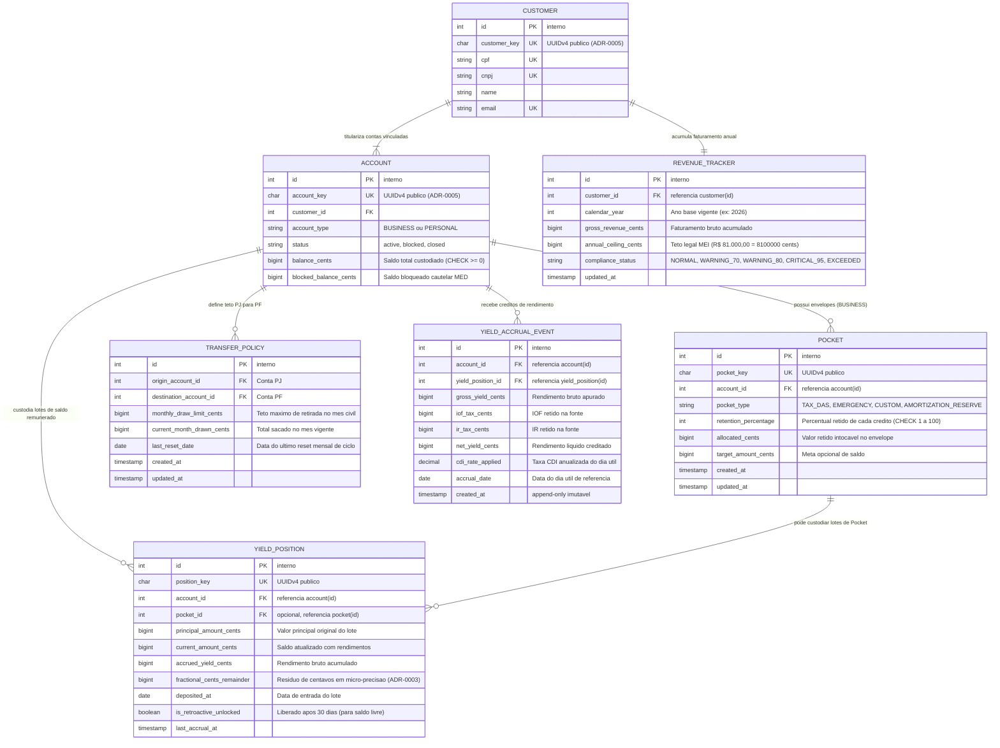
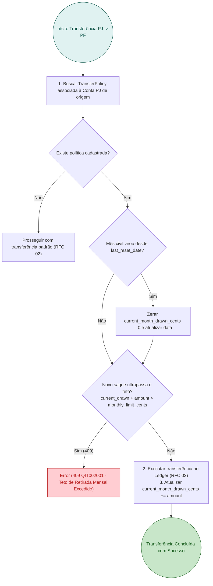
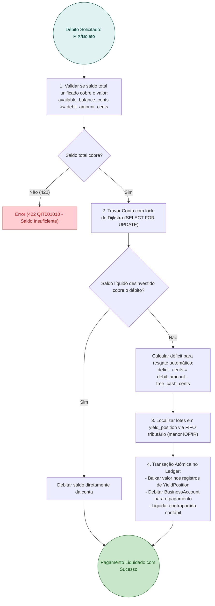
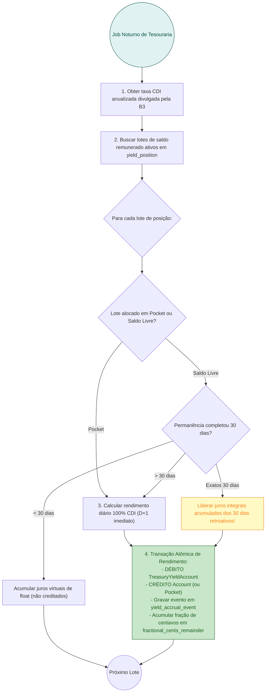

# RFC 03 — Governança Patrimonial, Envelopes Financeiros (Pockets) e Tesouraria Remunerada (CDB/RDB)

| | |
|---|---|
| **Status** | **Em Refinamento / Parcialmente Implementada** |
| **Time** | Core Banking, Governança MEI & Tesouraria |
| **Data** | 23/09/2026 |
| **Versão** | 1.0 (Consolidação Unificada das RFCs 06 e 07) |

> [!NOTE]
> **Grau de Maturidade e Roadmap**:
> - **Implementado em Código**: Subcontas e envelopes `Pocket` vinculados à `BusinessAccount`, tabelas e regras de negócio de `TransferPolicy` (teto mensal de retiradas PJ -> PF com erro formal `QIT002001`) e estrutura do `RevenueTracker` para monitoramento anual do teto do MEI de R$ 81.000,00.
> - **Roadmap / Em Refinamento**: Mecanismo de Cash Sweep automático invisível no débito, controle de lotes de custódia em `yield_position`, apuração de CDI diário com regra retroativa D+30 e retenção na fonte de IOF e IR regressivo junto ao BaaS da QI Tech.

---

## Contextualização

### Entendendo o problema

O Microempreendedor Individual (MEI) enfrenta uma dualidade crônica na gestão de seus recursos: a **confusão patrimonial** entre os gastos da empresa e do lar, combinada com o **esvaziamento compulsivo de caixa** motivado pelo medo de deixar o dinheiro "parado sem render".

Essa dinâmica gera quatro disfunções graves:
1. **Sangria do Capital de Giro**: O dinheiro das vendas que entra na conta PJ é transferido imediatamente para a conta pessoal como "lucro do dia", deixando a empresa sem liquidez para honrar compras de estoque, fornecedores e contas de consumo.
2. **Inadimplência Tributária Crônica (DAS-MEI)**: Sem mecanismos de retenção progressiva ao longo do mês, o empreendedor é surpreendido pelo vencimento da guia DAS-MEI (dia 20), acumulando juros, perda de benefícios previdenciários e inscrição em dívida ativa da União.
3. **Risco de Desenquadramento Compulsório do MEI**: O MEI possui um teto de faturamento anual de R$ 81.000,00 (média de R$ 6.750,00/mês). Sem rastreamento em tempo real, ultrapassa esse limite inadvertidamente, sendo desenquadrado para Microempresa (ME) de forma retroativa, com pesadas multas e cobrança de impostos retroativos pelo regime geral do Simples Nacional.
4. **Esvaziamento de Float e Perda de Liquidez para a Fintech**: Ao receber uma venda via PIX ou boleto, o MEI costuma transferir 100% dos fundos para um bancão em poucos minutos. O saldo médio mantido na instituição fica próximo de zero, impossibilitando a monetização de custódia, enfraquecendo a liquidez da fintech e inviabilizando travas de amortização de crédito.

### Explicando a solução de forma macro

A solução integra disciplina de caixa, separação de patrimônios e incentivos de tesouraria de alto rendimento com liquidez diária:

1. **Separação Patrimonial e Política de Retirada (`TransferPolicy`)**:
   - Apoiando-se no par de contas da [RFC 01](file:///home/jpcalsavara/projetos/andamento/bootcamp-qitech-api/docs/rfc/rfc-01-onboarding-identidade-contas.md), o sistema permite configurar uma `TransferPolicy` com teto mensal máximo de transferências da Conta PJ (`BUSINESS`) para a Conta PF (`PERSONAL`).
   - Tentativas de transferência que excedam o limite mensal acumulado são interceptadas e rejeitadas com erro semântico formal (`409 QIT002001`), protegendo o pró-labore planejado e garantindo capital de giro à empresa.
2. **Envelopes Financeiros de Retenção Automática (`Pocket`)**:
   - Subenvelopes virtuais atrelados à `BusinessAccount` para finalidades específicas:
     - **Tributário (`TAX_DAS`)**: Retenção automática de uma fração percentual (ex: 5%) de cada venda creditada para provisionar o imposto mensal.
     - **Reserva de Emergência / Fornecedores (`EMERGENCY` / `SUPPLIERS`)**: Alocação de valores para blindagem contra imprevistos operacionais.
   - O saldo retido nos `Pockets` compõe o saldo custodiado da conta, mas não fica disponível para débitos comuns de compras ou transferências cotidianas.
3. **Monitoramento Fiscal em Tempo Real (`RevenueTracker`)**:
   - Rastreador acumulador de créditos brutos no ano-calendário vigente.
   - Dispara avisos automáticos de conformidade (`NORMAL`, `WARNING_70`, `WARNING_80`, `CRITICAL_95`, `EXCEEDED`), auxiliando o MEI a buscar orientação contábil antes de sofrer sanções fiscais.
4. **Tesouraria Automatizada e Cash Sweep Invisível (100% CDI)**:
   - **Regra Híbrida de Rentabilidade**:
     - **Saldo Livre da Conta**: Rende **100% do CDI retroativo a partir do 30º dia** de permanência do depósito. Saldos voláteis de giro rápido geram margem de float para a fintech; saldos estáveis recebem os juros acumulados integralmente desde o 1º dia.
     - **Saldos Alocados em Pockets**: Rendem **100% do CDI diariamente desde o primeiro dia útil (D+1)**, incentivando a retenção de caixa e o cumprimento das obrigações fiscais.
   - **Cash Sweep Invisível**: O cliente visualiza e utiliza seu saldo disponível total unificado. Quando ocorre um pagamento ou transferência PIX que supera o saldo desinvestido, o sistema executa o resgate contábil em milissegundos a partir dos lotes de CDB (`YieldPosition`), priorizando os de menor incidência de IOF/IR (método FIFO/tributário ótimo), sem exigir qualquer intervenção manual de resgate.
5. **Partidas Dobradas no Rendimento ([ADR-0004](file:///home/jpcalsavara/projetos/andamento/bootcamp-qitech-api/docs/adr/0004-arquitetura-contabil-partidas-dobradas.md))**:
   - Cada crédito de juros apurado é lançado como:
     - `DÉBITO TreasuryYieldAccount` (Conta interna de despesa de rendimentos da fintech)
     - `CRÉDITO BusinessAccount` (ou `Pocket` correspondente)
   - Mantém rigorosa exatidão contábil com centavos inteiros `BIGINT` ([ADR-0003](file:///home/jpcalsavara/projetos/andamento/bootcamp-qitech-api/docs/adr/0003-representacao-monetaria-centavos-bigint.md)).

### Alternativas Descartadas e Trade-offs

- *Conta única com tags visuais de orçamento no extrato* — descartada porque categorização visual após o fato não impede que o empreendedor consuma o saldo em momentos de impulso no balcão. O isolamento lógico com bloqueio de saque via `Pocket` é a única defesa efetiva contra a sangria de caixa.
- *Bloqueio transacional de recebimento de vendas quando o faturamento atingir R$ 81.000,00* — descartada por causar dano irreparável ao negócio do MEI: recusar pagamentos de clientes quebra a atividade comercial. A conduta correta é liquidar a transação, emitir alerta de conformidade fiscal e orientar a transição contábil para ME.
- *Rendimento diário irrestrito em todo o saldo livre desde o primeiro dia (sem carência de 30 dias)* — descartada porque destrói a margem de float da fintech em contas de alta rotatividade e gera custos de IOF/IR desproporcionais para saldos que permanecem por menos de 24 horas.
- *Exigir que o MEI execute resgate manual da caixinha antes de passar o cartão ou pagar um boleto* — descartada pelo atrito operacional extremo: cartões recusados na boca do caixa e boletos não compensados por falta de resgate prévio geram insatisfação e abandono da conta.

---

## Implementação

### Diretriz Obrigatória de Testes
> [!IMPORTANT]
> **Padrão do Projeto: Apenas Testes de Integração (Sem Testes Unitários)**
> Conforme definido no [ADR-0001](file:///home/jpcalsavara/projetos/andamento/bootcamp-qitech-api/docs/adr/0001-apenas-testes-de-integracao.md), todos os cálculos de rentabilidade CDI, retenção automática em envelopes, travas da política de transferência e Cash Sweep devem ser validados exclusivamente via testes de integração ponta a ponta (`tests/integration/`) contra o banco de dados PostgreSQL real.

---

### Rotas Propostas

| Método | Caminho | O que faz | Entrada (campos que importam) | Saídas (status e quando) |
|---|---|---|---|---|
| `POST` | `/accounts/{account_key}/pockets` | Cria um envelope de retenção na Conta PJ | `pocket_type` (`TAX_DAS`, `EMERGENCY`, `CUSTOM`), `retention_percentage`, `target_amount_cents` | `201 Created` criado com `pocket_key`; `400` percentual fora de 1-100%; `404` conta não encontrada; `422` conta não é BUSINESS |
| `GET` | `/accounts/{account_key}/pockets` | Lista todos os envelopes e valores retidos da conta | `account_key` no caminho | `200 OK` lista de envelopes com valores alocados, percentuais e metas; `404` conta não encontrada |
| `POST` | `/accounts/{account_key}/pockets/{pocket_key}/deposit` | Aloca manualmente montante adicional no envelope | `amount_cents` | `200 OK` saldo do envelope atualizado; `422` saldo livre insuficiente na conta |
| `POST` | `/accounts/{account_key}/pockets/{pocket_key}/withdraw` | Resgata valor do envelope para o saldo livre da conta | `amount_cents` | `200 OK` saldo devolvido ao disponível; `422` valor superior ao saldo do envelope |
| `POST` | `/governance/transfer-policies` | Configura ou atualiza política de teto mensal de pró-labore PJ -> PF | `origin_account_key` (PJ), `destination_account_key` (PF), `monthly_limit_cents` | `201 Created` política configurada; `400` valor <= 0; `409` contas pertencem a titulares diferentes |
| `GET` | `/governance/transfer-policies/{account_key}` | Consulta a política de retiradas e total já sacado no mês | `account_key` no caminho | `200 OK` teto mensal, total já sacado no mês corrente e saldo remanescente disponível para retirada |
| `GET` | `/customers/{customer_key}/revenue-tracker` | Consulta acumulado anual de vendas e proximidade do teto MEI | `customer_key` no caminho | `200 OK` faturamento bruto anual, percentual do teto consumido (R$ 81k) e alerta de conformidade |
| `GET` | `/accounts/{account_key}/yield-position` | Consulta saldo remunerado, lotes de CDB e rendimento acumulado | `account_key` no caminho | `200 OK` saldo total em CDB, rendimento bruto/líquido apurado e taxa CDI aplicada |
| `POST` | `/treasury/accrue-yield` | Job noturno de fechamento que apura o CDI e credita rendimentos | Cabeçalho `INTERNAL-TOKEN`, data de referência `target_date` | `200 OK` resumo de contas processadas, juros creditados e contrapartidas em `TreasuryYieldAccount` |

---

### Banco de Dados (Diagrama ER Unificado)

---

### Desenho de Fluxo da Rota (As Seis Perguntas Respondidas no Desenho)

#### Fluxo 1: Validação de Política de Retirada (`TransferPolicy`) em Transferência PJ -> PF

#### Fluxo 2: Cash Sweep Invisível e Resgate Automático no Débito

#### Fluxo 3: Rotina Noturna de Apuração do CDI e Rendimento Retroativo D+30

---

### Fluxos Detalhados Textuais

#### Fluxo 1: Caminho Feliz de Gestão e Cash Sweep
1. O MEI configura um `Pocket` tributário do tipo `TAX_DAS` com 5% de retenção e define uma `TransferPolicy` mensal de R$ 3.000,00 da PJ para a PF.
2. A cada liquidação de cobrança comercial, o sistema retém 5% no `Pocket`, rentabilizando esse montante a 100% do CDI desde D+1.
3. Ao transferir pró-labore para sua Conta PF via `POST /transactions/transfers`, o sistema verifica se o total sacado no mês respeita o teto de R$ 3.000,00 e incrementa o acumulador `current_month_drawn_cents`.
4. Ao realizar um pagamento de fornecedor, caso o saldo não aplicado em CDB não seja suficiente, o Cash Sweep resgata automaticamente a diferença das posições de CDB sem atrito para o cliente.

#### Fluxo 2: Caminhos de Falha e Exceções Formais
1. **Teto Mensal de Transferência Excedido**: Caso a transferência PJ -> PF ultrapasse o limite pactuado no mês, a operação falha com `409 Conflict` e código formal `QIT002001` (`MONTHLY_TRANSFER_CEILING_EXCEEDED`).
2. **Contas de Titulares Divergentes na Política de Transferência**: Tentativa de registrar `TransferPolicy` entre contas que pertençam a clientes diferentes é rejeitada com `409 Conflict`.
3. **Resgate de Pocket Superior ao Saldo Retido**: Se o usuário tentar sacar do envelope um valor maior que `allocated_cents`, a requisição falha com `422 Unprocessable Entity`.
4. **Saldo Disponível Global Insuficiente**: Caso a soma de saldo livre mais saldo elegível a Cash Sweep seja inferior ao débito solicitado, a API retorna `422 Unprocessable Entity` com código `QIT001010`.

---

## Principal Desafio

- **Qual é:** Calcular rendimentos diários de juros flutuantes (CDI) com exatidão matemática centesimal (`BIGINT`) sem acumular perdas residuais de ponto flutuante, sincronizando resgates instantâneos (*Cash Sweep*) transparentes e blindagem de saldos alocados em subenvelopes (`Pockets`) sob alta concorrência de pagamentos.
- **Por que é difícil:** O CDI diário aplicado a saldos fracionados de microempreendedores gera valores decimais extensos (ex: R$ 53,20 a render 0,042% ao dia resulta em frações de centavos). Se o arredondamento for truncado ingenuamente, o balanço global do banco apresentará divergências acumuladas com a posição de custódia na QI Tech. Além disso, no momento do pagamento, o algoritmo precisa determinar atomicamente se o débito consome saldo livre ou aciona resgate de CDB, respeitando os saldos retidos em envelopes intocáveis.
- **Como o desenho resolve:** Adoção estrita de centavos inteiros `BIGINT` ([ADR-0003](file:///home/jpcalsavara/projetos/andamento/bootcamp-qitech-api/docs/adr/0003-representacao-monetaria-centavos-bigint.md)), acumulando resíduos infinitesimais na coluna `fractional_cents_remainder` até que atinjam centavos completos para crédito, e ordenação pessimista de locks (Dijkstra) que resolve a concorrência entre resgates automáticos de CDB e débitos no ledger em uma única transação atômica.
