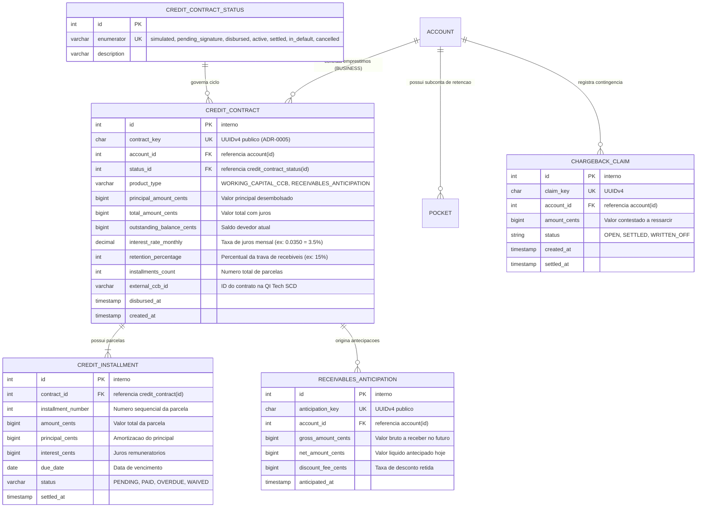
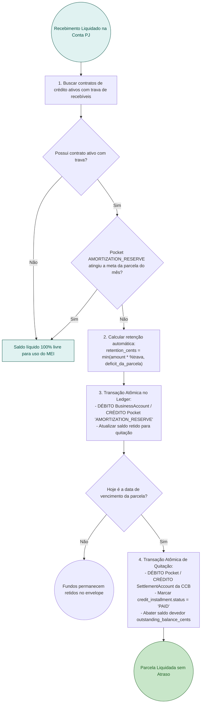
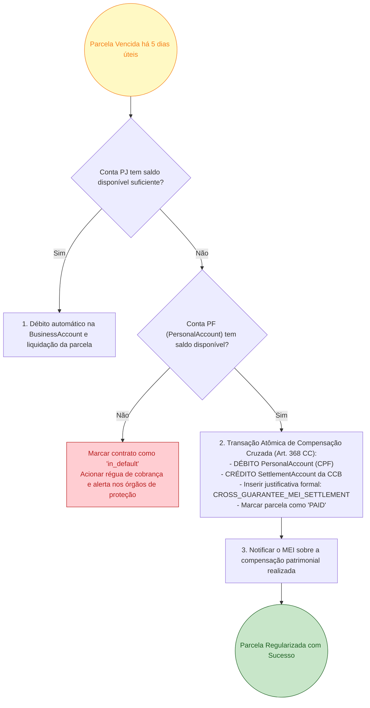

# RFC 04 — Linhas de Crédito MEI, Cédula de Crédito Bancário (CCB) e Antecipação com Trava Dinâmica

| | |
|---|---|
| **Status** | **Proposta** |
| **Time** | Core Banking & Crédito |
| **Data** | 23/09/2026 |
| **Versão** | 1.0 (Uniformizada com o Modelo Canônico de Customer e Consolidação) |

> [!NOTE]
> **Grau de Maturidade e Roadmap**:
> - **Implementado em Código**: Estrutura dos modelos relacionais `CreditContract`, `CreditInstallment`, `ReceivablesAnticipation` em `src/models/credit.py` e tipos transacionais no ledger para crédito (`CREDIT_DISBURSEMENT`, `CREDIT_AMORTIZATION`, `RECEIVABLES_ANTICIPATION`).
> - **Roadmap / Em Refinamento**: Integração com a esteira de CCB da QI Tech SCD via conector, orquestração do split automático de vendas em `AmortizationPocket`, job noturno de execução de garantia cruzada PF/PJ por atraso e fluxo de conciliação de `ChargebackClaim`.

---

## Contextualização

### Entendendo o problema

O Microempreendedor Individual (MEI) enfrenta uma das maiores barreiras do sistema financeiro nacional: a **ausência de acesso a crédito produtivo acessível**. Os grandes bancos tradicionais exigem garantias reais pesadas ou cobram juros extorsivos (superando frequentemente 12% a 15% ao mês em cheque especial ou rotativo de cartão PJ) pela falta de visibilidade do faturamento real do MEI.

Por outro lado, para a fintech, emprestar dinheiro para microempreendedores sem uma infraestrutura sólida de garantias e travas acarreta índices de inadimplência proibitivos (superando 20% no crédito pessoal sem garantias, vulgarmente chamado de "crédito fumaça").

Para viabilizar uma esteira de crédito rentável, segura e sustentável para ambas as partes, a arquitetura precisa:
1. Oferecer **Antecipação de Recebíveis** imediata sobre vendas a prazo com colateral garantido pelo fluxo futuro de liquidação de cobranças comerciais ([RFC 02](file:///home/jpcalsavara/projetos/andamento/bootcamp-qitech-api/docs/rfc/rfc-02-ledger-meios-pagamento-liquidacao.md));
2. Estruturar **Cédulas de Crédito Bancário (CCBs)** de Capital de Giro através da infraestrutura de BaaS da QI Tech SCD;
3. Mitigar o risco de inadimplência através de uma **Trava de Recebíveis Dinâmica**: retenção automática e contínua de um percentual (ex: 15%) de cada venda liquidada em um subenvelope (`Pocket`) dedicado à amortização da parcela vincenda;
4. Executar **Garantia Cruzada Patrimonial PF/PJ**: alavancar o vínculo unificado entre `BusinessAccount` e `PersonalAccount` do mesmo `Customer` ([RFC 01](file:///home/jpcalsavara/projetos/andamento/bootcamp-qitech-api/docs/rfc/rfc-01-onboarding-identidade-contas.md)), respaldada pela responsabilidade legal ilimitada do MEI perante o Código Civil brasileiro.

### Explicando a solução de forma macro

A solução estabelece a esteira de crédito do MEI em duas modalidades complementares integradas ao motor financeiro:

1. **Antecipação de Recebíveis (`POST /credit/anticipations`)**:
   - O MEI seleciona cobranças ou parcelas futuras de vendas comerciais com cartão/boleto ainda a liquidar.
   - O motor calcula a taxa de desconto (deságio a valor presente) proporcional aos dias de antecipação.
   - Na contratação confirmada pelo PIN transacional de 4 dígitos, o valor líquido é creditado imediatamente na `BusinessAccount` com contrapartida contábil na conta de antecipação da instituição. Quando a adquirente liquida a venda original no futuro, o montante quita a operação no ledger automaticamente.
2. **Capital de Giro via CCB Digital (`POST /credit/contracts`)**:
   - O motor de crédito avalia o histórico de faturamento consolidado no `RevenueTracker` ([RFC 03](file:///home/jpcalsavara/projetos/andamento/bootcamp-qitech-api/docs/rfc/rfc-03-governanca-caixa-envelopes-tesouraria.md)) e as métricas de bureau salvas em `CustomerRiskProfile` ([RFC 01](file:///home/jpcalsavara/projetos/andamento/bootcamp-qitech-api/docs/rfc/rfc-01-onboarding-identidade-contas.md)).
   - A minuta formal da CCB é emitida via QI Tech SCD, parcelada em até 24 meses.
   - O MEI formaliza e assina a CCB eletronicamente fornecendo seu `TransactionPin`.
   - O desembolso ocorre em transação de partidas dobradas ([ADR-0004](file:///home/jpcalsavara/projetos/andamento/bootcamp-qitech-api/docs/adr/0004-arquitetura-contabil-partidas-dobradas.md)), creditando o principal líquido na `BusinessAccount`.
3. **Mecanismo da Trava de Recebíveis Dinâmica (Retenção em Pocket)**:
   - A cada recebimento liquidado na `BusinessAccount`, o sistema desvia atomicamente o percentual pactuado (ex: 15%) para o `Pocket` de amortização (`AMORTIZATION_RESERVE`).
   - Quando o saldo do `Pocket` atinge o valor exato da parcela vincenda, o split automático é suspenso.
   - No dia do vencimento da parcela, o sistema debita o `Pocket` e liquida a parcela da CCB sem gerar boleto ou necessidade de intervenção manual do cliente.
4. **Acionamento de Garantia Cruzada PF/PJ**:
   - Caso o MEI chegue ao vencimento sem faturamento suficiente na PJ para cobrir a parcela, após uma janela de tolerância de 5 dias úteis o sistema executa compensação contábil cruzada debitando a `PersonalAccount` do mesmo titular, prevenindo a negativação do CPF.
5. **Gestão de Contestações e Chargeback Claim**:
   - Em caso de contestação de venda com cartão onde a conta PJ não possua saldo suficiente, o sistema registra um `ChargebackClaim` para compensação prioritária sobre os recebimentos seguintes.

### Alternativas Descartadas e Trade-offs

- *Empréstimo pessoal tradicional sem garantia nem retenção no fluxo de caixa (Crédito Fumaça)* — descartada pelo alto índice de inadimplência crônica em microempreendedores informais. Ganharia apenas em cenários com juros extorsivos que inviabilizam a atividade produtiva do MEI.
- *Exigir registro formal de trava de domicílio em registradora autorizada (CERC/B3) para todas as operações* — descartada para microantecipações de baixo valor devido ao custo fixo regulatório de emolumentos por contrato cobrado pelas registradoras. O registro em registradora é reservado apenas para CCBs de valores mais elevados (> R$ 10.000,00).
- *Executar cobrança forçada na PersonalAccount imediatamente no primeiro minuto de atraso* — descartada para evitar atritos desnecessários e litígios; o modelo adota régua transparente de notificações e janela de carência de 5 dias úteis antes da compensação patrimonial cruzada.

---

## Implementação

### Diretriz Obrigatória de Testes
> [!IMPORTANT]
> **Padrão do Projeto: Apenas Testes de Integração (Sem Testes Unitários)**
> Conforme o [ADR-0001](file:///home/jpcalsavara/projetos/andamento/bootcamp-qitech-api/docs/adr/0001-apenas-testes-de-integracao.md), todos os fluxos de contratação de CCB, cálculo de juros e amortizações, split da trava de recebíveis em Pocket e compensação cruzada devem ser validados exclusivamente via testes de integração ponta a ponta (`tests/integration/`) com banco de dados real.

---

### Rotas Propostas

| Método | Caminho | O que faz | Entrada (campos que importam) | Saídas (status e quando) |
|---|---|---|---|---|
| `POST` | `/credit/simulations` | Simula parcelas, CET, taxas e percentual de trava de CCB ou antecipação | `account_key`, `product_type` (`WORKING_CAPITAL_CCB`, `RECEIVABLES_ANTICIPATION`), `requested_amount_cents`, `installments` | `200 OK` com simulação detalhada (CET, taxa mensal, valor da parcela, % de trava sugerido); `400` valor fora das faixas permitidas |
| `POST` | `/credit/contracts` | Formaliza e contrata CCB de Capital de Giro | `account_key`, `simulation_id`, `transaction_pin`, cabeçalho `Idempotency-Key` | `201 Created` com `contract_key`, link do instrumento da CCB e status `disbursed`; `401` PIN incorreto; `409` proposta expirada |
| `POST` | `/credit/anticipations` | Contrata antecipação de recebíveis futuros de vendas comerciais | `account_key`, `charge_keys` (lista de cobranças a antecipar), `transaction_pin` | `201 Created` com `anticipation_key`, valor líquido creditado e taxas retidas; `422` cobrança inelegível |
| `GET` | `/credit/contracts/{contract_key}` | Consulta detalhes do contrato, parcelas pagas e saldo em aberto | `contract_key` no caminho | `200 OK` detalhes do contrato, cronograma de parcelas e saldo acumulado no Pocket de amortização; `404` contrato não encontrado |
| `POST` | `/credit/contracts/{contract_key}/repay` | Realiza amortização extraordinária ou quitação antecipada | `contract_key`, `amount_cents`, `transaction_pin` | `200 OK` quitação processada com abatimento proporcional de juros futuros; `422` saldo insuficiente |
| `POST` | `/credit/cross-guarantee/execute` | Executa rotina de compensação patrimonial PF/PJ para contratos em atraso | Cabeçalho `INTERNAL-TOKEN`, `target_date` | `200 OK` resumo de contratos regularizados via débito na PersonalAccount |

---

### Banco de Dados (Diagrama ER)

---

### Desenho de Fluxo da Rota (As Seis Perguntas Respondidas no Desenho)

#### Fluxo 1: Trava Dinâmica de Recebíveis e Amortização Automática em Pocket

#### Fluxo 2: Acionamento de Garantia Cruzada PF/PJ por Inadimplência

---

### Fluxos Detalhados Textuais

#### Fluxo 1: Caminho Feliz de Contratação e Amortização por Trava
1. O MEI solicita simulação de Capital de Giro (`POST /credit/simulations`).
2. Com limite aprovado, submete a contratação formal (`POST /credit/contracts`) com chave de idempotência e seu PIN transacional.
3. O principal é creditado na `BusinessAccount` e as parcelas com seus vencimentos são gravadas em `credit_installment`.
4. À medida que o MEI emite cobranças e recebe pagamentos de clientes (PIX/Boleto), a aplicação desvia automaticamente 15% do valor creditado para o `Pocket` de amortização.
5. No vencimento da parcela, o montante retido no `Pocket` é debitado e liquida a obrigação sem necessidade de pagamento manual de boleto.

#### Fluxo 2: Caminhos de Falha e Exceções Formais
1. **PIN Transacional Incorreto na Contratação**: Retorna `401 Unauthorized` com código `QIT000402`.
2. **Cobrança Inelegível para Antecipação**: Tentativa de antecipar cobrança já liquidada, cancelada ou com vencimento ultrapassado falha com `422 Unprocessable Entity`.
3. **Simulação Expirada**: Tentar contratar CCB após expiração do prazo de validade da taxa simulada retorna `409 Conflict`.
4. **Saldo Insuficiente na Amortização Extraordinária**: Caso o MEI solicite quitação antecipada e a conta não detenha fundos livres, a transação retorna `422 Unprocessable Entity` com código `QIT001010`.

---

## Principal Desafio

- **Qual é:** Conciliação determinística e concorrente da trava de recebíveis a cada liquidação de venda no balcão, garantindo que o split nunca retenha mais recursos do que a meta estrita da parcela do mês, preservando o capital de giro operacional do MEI e evitando retenções indevidas.
- **Por que é difícil:** Se o microempreendedor receber simultaneamente dezenas de transações via PIX dinâmico em horários de pico comercial, múltiplas requisições em voo concorrem para ler e atualizar o saldo retido no `Pocket`. Sem ordenação e travamento adequados, o `Pocket` poderia acumular valores superiores à parcela vincenda, gerando sangria involuntária do fluxo de caixa operacional da empresa.
- **Como o desenho resolve:** Utilização de lock pessimista na linha do `Pocket` e na `BusinessAccount` através da ordenação de Dijkstra ([ADR-0002](file:///home/jpcalsavara/projetos/andamento/bootcamp-qitech-api/docs/adr/0002-prevencao-deadlock-ordenacao-dijkstra.md)), calculando o split como `min(valor_da_venda * %trava, meta_da_parcela - saldo_atual_do_pocket)`. Isso garante que a retenção seja suspensa no instante exato em que a parcela do mês é provisionada, liberando 100% dos recebimentos subsequentes para o giro livre do negócio.
