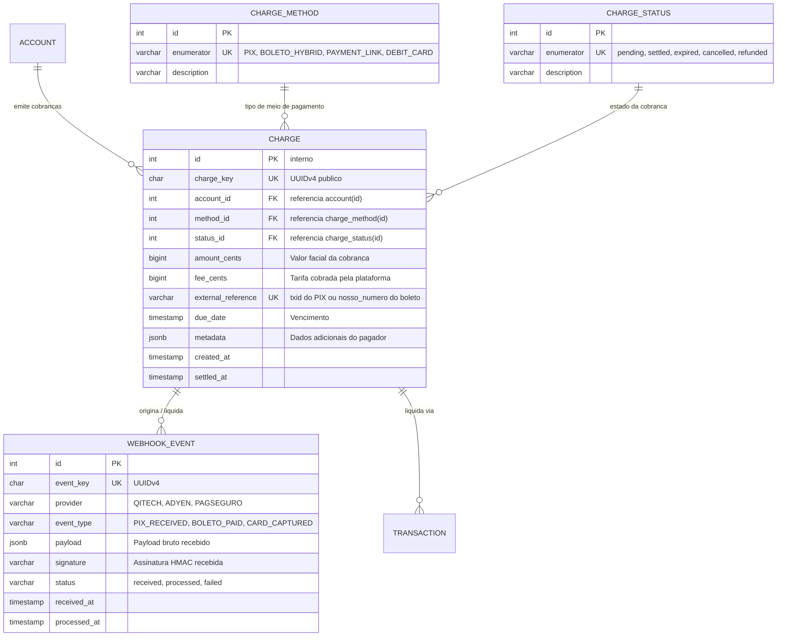
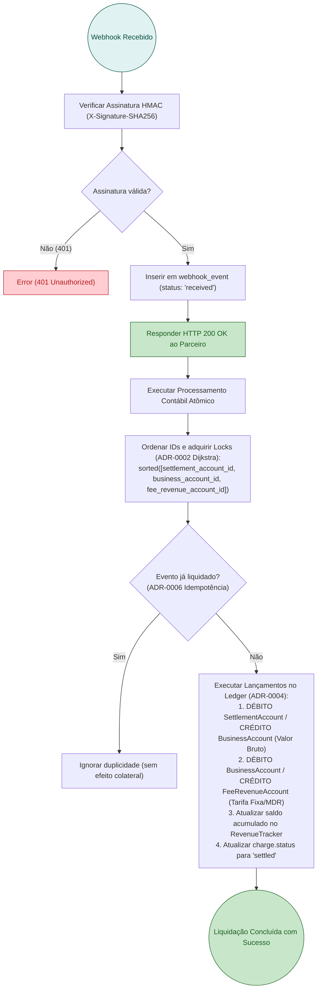

# RFC 04 — Meios de Pagamento, Liquidação e Tarifação Transacional

| | |
|---|---|
| **Status** | **Proposta** |
| **Time** | Core Banking & Pagamentos |
| **Data** | 21/09/2026 |
| **Versão** | 1.0 |

---

## Contextualização

### Entendendo o problema

Para que o Microempreendedor Individual (MEI) centralize sua vida financeira no CoreBank MEI, ele precisa cobrar seus próprios clientes através dos meios mais utilizados no mercado brasileiro: **PIX (QR Code Dinâmico)**, **Boleto Bancário Híbrido** e **Cartão de Crédito via Link de Pagamento**.

Entretanto, nos sistemas bancários tradicionais e gateways comuns, existem três problemas crônicos que prejudicam o MEI e a fintech:
1. **Confusão Fiscal e Extratos Líquidos**: Quando um gateway desconta a tarifa direto do valor recebido (ex: venda de R$ 100,00 entra como R$ 96,01), o MEI tem enorme dificuldade para emitir a Nota Fiscal de Serviço (NFS-e) e comprovar seu faturamento bruto real perante a Receita Federal (teto de R$ 81k do MEI).
2. **Fragilidade de Webhooks e Perda de Liquidações**: Conexões de rede instáveis entre adquirentes/BaaS (QI Tech) e a API causam requisições duplicadas ou não tratadas, gerando cobranças cobradas do cliente final mas não creditadas na conta do MEI.
3. **Ausência de Partidas Dobradas na Tarifação**: A taxa cobrada da liquidação é frequentemente lançada como um "ajuste de saldo" obscuro, em vez de ser um lançamento contábil auditável de transferência para a conta de receita da instituição.

### Explicando a solução de forma macro

A solução estabelece a esteira de cobranças comerciais com conciliação contábil atômica e imutável:
1. **Criação de Cobranças Multimodais (`POST /charges/pix`, `/charges/boleto`, `/charges/link`)**:
   - Cada cobrança gera um registro na tabela `charge` com `charge_key`, valor em centavos (`amount_cents`), vencimento e status inicial `pending`.
   - **PIX Cobrança**: Gera QR Code dinâmico EMVCo e `txid` exclusivo registrado no SPI (Sistema de Pagamentos Instantâneos) via QI Tech.
   - **Boleto Híbrido**: Gera linha digitável Febraban padrão e QR Code PIX impresso no mesmo documento, permitindo liquidação instantânea D+0 via PIX ou D+1 via câmara CIP/Nuclea.
   - **Link de Pagamento**: Gera uma URL de checkout para recebimento via Cartão de Crédito à vista ou parcelado.
2. **Ingestão Resiliente de Webhooks (`POST /webhooks/settlement`)**:
   - O payload bruto recebido da QI Tech ou adquirente é autenticado via assinatura HMAC (`X-Signature-SHA256`) e salvo imediatamente em tabela *append-only* `webhook_event`.
   - A resposta `HTTP 200 OK` é retornada instantaneamente ao provedor para evitar retentativas desnecessárias.
3. **Liquidação no Ledger com Lançamento Bruto e Débito Atômico de Tarifa**:
   - Em uma transação atômica única no PostgreSQL protegida por locks ordenados de Dijkstra ([ADR-0002](file:///home/jpcalsavara/projetos/andamento/bootcamp-qitech-api/docs/adr/0002-prevencao-deadlock-ordenacao-dijkstra.md)):
     - **Lançamento 1 (Crédito Bruto)**: Credita o valor total da venda (`amount_cents`) na `BusinessAccount` do MEI com contrapartida de débito na `SettlementAccount` interna do sistema.
     - **Lançamento 2 (Débito da Tarifa)**: Debita a taxa de transação (ex: R$ 0,49 no PIX ou R$ 1,99 no Boleto) da `BusinessAccount` com crédito na conta contábil interna de receita (`FeeRevenueAccount`).
     - **Lançamento 3 (Faturamento Fiscal)**: Incrementa atomicamente o faturamento bruto no `RevenueTracker` para monitoramento do teto de R$ 81.000,00/ano do MEI.

### Alternativas Descartadas e Trade-offs

- *Liquidação líquida direta (Net Settlement)* — creditar diretamente o valor descontado da taxa na conta do MEI: descartada porque viola a transparência contábil, impede a conciliação com a Nota Fiscal emitida pelo MEI e dificulta a comprovação de faturamento bruto para fins de enquadramento tributário (Simples Nacional).
- *Processamento síncrono e bloqueante dentro da requisição do Webhook* — descartada pelo alto risco de timeout do parceiro externo (QI Tech / Gateway) sob picos de volume concorrente, o que provocaria reenvios massivos de webhooks duplicados.
- *Tarifação mensal consolidada em fatura pós-paga* — descartada pelo risco de inadimplência do próprio MEI em não honrar a fatura de tarifas no início do mês seguinte após já ter sacado os recursos recebidos.

---

## Implementação

### Diretriz Obrigatória de Testes
> [!IMPORTANT]
> **Padrão do Projeto: Apenas Testes de Integração (Sem Testes Unitários)**
> Conforme o [ADR-0001](file:///home/jpcalsavara/projetos/andamento/bootcamp-qitech-api/docs/adr/0001-apenas-testes-de-integracao.md), todos os cenários de geração de cobrança, liquidação via webhook, lançamento bruto, débito de tarifa e atualização de faturamento devem ser validados exclusivamente via testes de integração ponta a ponta com banco real.

---

### Rotas Propostas

| Método | Caminho | O que faz | Entrada (campos que importam) | Saídas (status e quando) |
|---|---|---|---|---|
| `POST` | `/charges/pix` | Cria cobrança PIX com QR Code dinâmico | `account_key`, `amount_cents`, `description`, `expires_in_seconds`, `customer_document` | `201 Created` com `charge_key`, `txid`, `qr_code_payload` e `qr_code_image_url`; `400` valor inválido; `404` conta não encontrada |
| `POST` | `/charges/boleto` | Emite boleto bancário híbrido (código de barras + QR Pix) | `account_key`, `amount_cents`, `due_date`, `payer_name`, `payer_document` | `201 Created` com `charge_key`, `digitable_line`, `barcode`, `pix_qr_code` e `pdf_url`; `400` data de vencimento inválida |
| `POST` | `/charges/link` | Cria link de pagamento para cartão de crédito | `account_key`, `amount_cents`, `description`, `max_installments` | `201 Created` com `charge_key`, `checkout_url` e `status`; `400` parcelas inválidas |
| `GET` | `/charges/{charge_key}` | Consulta detalhes e status da cobrança | `charge_key` no caminho | `200 OK` detalhes da cobrança, valor, método, status (`pending`, `settled`, `expired`, `cancelled`) e extrato |
| `POST` | `/webhooks/settlement` | Ingestão assíncrona de eventos de liquidação de parceiros | Payload bruto do parceiro (JSON) e cabeçalho `X-Signature-SHA256` | `200 OK` evento registrado e agendado para liquidação contábil; `401` assinatura HMAC inválida |

---

### Banco de Dados (Diagrama ER)

---

### Desenho de Fluxo da Liquidação Contábil e Tarifação (Webhook Ingestion)

---

## Principal Desafio

- **Qual é:** Garantir atomicidade rigorosa e consistência contábil no momento exato em que a liquidação externa ocorre, sem criar pontos de contenção de concorrência ou riscos de saldo negativo na cobrança de tarifas.
- **Por que é difícil:** Se o crédito do valor bruto e o débito da tarifa forem executados em etapas desacopladas ou transações separadas, falhas de rede ou lentidão no banco poderiam creditar o cliente sem cobrar a taxa, ou gerar corridas transacionais com saques imediatos.
- **Como o desenho resolve:** Execução em transação única no PostgreSQL com locking ordenado via algoritmo de Dijkstra ([ADR-0002](file:///home/jpcalsavara/projetos/andamento/bootcamp-qitech-api/docs/adr/0002-prevencao-deadlock-ordenacao-dijkstra.md)) e lançamentos de partidas dobradas estritamente vinculados na tabela imutável `ledger_entry` ([ADR-0004](file:///home/jpcalsavara/projetos/andamento/bootcamp-qitech-api/docs/adr/0004-arquitetura-contabil-partidas-dobradas.md)).
