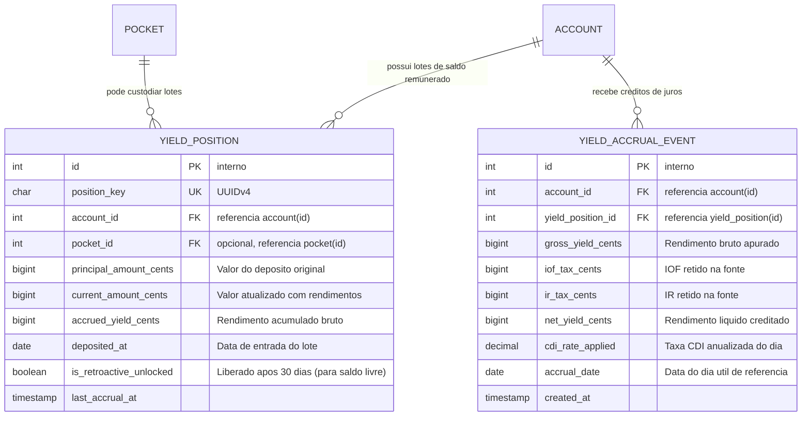
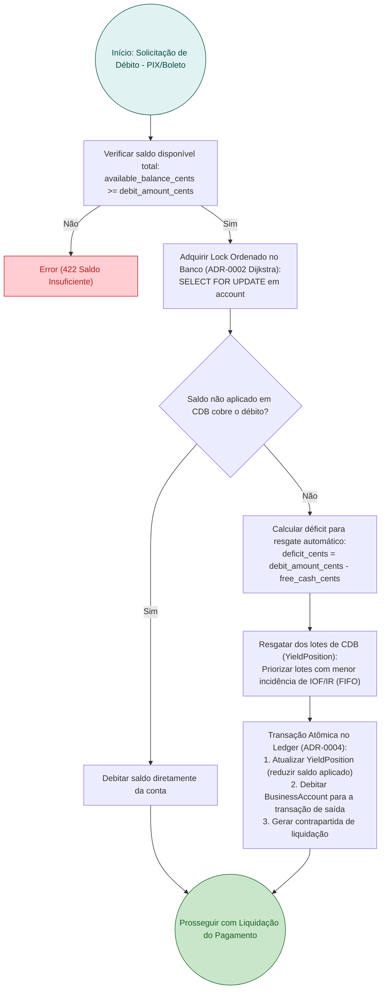
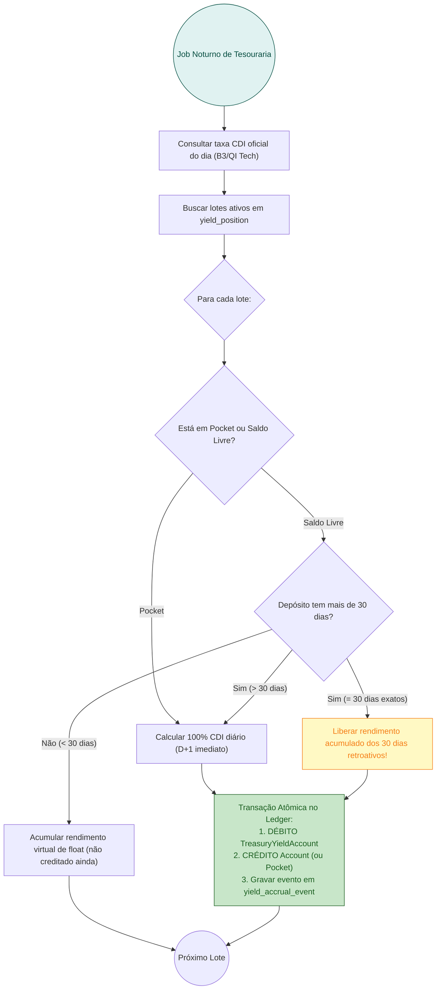

# RFC 06 — Fluxo de Caixa Remunerado e Tesouraria Automatizada (CDB/RDB 100% CDI)

| | |
|---|---|
| **Status** | **Proposta** |
| **Time** | Core Banking & Tesouraria |
| **Data** | 21/09/2026 |
| **Versão** | 1.0 |

---

## Contextualização

### Entendendo o problema

No ecossistema de microempreendedores, o fenômeno mais comum em contas de pagamento é o **esvaziamento imediato de caixa**: o MEI recebe uma venda via PIX ou boleto e, em poucos minutos, transfere 100% dos recursos para um banco tradicional ou para sua conta pessoal por medo de o dinheiro "ficar parado sem render".

Esse comportamento gera três consequências severas:
1. **Perda de Liquidez e Float para a Fintech**: O saldo médio mantido na instituição fica próximo de zero, inviabilizando a monetização de custódia e enfraquecendo a capacidade de concessão de crédito próprio.
2. **Desproteção Inflacionária do Capital de Giro do MEI**: O dinheiro mantido em contas correntes comuns sofre depreciação do poder de compra, prejudicando o fluxo de reposição de estoque e pagamento de fornecedores.
3. **Inviabilização das Travas de Amortização**: Quando o cliente esvazia o saldo no mesmo instante do recebimento, o mecanismo de provisão do DAS-MEI e das parcelas de crédito em `Pocket` perde eficácia.

### Explicando a solução de forma macro

A solução estabelece a **Conta Remunerada Automática com Liquidez Diária e Cash Sweep Invisível**, operada através da infraestrutura regulatória de CDB/RDB da QI Tech SCD:
1. **Modelo Híbrido de Rentabilidade (Float de Giro + Incentivo a Pockets)**:
   - **Saldo Livre da Conta**: Rende **100% do CDI** de forma **retroativa a partir do 30º dia** de permanência do depósito. Saldos que entram e saem no giro rápido de curto prazo geram receita de *float* de tesouraria para a fintech; saldos que permanecem por mais de 30 dias recebem 100% dos juros acumulados desde o primeiro dia.
   - **Saldos Alocados em Pockets (`Pocket`)**: Rendem **100% do CDI diariamente desde o 1º dia útil (D+1)**, com incidência regressiva de IOF/IR retidos na fonte pela QI Tech. Isso cria um poderoso incentivo financeiro para o MEI reservar recursos para o DAS-MEI, emergências e quitação de empréstimos.
2. **Resgate Automático Invisível (*Cash Sweep*)**:
   - O MEI enxerga em seu extrato o saldo disponível total unificado (`available_balance_cents`).
   - Quando uma transação de saída é solicitada (PIX, pagamento de boleto ou compra no cartão de débito), a API efetua o resgate em milissegundos sem exigir que o MEI "tire da caixinha" ou execute operações manuais de resgate.
   - A conciliação financeira entre a carteira de CDB/RDB e o saldo de liquidação da conta ocorre de forma contábil no ledger e em lote diário junto à QI Tech.
3. **Contabilidade Imutável no Ledger ([ADR-0004](file:///home/jpcalsavara/projetos/andamento/bootcamp-qitech-api/docs/adr/0004-arquitetura-contabil-partidas-dobradas.md))**:
   - Todo crédito de rendimento gera um lançamento bilateral formal:
     - `DÉBITO TreasuryYieldAccount` (Conta interna de despesa de rendimento de tesouraria)
     - `CRÉDITO BusinessAccount` (ou `PersonalAccount` / `Pocket`)

### Alternativas Descartadas e Trade-offs

- *Rendimento diário imediato em todo o saldo livre desde o primeiro dia (sem regra de 30 dias)* — descartada porque destrói a margem de float da fintech em contas transacionais de alta rotatividade, além de gerar custos tributários e de processamento desproporcionais para valores que saem no mesmo dia.
- *Exigir resgate manual do MEI para usar o dinheiro investido (Modelo Caixinha Tradicional)* — descartada pelo atrito operacional: o MEI que está no caixa do fornecedor ou pagando um boleto urgente tem sua transação rejeitada por "saldo insuficiente" se esquecer de resgatar previamente da caixinha.
- *CDB com carência de 90 a 180 dias com taxas ligeiramente maiores (ex: 110% CDI)* — descartada para a conta principal porque o MEI necessita de liquidez imediata para despesas operacionais imprevistas; títulos travados geram suporte e litígios por falta de acesso ao dinheiro.

---

## Implementação

### Diretriz Obrigatória de Testes
> [!IMPORTANT]
> **Padrão do Projeto: Apenas Testes de Integração (Sem Testes Unitários)**
> Conforme o [ADR-0001](file:///home/jpcalsavara/projetos/andamento/bootcamp-qitech-api/docs/adr/0001-apenas-testes-de-integracao.md), todos os cálculos de juros de CDI, aplicação retroativa D+30, resgate automático em Cash Sweep e lançamentos contábeis devem ser validados exclusivamente via testes de integração ponta a ponta com banco real.

---

### Rotas Propostas

| Método | Caminho | O que faz | Entrada (campos que importam) | Saídas (status e quando) |
|---|---|---|---|---|
| `GET` | `/accounts/{account_key}/yield-summary` | Consulta extrato de rendimento acumulado, rentabilidade do mês e projeção | `account_key` no caminho | `200 OK` com saldo remunerado, rendimento bruto/líquido acumulado no mês, taxa CDI vigente e lote a liberar em 30 dias |
| `GET` | `/accounts/{account_key}/yield-positions` | Lista os lotes de depósitos com suas datas de antiguidade e status de rendimento | `account_key` no caminho | `200 OK` com lista de lotes (`YieldPosition`), data de depósito, valor original, rendimento provisionado e alíquota de IOF/IR |
| `POST` | `/admin/treasury/accrue-yields` | Job de fechamento diário que apura o CDI do dia útil e credita rendimentos no ledger | Cabeçalho `INTERNAL-TOKEN`, data de referência `target_date` | `200 OK` com total de contas processadas, montante creditado e contrapartida lançada na `TreasuryYieldAccount` |

---

### Banco de Dados (Diagrama ER)

---

### Desenho de Fluxo do Resgate Automático Invisível (*Cash Sweep*)

---

### Desenho de Fluxo da Rotina Noturna de Rendimento (Job de CDI)

---

## Principal Desafio

- **Qual é:** Calcular rendimentos de juros diários com precisão exata de centavos (`BIGINT`) sem acumular perdas ou discrepâncias por resíduos de ponto flutuante em milhares de contas, respeitando a tabela regressiva de tributação na fonte.
- **Por que é difícil:** Juros de CDI diários geram números com muitas casas decimais em saldos fracionados (ex: R$ 42,15 rendendo 0,041% ao dia). Se o arredondamento for feito incorretamente, o somatório do ledger divergirá da posição de custódia na QI Tech.
- **Como o desenho resolve:** Aplicação rigorosa da representação monetária inteira em centavos ([ADR-0003](file:///home/jpcalsavara/projetos/andamento/bootcamp-qitech-api/docs/adr/0003-representacao-monetaria-centavos-bigint.md)), acumulando resíduos fracionários de centavos em coluna dedicada `fractional_cents_remainder` no registro de `YieldPosition` até que atinjam um centavo inteiro, garantindo que o ledger permaneça matematicamente exato (soma algébrica zero).
