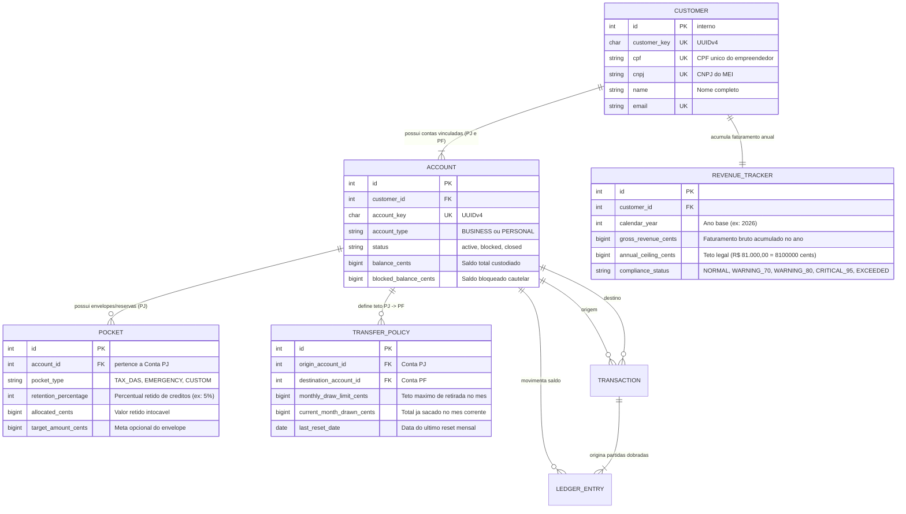

# RFC 07 — Gestão de Fluxo de Caixa, Separação Patrimonial e Envelopes MEI

| | |
|---|---|
| **Status** | **Em Refinamento (Backlog)** |
| **Time** | João Pedro Calsavara |
| **Data** | 19/09/2026 |
| **Versão** | 2 (Uniformizada com o Modelo Canônico de Customer e Contas Vinculadas) |

---

## Contextualização

### Entendendo o problema

O Microempreendedor Individual (MEI) sofre historicamente com a **confusão patrimonial**: por ser uma pessoa física com inscrição no CNPJ, a grande maioria dos empreendedores utiliza a mesma conta bancária para receber de clientes e pagar despesas domésticas (aluguel pessoal, mercado, lazer). Essa ausência de fronteira financeira gera três problemas graves:
1. **Sangria do Capital de Giro**: O dinheiro que entra é consumido como "salário pessoal", e quando chegam as obrigações da empresa (compra de estoque, fornecedores e o tributo mensal DAS-MEI), a empresa não possui liquidez.
2. **Inadimplência Tributária Recorrente**: O MEI esquece de provisionar os valores do DAS-MEI (vencimento dia 20), acumulando juros, perda de benefícios previdenciários e inscrição em dívida ativa.
3. **Risco de Desenquadramento Compulsório**: O MEI tem um teto de faturamento anual de R$ 81.000,00 (média de R$ 6.750,00/mês). Sem acompanhamento em tempo real, o empreendedor ultrapassa o teto e é desenquadrado para Microempresa (ME) retroativamente com multas severas.

### Explicando a solução de forma macro

A solução expande o subsistema de Core Identity e Contas Vinculadas ([RFC 01](rfc-01-core-customer-accounts.md)) apoiando-se em quatro pilares estruturais:
1. **Contas Vinculadas do `Customer`**: O `Customer` possui formalmente sua **Conta PJ (`BUSINESS`)** e sua **Conta PF (`PERSONAL`)**, segregando o patrimônio da empresa e da pessoa física.
2. **Política de Teto de Retirada (`TransferPolicy`)**: Permite que o MEI defina um teto máximo mensal de transferências da Conta PJ para sua Conta PF (pró-labore programado), impedindo a retirada descontrolada que esvaziaria o capital de giro operacional.
3. **Envelopes de Retenção Automática (`Pocket`)**: Subcontas virtuais dentro da Conta PJ (`BUSINESS`) com retenção percentual parametrizada sobre os créditos recebidos (ex: 5% retido automaticamente para o DAS-MEI e 10% para Reserva de Emergência/Fornecedores).
4. **Monitoramento do Teto Fiscal Anual (`RevenueTracker`)**: Rastreador em tempo real do acumulado de créditos na Conta PJ no ano-calendário, emitindo avisos de conformidade ao atingir 70%, 80% e 95% do teto de R$ 81.000,00.

### Alternativas Descartadas e Trade-offs

- *Conta única com categorização visual de despesas (tags)* — descartada porque categorização visual após o fato não impede que o saldo seja gasto impulsivamente. Ganharia em complexidade de onboarding, mas não resolve a proteção de caixa.
- *Bloqueio hard de recebimento de novos PIX ao atingir R$ 81.000,00* — descartada porque recusar pagamentos de clientes prejudica gravemente o negócio do MEI; a abordagem correta é processar o crédito e alertar sobre o desenquadramento tributário para orientação contábil.
- *Permitir que o envelope `Pocket` tenha saldo negativo* — descartada porque viola as regras do ledger de partidas dobradas e quebra a consistência contábil.
- *Testes unitários isolados com mocks para validação de políticas* — **descartada conforme [ADR-0001](file:///home/jpcalsavara/projetos/andamento/bootcamp-qitech-api/docs/adr/0001-apenas-testes-de-integracao.md)**: todas as validações de teto, envelopes e movimentações são verificadas exclusivamente através de **testes de integração ponta a ponta** com banco de dados real.

---

## Implementação

### Diretriz Obrigatória de Testes
> [!IMPORTANT]
> **Padrão do Projeto: Apenas Testes de Integração (Sem Testes Unitários)**
> Conforme definido no [ADR-0001](file:///home/jpcalsavara/projetos/andamento/bootcamp-qitech-api/docs/adr/0001-apenas-testes-de-integracao.md), esta funcionalidade não deve possuir testes unitários com mocks. Toda a suíte de testes deve ser escrita sob `tests/integration/`, exercitando os endpoints FastAPI via `TestClient` e verificando a integridade das transações no PostgreSQL.

---

### Rotas Propostas

| Método | Caminho | O que faz | Entrada | Saídas |
|---|---|---|---|---|
| `POST` | `/accounts/{account_key}/pockets` | Cria um envelope de retenção na Conta PJ | `pocket_type` (`TAX_DAS`, `EMERGENCY`), `retention_percentage`, `target_amount_cents` | `201` criado; `400` percentual inválido; `404` conta não encontrada; `422` conta não é do tipo BUSINESS |
| `GET` | `/accounts/{account_key}/pockets` | Lista os envelopes e valores alocados da conta | `account_key` | `200` lista de envelopes com saldo livre vs retido |
| `POST` | `/accounts/{account_key}/transfer-policy` | Configura política de teto mensal de retirada para a PF | `destination_personal_account_key`, `monthly_draw_limit_cents` | `201` política configurada; `400` valor <= 0; `409` contas pertencem a titulares diferentes |
| `GET` | `/accounts/{account_key}/transfer-policy` | Consulta o teto mensal, total já retirado e saldo disponível para saque | `account_key` | `200` status da política de retirada |
| `POST` | `/transactions/draw-profit` | Executa transferência de pró-labore da PJ para PF respeitando o teto | `origin_account_key`, `amount_cents`, `transaction_pin`, `Idempotency-Key` | `201` transferido com sucesso; `409` **Teto excedido (`QIT002001`)**; `422` saldo insuficiente |
| `GET` | `/customers/{customer_key}/revenue-status` | Consulta o acumulado anual de faturamento e proximidade do teto MEI | `customer_key` | `200` faturamento anual, percentual consumido do teto (R$ 81k) e alerta de conformidade |

---

### Banco de Dados (Diagrama ER)

---

## Próximos Passos para Refinamento

Pontos a refinar antes de avançar para `/to-tickets`:
1. **Regra de Bypass Emergencial**: O MEI pode estourar o teto de pró-labore em caso de emergência pessoal? Se sim, qual o mecanismo de confirmação (ex: justificativa auditada)?
2. **Automação do Pagamento do DAS**: O envelope `TAX_DAS` deve apenas reter o valor ou liquidar a guia DAS automaticamente via código de barras no dia 20?
3. **Virada do Ano Fiscal**: Como lidar com o reset do `REVENUE_TRACKER` em 1º de janeiro.
