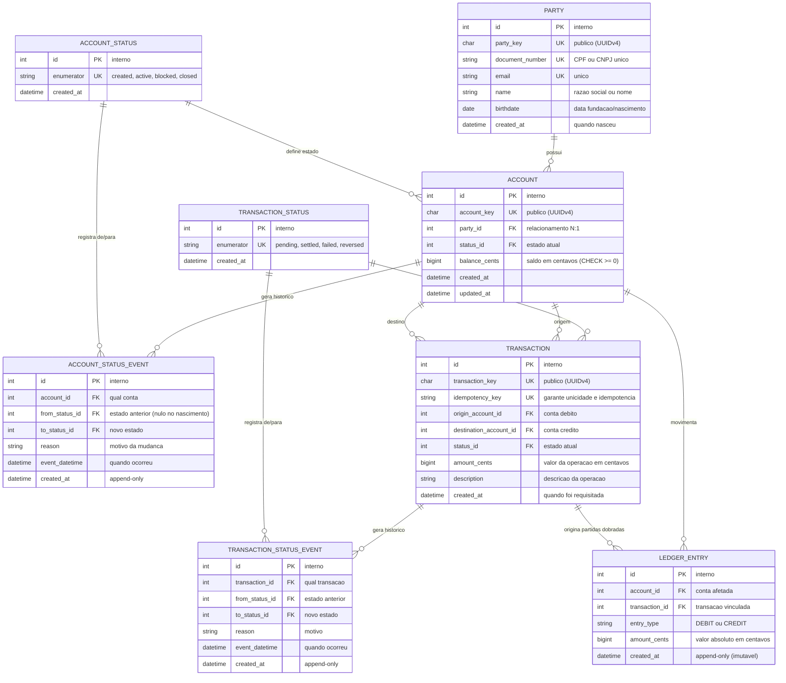

# RFC — CoreBank MEI: Arquitetura de Ledger Contábil e Ciclo de Vida de Estados

| | |
|---|---|
| **Time** | João Pedro Calsavara |
| **Data** | 19/09/2026 |
| **Versão** | 1 |

## Contextualização

### Entendendo o problema

O CoreBank MEI é uma API de Core Banking projetada para Microempreendedores Individuais e autônomos PJ, provendo abertura de conta simplificada, transferências instantâneas bilaterais atômicas, consulta de saldo em tempo real e extratos contábeis. A complexidade do sistema reside na necessidade de garantir precisão matemática absoluta e integridade transacional sob concorrência intensa: o saldo nunca pode ser inconsistente ou negativo, operações repetidas por perda de sinal não podem gerar cobranças duplicadas e toda mutação patrimonial deve ser auditável e reconstituível centavo a centavo. Se houver falha de concorrência ou modelagem frágil de estados, o resultado é divergência contábil, saldo fantasma e passivo regulatório imediato perante o BACEN. Estão fora do escopo desta entrega limites de crédito rotativo/cheque especial, rendimento automático de saldo (float) e conectividade direta com a rede do SPB/PIX.

### Explicando a solução de forma macro

A solução apoia-se em um livro-razão (*ledger*) contábil imutável com partidas dobradas (*double-entry*) e representação de valores exclusivamente em centavos inteiros (`BIGINT`), garantindo que todo crédito possua um débito simétrico correspondente. O ciclo de vida de contas e transações é modelado por tabelas de domínio de enumeradores associadas a tabelas de histórico append-only, prevenindo bloqueios de esquema e mantendo a rastreabilidade temporal. A aquisição de recursos em transferências adota a hierarquia global de locks de Dijkstra para eliminar deadlocks concorrentes, enquanto a borda da API assegura idempotência estrita via cabeçalho `Idempotency-Key` e catálogo semântico de erros.

- *Uso de ENUM nativo do PostgreSQL (`CREATE TYPE status AS ENUM`) para estados* — descartado porque alterações de valores exigem comandos DDL com trava de tabela (`EXCLUSIVE LOCK`), inviabilizam migrações zero-downtime e impedem acoplamento de metadados. Ganharia em domínios estritamente fechados e perenes que nunca sofrerão evolução.
- *Coluna de texto livre (`VARCHAR`) para estados sem chave estrangeira* — descartada porque não oferece integridade relacional nativa no banco, deixando a consistência refém de código e vulnerável a erros de digitação. Ganharia apenas em protótipos rápidos e descartáveis.
- *Retentativas automáticas (Retry com Backoff e Jitter) para resolução de Deadlocks* — descartada porque adiciona complexidade desnecessária, degrada a latência sob alta concorrência e arrisca falhas em cascata. Ganharia em bancos de dados distribuídos sem suporte a locking pessimista ordenado.
- *Mutação direta de saldo via `UPDATE account SET balance = ...` sem Ledger de Partidas Dobradas* — descartada porque destrói a trilha forense e impede conciliação contábil contínua. Ganharia apenas em aplicações simples de pontuação não financeira.
- *Representação monetária com ponto flutuante (`FLOAT`/`DOUBLE`)* — descartada pelo acúmulo inevitável de resíduos de precisão binária IEEE 754. Ganharia exclusivamente em cálculos científicos de grandezas contínuas.

## Implementação

### Rotas

| Método | Caminho | O que faz | Entrada (campos que importam) | Saídas (status e quando) |
|---|---|---|---|---|
| `POST` | `/parties` | Cria o cadastro do cliente MEI/PJ | `name`, `email`, `document_number` (CPF/CNPJ), `birthdate` | `201` criado com `party_key`; `400` payload inválido (`QIT000001`); `409` documento ou e-mail duplicado (`QIT001004`/`QIT001005`); `422` documento inválido (`QIT001003`) |
| `POST` | `/accounts` | Cria uma conta de pagamento vinculada ao cliente | `party_key` | `201` criada com `account_key`, saldo zero e status `created`; `400` payload inválido; `404` party não encontrada (`QIT001001`) |
| `GET` | `/accounts/{account_key}` | Consulta detalhes da conta, saldo e status atual | `account_key` no caminho | `200` conta localizada com saldo em centavos, string decimal e status textual; `404` conta não encontrada (`QIT001001`) |
| `PUT` | `/accounts/{account_key}/status` | Altera o estado da conta (ativar, bloquear, encerrar) | `status` (`active`, `blocked`, `closed`), `reason` | `202` transição aceita com `account_key`; `400` status desconhecido; `404` conta não encontrada; `409` transição a partir de estado final (`QIT001002`) |
| `POST` | `/transactions` | Executa transferência financeira bilateral atômica (idempotente via `Idempotency-Key`) | `origin_account_key`, `destination_account_key`, `amount_cents`, `description`, cabeçalho `Idempotency-Key` | `201` liquidada com `transaction_key`; `400` payload inválido; `404` conta de origem ou destino não encontrada; `409` transação repetida com payload diferente (`QIT001008`) ou conta de origem/destino não ativa (`QIT001009`); `422` saldo insuficiente (`QIT001010`) ou valor <= 0 |
| `GET` | `/accounts/{account_key}/statement` | Emite o extrato de lançamentos contábeis da conta | `account_key` no caminho, `limit`, `page` | `200` lista paginada de lançamentos do ledger; `404` conta não encontrada (`QIT001001`) |

### Banco de Dados (Somente diagrama)

### Fluxos

**POST /transactions — caminho feliz**

1. O Resource recebe a requisição com o cabeçalho `Idempotency-Key` e valida o contrato via JSON Schema.
2. O Controller verifica a existência prévia de `idempotency_key` na tabela `transaction`. Não existindo, a criação prossegue; existindo com o mesmo payload, retorna a resposta salva imediatamente.
3. O Controller obtém os `id`s internos das contas de origem e destino a partir de `origin_account_key` e `destination_account_key`.
4. O Repository aplica a ordenação determinística de Dijkstra (`sorted([origin_id, destination_id])`) e adquire locks de linha no PostgreSQL via `SELECT ... FOR UPDATE` sobre ambas as contas.
5. O Controller valida a máquina de estados: confirma que ambas as contas possuem `status.enumerator == 'active'`.
6. O Controller verifica se a conta de origem possui saldo suficiente (`balance_cents >= amount_cents`).
7. O Repository insere a `transaction` com `status_id` correspondente a `settled` e registra o evento na tabela `transaction_status_event` (`from_status: pending`, `to_status: settled`).
8. O Repository insere dois lançamentos atômicos e imutáveis na tabela `ledger_entry`: um `DEBIT` para a conta de origem e um `CREDIT` para a conta de destino, ambos com o mesmo `amount_cents`.
9. O Repository atualiza os saldos de leitura rápida na tabela `account` (decrementa a origem e incrementa o destino).
10. O Controller executa `self.session.commit()`, o DTO formata o payload de resposta e a API retorna `201 Created` com `transaction_key`.

**POST /transactions — falha: saldo insuficiente ou conta bloqueada**

1. Os passos 1 a 4 são executados identicamente com locks ordenados adquiridos.
2. Se qualquer uma das contas estiver com status diferente de `active` (ex: `blocked` ou `closed`), o Controller lança `InactiveAccountError`. A transação sofre rollback e a API retorna `409 Conflict` com código semântico `QIT001009`.
3. Se a conta de origem possuir `balance_cents < amount_cents`, o Controller lança `InsufficientBalanceError`. A transação sofre rollback e a API retorna `422 Unprocessable Entity` com código semântico `QIT001010`. Em ambos os casos, nenhuma alteração de saldo ou lançamento de ledger é persistido.

**PUT /accounts/{account_key}/status — caminho feliz**

1. O Resource recebe a requisição com `status` desejado e `reason`, validando o schema de entrada.
2. O Controller busca a conta e adquire lock na linha via `SELECT ... FOR UPDATE`.
3. O Controller avalia a máquina de estados: transições válidas a partir de `created` são exclusivamente para `active`; a partir de `active` são para `blocked` ou `closed`; a partir de `blocked` são para `active` ou `closed`.
4. O Repository atualiza `account.status_id` para o novo enumerador.
5. O Repository insere um registro em `account_status_event` com `from_status_id`, `to_status_id`, `event_datetime` e `reason`.
6. O Controller invoca `self.session.commit()` e o DTO retorna `202 Accepted` com `account_key`.

**PUT /accounts/{account_key}/status — falha: transição a partir de status final (CLOSED)**

1. Os passos 1 e 2 ocorrem normalmente.
2. O Controller verifica que o status atual da conta é `closed`. Como `closed` é um estado final irreversível, o Controller recusa a solicitação lançando `AccountFinalStatusError`.
3. A sessão é descartada sem persistência e a API responde `409 Conflict` com código semântico `QIT001002`.

> ## Principal desafio
>
> - **Qual é:** Concorrência bilateral e prevenção de Deadlock em liquidações simultâneas cruzadas, mantendo a integridade estrita da máquina de estados e do ledger contábil.
> - **Por que é difícil:** Quando duas contas transferem recursos simultaneamente uma para a outra no mesmo milissegundo, duas transações de banco adquirem locks em ordem inversa. O PostgreSQL detecta a espera circular (*Circular Wait*) e aborta uma das transações com o erro `DeadlockDetected (40P01)`, expondo um erro 500 ao cliente. Adicionalmente, validar o status da conta sem locks atômicos gera *race conditions* que permitiriam saques em contas bloqueadas concorrentemente.
> - **Como o desenho resolve:** Aplicação da Hierarquia Global de Recursos de Dijkstra (1965): os identificadores numéricos internos das contas participantes são deterministicamente ordenados em ordem crescente (`sorted([origin_id, destination_id])`) antes da execução do `SELECT ... FOR UPDATE`. Isso torna a espera circular matematicamente impossível, eliminando qualquer ocorrência de erro 40P01. A máquina de estados e o saldo são validados sob esse mesmo lock, assegurando atomicidade absoluta.
